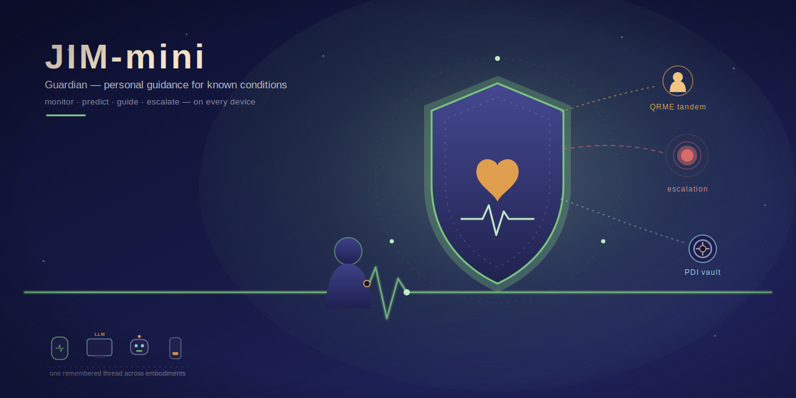
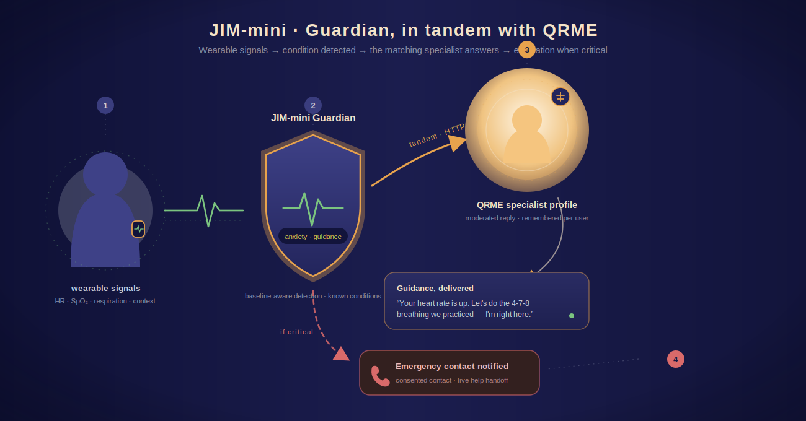
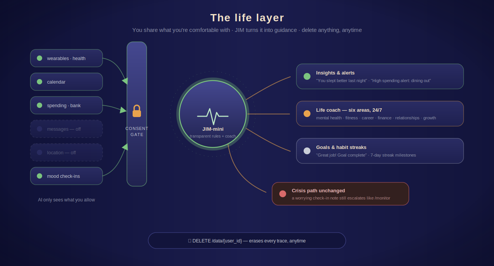

# JIM-mini / Guardian



A standalone **personal-guidance** system (patent app 19/038,196): it monitors
a user's biometric and contextual signals, detects known conditions, delivers
guidance, and escalates to an emergency contact / live help on critical events.
Around that core sits a **life layer** — consented data sources, mood/energy
check-ins, smart goals, habit streaks, proactive insights, and a 24/7 life
coach across six life areas.

JIM-mini is its own product. When configured for tandem it delegates guidance
to QRME specialist profiles over HTTP. See [docs/tandem.md](docs/tandem.md).



*Wearable signals → Guardian detects a condition → triggers the matching
specialist → moderated guidance, escalating to an emergency contact on critical
events.*

## Run

```bash
pip install -e .[dev]
uvicorn jim.api:app            # standalone
JIM_QRME_URL=http://localhost:8000 uvicorn jim.api:app   # tandem with QRME
```

`JIM_DB` sets the SQLite path (default `jim.db`). Set `ANTHROPIC_API_KEY` for
real `claude-opus-4-8` guidance; otherwise (or with `JIM_LLM=stub`) a
deterministic stub answers offline. `JIM_MODEL` overrides the model.

## API

| Endpoint | Purpose |
|---|---|
| `GET /health` | Status + whether tandem is configured |
| `POST /enroll` | Enroll a user: terms/guardian consent, emergency contact (+ consent), device pairing, resting-HR baseline, goals |
| `POST /specialists` | Register a condition specialist — `local` (JIM's own guidance) or `tandem` (a QRME `qrme_profile_id`) |
| `POST /monitor/{user_id}` | Ingest a biometric/context sample; runs detect → guide → escalate |
| `GET /events/{user_id}` | Event timeline (biometric → detection → guidance → escalation) |
| `GET`/`PUT /sources/{user_id}` | Per-source consent (wearable, health, calendar, spending, bank, messages, location) — nothing is read from a source the user hasn't allowed |
| `POST /context/{user_id}` | Ingest an event from a consented source (403 otherwise); transparent rules turn it into insights |
| `POST /checkin/{user_id}` | Mood & energy check-in; a worrying note still runs the full Guardian detect → escalate pipeline |
| `GET`/`POST /goals/{user_id}`, `PATCH /goals/{user_id}/{goal_id}` | Smart goals with progress; completion earns a praise insight |
| `GET`/`POST /habits/{user_id}`, `POST …/{habit_id}/log` | Habit tracking with streaks; milestones (7/30/100 days) earn insights |
| `POST`/`GET /coach/{user_id}` | 24/7 life coach across `mental_health`, `health_fitness`, `career`, `finance`, `relationships`, `personal_growth`, grounded in recent check-ins and active goals |
| `GET /insights/{user_id}` | Proactive nudges: spending alerts, sleep praise, interview prep, mindful-break suggestions, milestones |
| `DELETE /data/{user_id}` | Delete anything, anytime — erases every trace of the user |

## Condition detection (`jim/conditions.py`)

Transparent rules over a biometric sample (heart rate vs. the user's resting
baseline, respiratory rate, SpO₂) plus free-text and crisis cues, returning a
condition domain and `info` / `guidance` / `critical` severity.

## Guidance

- **Standalone** (`jim/guidance.py`): JIM generates condition-specific guidance
  through its own LLM provider, with a minimal safety check.
- **Tandem** (`jim/qrme_client.py`): delegates to a QRME specialist profile over
  HTTP; the reply is subject to QRME's moderation and stored in QRME's per-user
  memory. If a tandem specialist is registered but no QRME endpoint is
  configured, JIM falls back to standalone guidance and says so.

## Test

```bash
pytest jim/tests
```

Covers standalone detection/guidance/escalation and a real in-process tandem
run against a separate QRME instance (reached only through the HTTP client).

## Life layer (`jim/life.py`, `jim/coach.py`)



The guardrail is consent: context only flows from sources the user has
switched on, and `DELETE /data/{user_id}` erases everything on request.
Insight rules are deliberately transparent (a spending threshold, sleep-hours
bands, calendar keywords, mood ≤ 2, streak milestones) rather than opaque
scoring. The coach shares Guardian's LLM provider and safety net, and check-in
notes feed the same crisis detection as biometric monitoring.

## Out of scope for v1

Live device streaming/pairing, real bank/brokerage connections (spending
events are ingested, no auto-investing), voice mode, AR visualizations,
image insights, community challenges, real emergency-services dispatch, and a
specialist knowledge-pack marketplace — represented structurally, not as live
integrations.
