# JIM-mini / Guardian


A standalone **personal-guidance** system (patent app 19/038,196): it monitors
a user's biometric and contextual signals, detects known conditions, delivers
guidance, and escalates to an emergency contact / live help on critical events.
Around that core sits a **life layer** — consented data sources, mood/energy
check-ins, smart goals, habit streaks, proactive insights, and a 24/7 life
coach across six life areas.

JIM-mini is its own product. When configured for tandem it delegates guidance
to QRME specialist profiles over HTTP. See [docs/tandem.md](docs/tandem.md).


*Wearable signals → Guardian detects a condition → triggers the matching
specialist → moderated guidance, escalating to an emergency contact on critical
events.*

## Desktop app

A wide, multi-panel desktop form of Jim Mini — sidebar nav and an operator workspace, in the guardian-green identity — complementing the phone app and the watch. Each is a self-contained SVG; regenerate with `python3 docs/desktop/build.py`.

<table>
  <tr>
    <td align="center" width="50%"><a href="docs/desktop/01-overview.svg">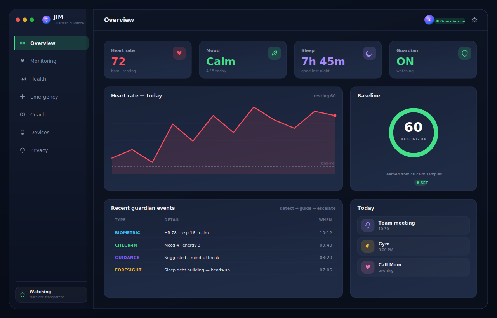</a><br><sub><b>01</b> · Overview</sub></td>
    <td align="center" width="50%"><a href="docs/desktop/02-live-monitoring.svg">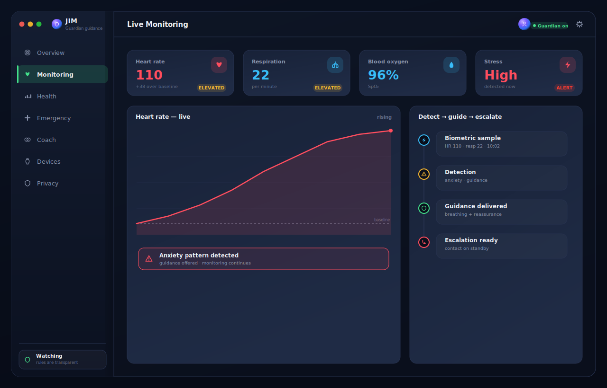</a><br><sub><b>02</b> · Live Monitoring</sub></td>
  </tr>
  <tr>
    <td align="center" width="50%"><a href="docs/desktop/03-health.svg">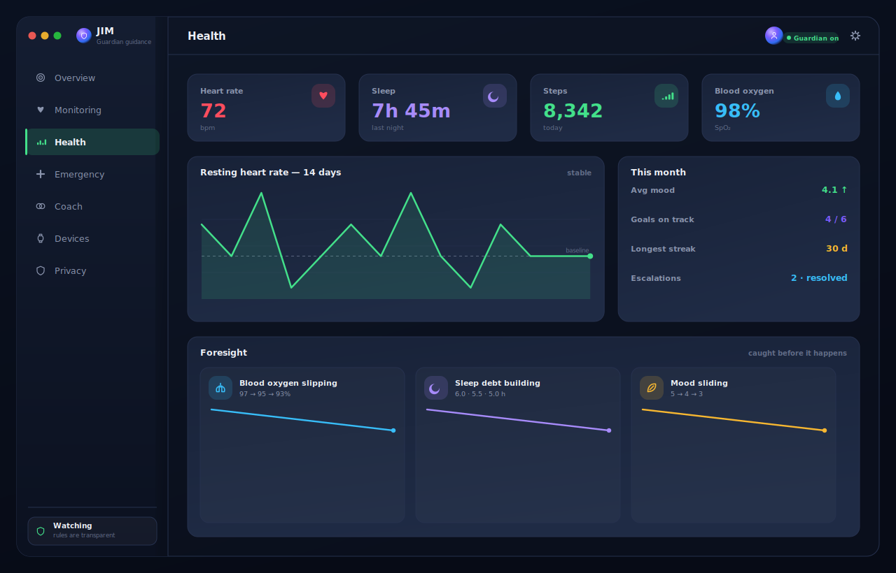</a><br><sub><b>03</b> · Health</sub></td>
    <td align="center" width="50%"><a href="docs/desktop/04-emergency-guardian.svg">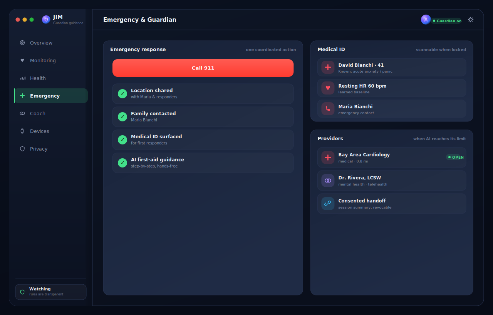</a><br><sub><b>04</b> · Emergency & Guardian</sub></td>
  </tr>
  <tr>
    <td align="center" width="50%"><a href="docs/desktop/05-coach-life.svg">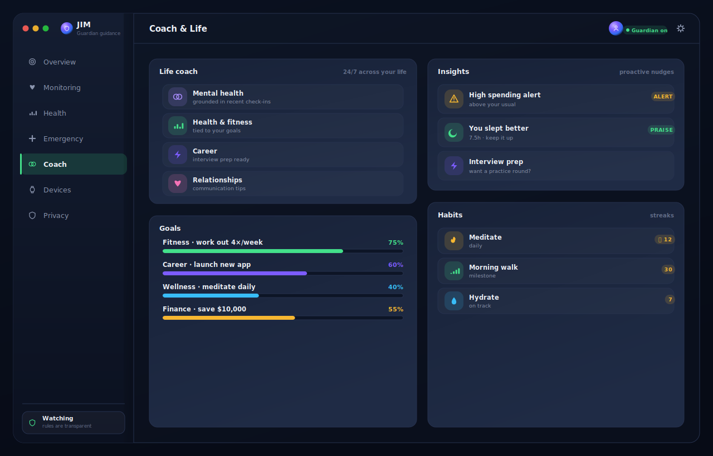</a><br><sub><b>05</b> · Coach & Life</sub></td>
    <td align="center" width="50%"><a href="docs/desktop/06-privacy-data.svg">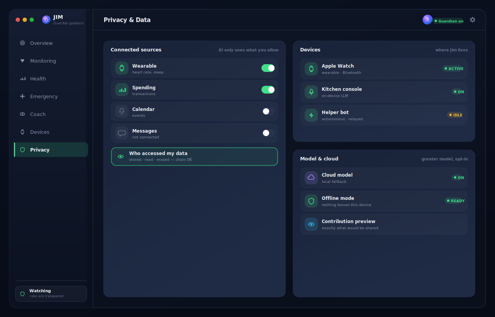</a><br><sub><b>06</b> · Privacy & Data</sub></td>
  </tr>
</table>

## Platforms

Every screen ships in each platform's native chrome — mobile in **iOS** (`docs/screens/`) and **Android** (`docs/screens/android/`); desktop in **macOS** (`docs/desktop/`) and **Windows** (`docs/desktop/windows/`). iOS's Dynamic Island + home indicator vs Android's punch-hole + gesture nav; macOS traffic-lights vs the Windows caption bar. (The watch is watchOS-only.)

<table>
  <tr>
    <td align="center" width="50%"><a href="docs/screens/02-home.svg">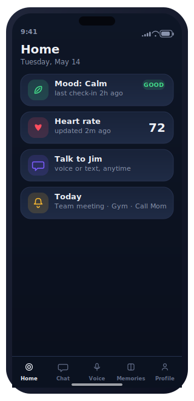</a><br><sub>Mobile · <b>iOS</b></sub></td>
    <td align="center" width="50%"><a href="docs/screens/android/02-home.svg">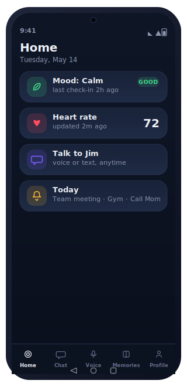</a><br><sub>Mobile · <b>Android</b></sub></td>
  </tr>
  <tr>
    <td align="center"><a href="docs/desktop/01-overview.svg"></a><br><sub>Desktop · <b>macOS</b></sub></td>
    <td align="center"><a href="docs/desktop/windows/01-overview.svg"></a><br><sub>Desktop · <b>Windows</b></sub></td>
  </tr>
</table>

## App screens

Every capability has a screen, in the product's dark-OLED style (regenerate with `python3 docs/screens/build.py`). Each is a self-contained SVG — no fonts, images, or scripts — and maps to a shipped endpoint.

<table>
<tr>
<td align="center" width="25%">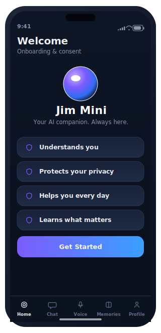<br><sub>01 · Welcome</sub></td>
<td align="center" width="25%"><br><sub>02 · Home</sub></td>
<td align="center" width="25%">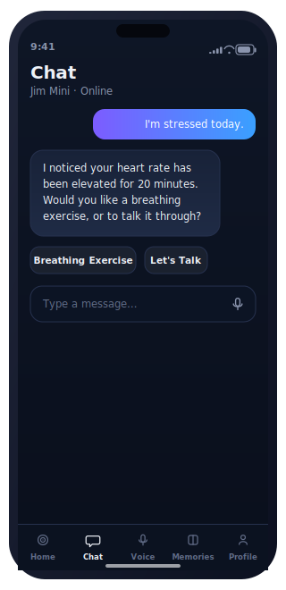<br><sub>03 · Chat</sub></td>
<td align="center" width="25%">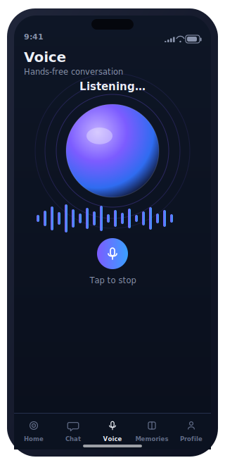<br><sub>04 · Voice</sub></td>
</tr>
<tr>
<td align="center" width="25%">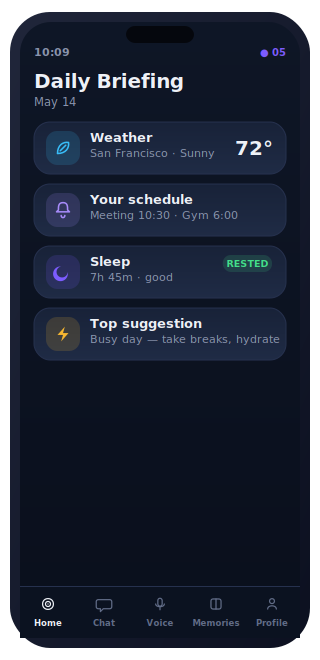<br><sub>05 · Daily Briefing</sub></td>
<td align="center" width="25%">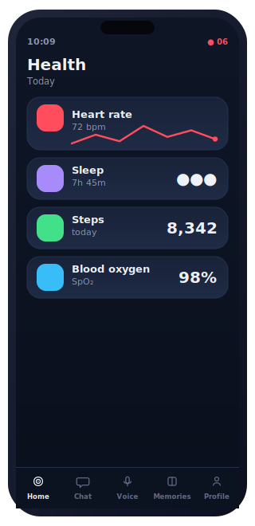<br><sub>06 · Health</sub></td>
<td align="center" width="25%">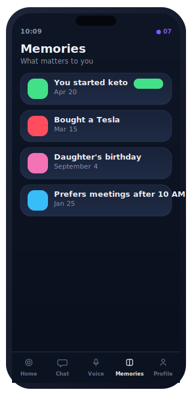<br><sub>07 · Memories</sub></td>
<td align="center" width="25%">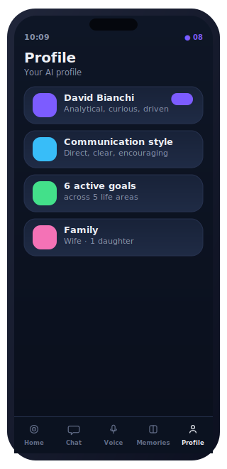<br><sub>08 · Profile</sub></td>
</tr>
<tr>
<td align="center" width="25%">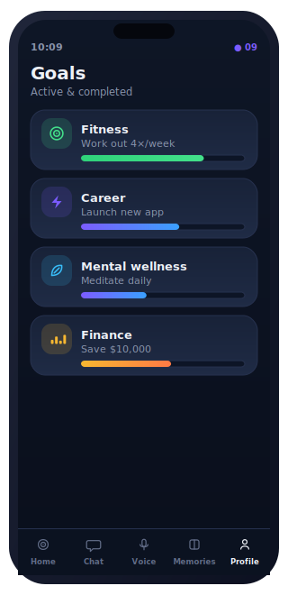<br><sub>09 · Goals</sub></td>
<td align="center" width="25%">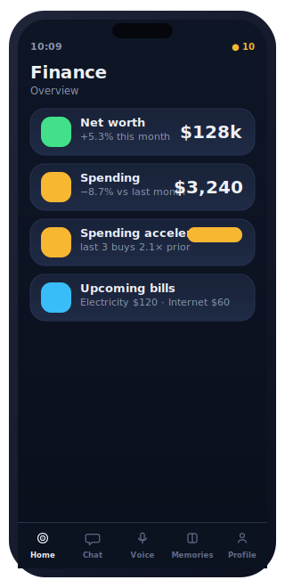<br><sub>10 · Finance</sub></td>
<td align="center" width="25%">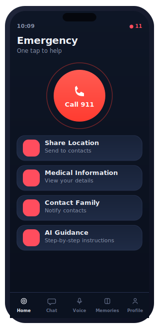<br><sub>11 · Emergency</sub></td>
<td align="center" width="25%">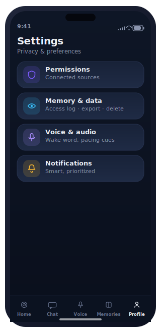<br><sub>12 · Settings</sub></td>
</tr>
<tr>
<td align="center" width="25%">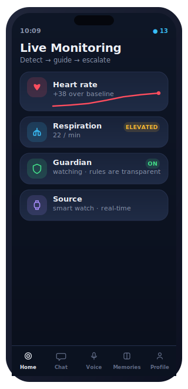<br><sub>13 · Live Monitoring</sub></td>
<td align="center" width="25%">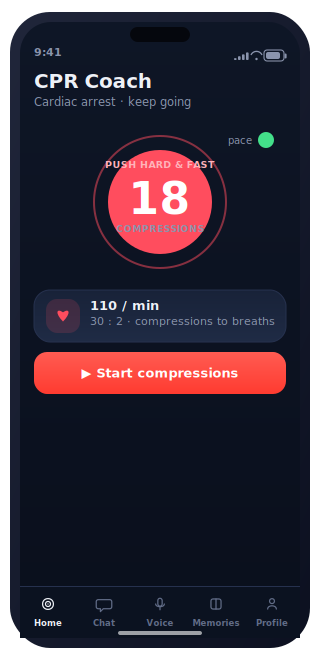<br><sub>14 · CPR Coach</sub></td>
<td align="center" width="25%">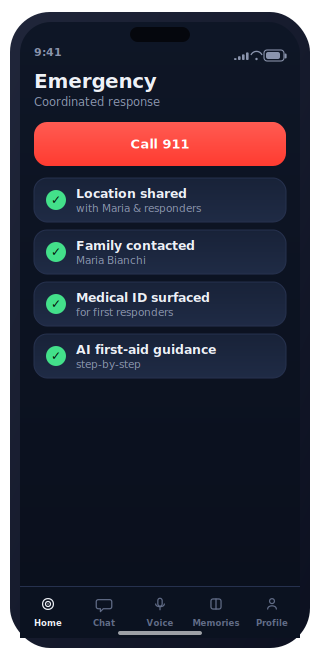<br><sub>15 · Emergency</sub></td>
<td align="center" width="25%">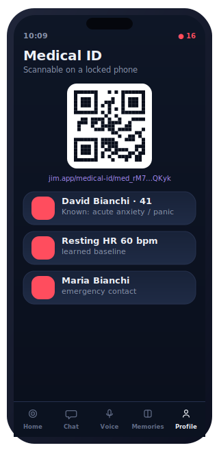<br><sub>16 · Medical ID</sub></td>
</tr>
<tr>
<td align="center" width="25%">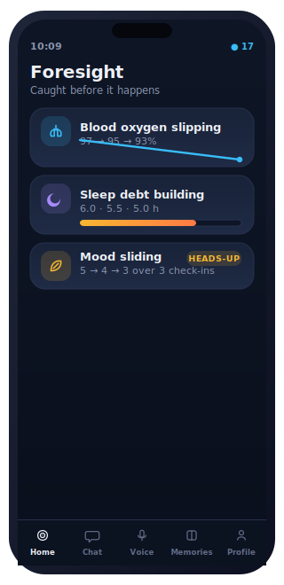<br><sub>17 · Foresight</sub></td>
<td align="center" width="25%">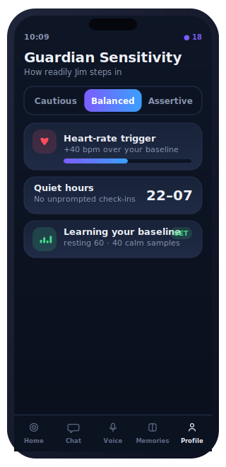<br><sub>18 · Guardian Sensitivity</sub></td>
<td align="center" width="25%">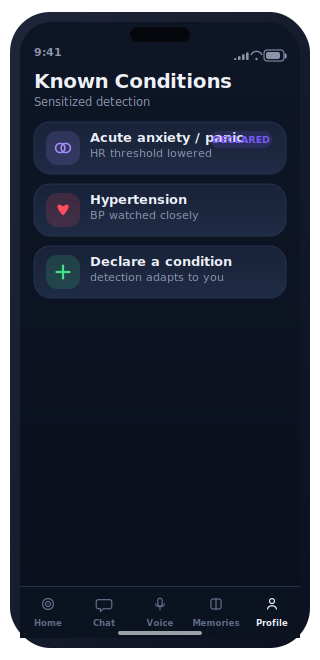<br><sub>19 · Known Conditions</sub></td>
<td align="center" width="25%">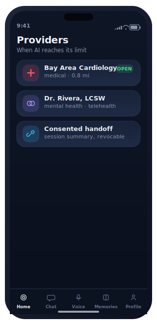<br><sub>20 · Providers</sub></td>
</tr>
<tr>
<td align="center" width="25%">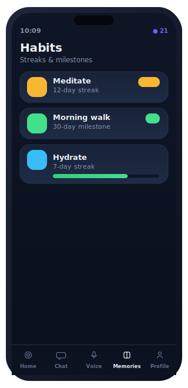<br><sub>21 · Habits</sub></td>
<td align="center" width="25%">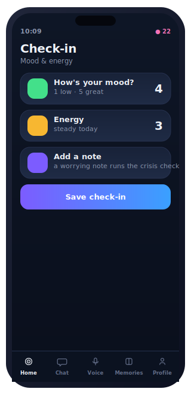<br><sub>22 · Check-in</sub></td>
<td align="center" width="25%">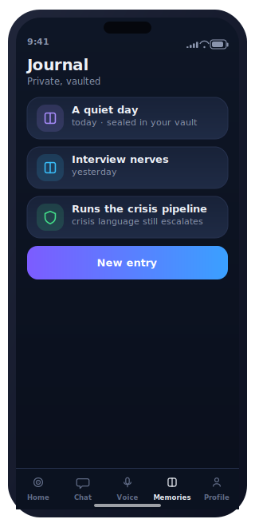<br><sub>23 · Journal</sub></td>
<td align="center" width="25%">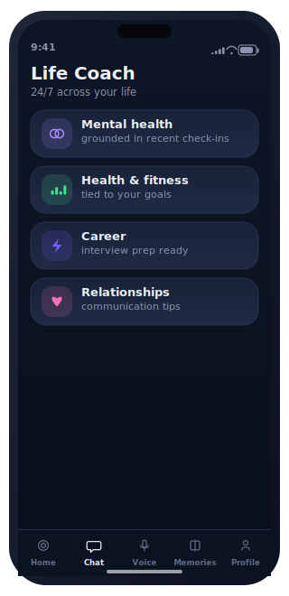<br><sub>24 · Life Coach</sub></td>
</tr>
<tr>
<td align="center" width="25%">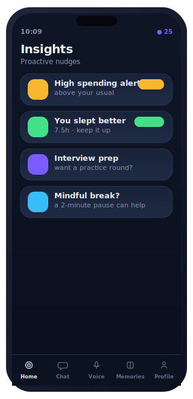<br><sub>25 · Insights</sub></td>
<td align="center" width="25%">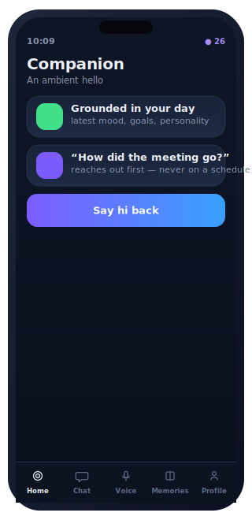<br><sub>26 · Companion</sub></td>
<td align="center" width="25%">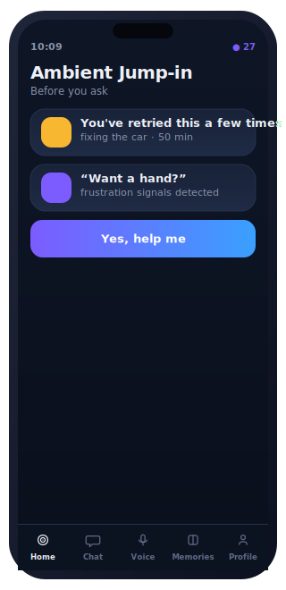<br><sub>27 · Ambient Jump-in</sub></td>
<td align="center" width="25%">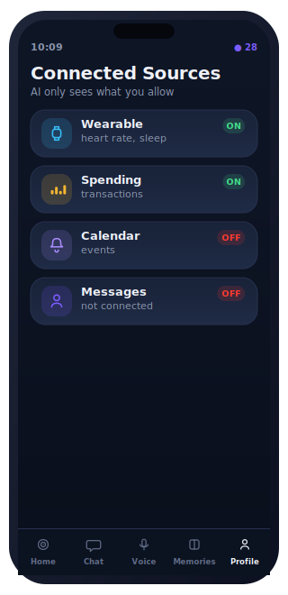<br><sub>28 · Connected Sources</sub></td>
</tr>
<tr>
<td align="center" width="25%">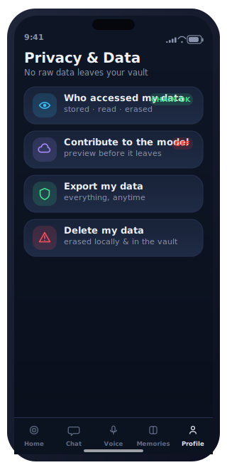<br><sub>29 · Privacy & Data</sub></td>
<td align="center" width="25%">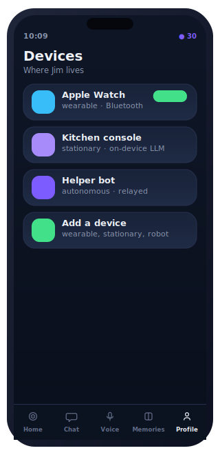<br><sub>30 · Devices</sub></td>
<td align="center" width="25%">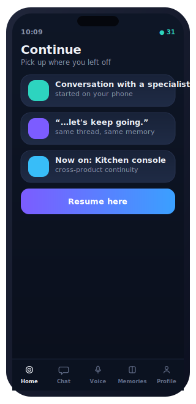<br><sub>31 · Continue</sub></td>
<td align="center" width="25%">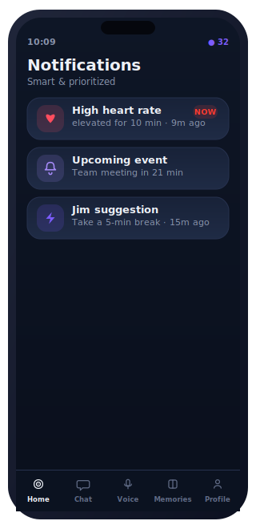<br><sub>32 · Notifications</sub></td>
</tr>
<tr>
<td align="center" width="25%">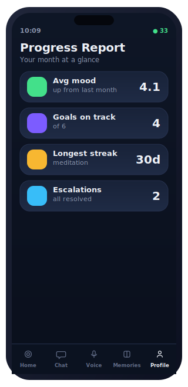<br><sub>33 · Progress Report</sub></td>
<td align="center" width="25%">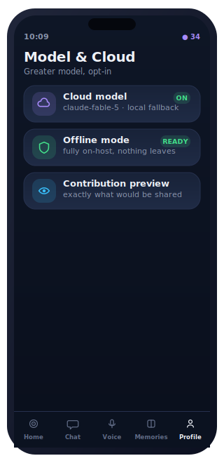<br><sub>34 · Model & Cloud</sub></td>
<td align="center" width="25%">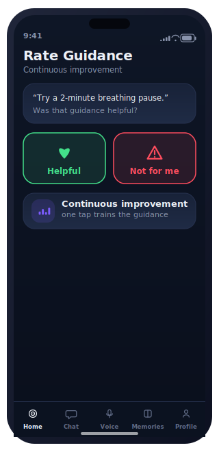<br><sub>35 · Rate Guidance</sub></td>
<td align="center" width="25%">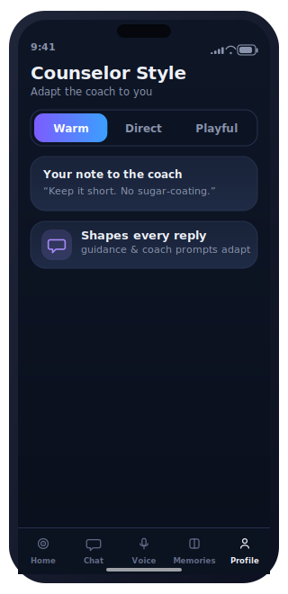<br><sub>36 · Counselor Style</sub></td>
</tr>
<tr>
<td align="center" width="25%">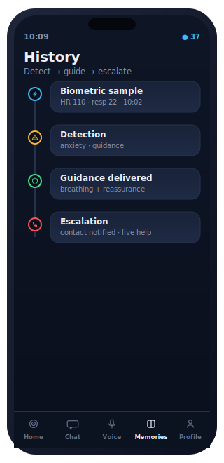<br><sub>37 · History</sub></td>
<td align="center" width="25%">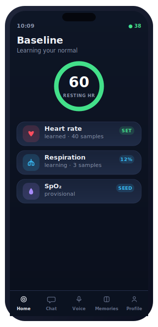<br><sub>38 · Baseline</sub></td>
<td align="center" width="25%">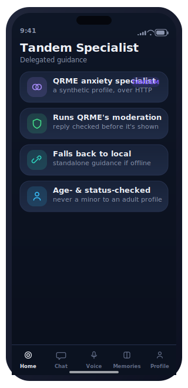<br><sub>39 · Tandem Specialist</sub></td>
<td align="center" width="25%">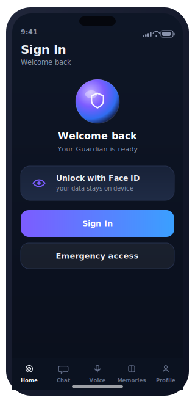<br><sub>40 · Sign In</sub></td>
</tr>
<tr>
<td align="center" width="25%">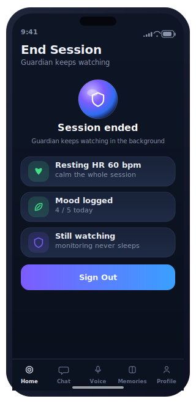<br><sub>41 · End Session</sub></td>
</tr>
</table>

## Watch screens

The same system on the wrist — glanceable Apple-Watch faces, one per capability (regenerate with `python3 docs/watch/build.py`).

<table>
<tr>
<td align="center" width="20%">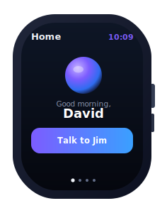<br><sub>01 · Home</sub></td>
<td align="center" width="20%">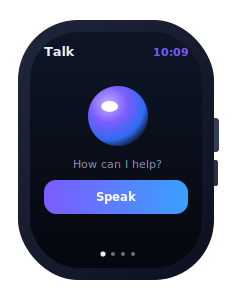<br><sub>02 · Talk</sub></td>
<td align="center" width="20%">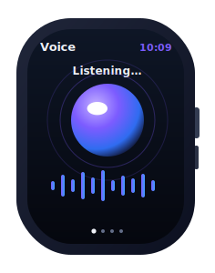<br><sub>03 · Voice</sub></td>
<td align="center" width="20%">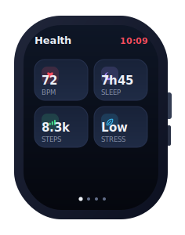<br><sub>04 · Health</sub></td>
<td align="center" width="20%">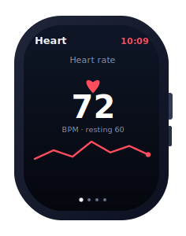<br><sub>05 · Heart</sub></td>
</tr>
<tr>
<td align="center" width="20%">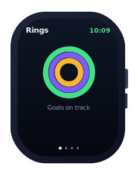<br><sub>06 · Rings</sub></td>
<td align="center" width="20%">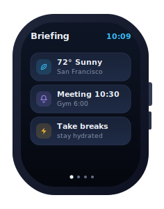<br><sub>07 · Briefing</sub></td>
<td align="center" width="20%">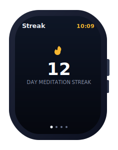<br><sub>08 · Streak</sub></td>
<td align="center" width="20%">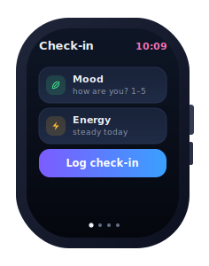<br><sub>09 · Check-in</sub></td>
<td align="center" width="20%">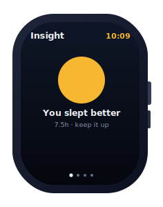<br><sub>10 · Insight</sub></td>
</tr>
<tr>
<td align="center" width="20%">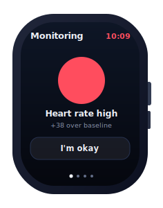<br><sub>11 · Monitoring</sub></td>
<td align="center" width="20%">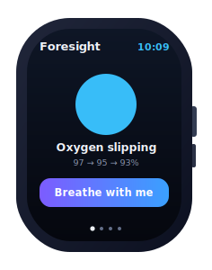<br><sub>12 · Foresight</sub></td>
<td align="center" width="20%">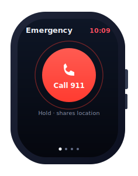<br><sub>13 · Emergency</sub></td>
<td align="center" width="20%">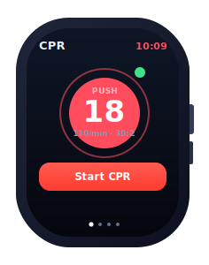<br><sub>14 · CPR</sub></td>
<td align="center" width="20%">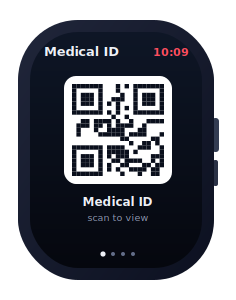<br><sub>15 · Medical ID</sub></td>
</tr>
<tr>
<td align="center" width="20%">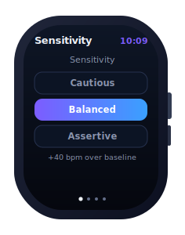<br><sub>16 · Sensitivity</sub></td>
<td align="center" width="20%">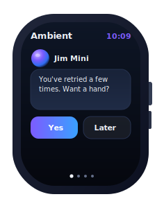<br><sub>17 · Ambient</sub></td>
<td align="center" width="20%">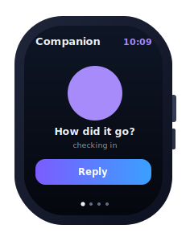<br><sub>18 · Companion</sub></td>
<td align="center" width="20%">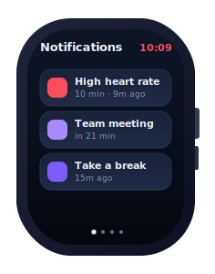<br><sub>19 · Notifications</sub></td>
<td align="center" width="20%">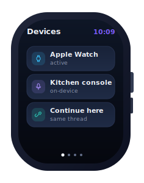<br><sub>20 · Devices</sub></td>
</tr>
<tr>
<td align="center" width="20%">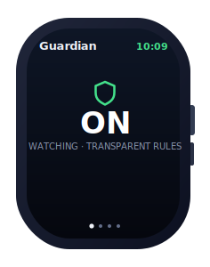<br><sub>21 · Guardian</sub></td>
<td align="center" width="20%">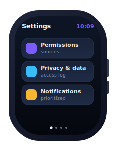<br><sub>22 · Settings</sub></td>
<td align="center" width="20%">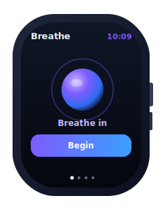<br><sub>23 · Breathe</sub></td>
<td align="center" width="20%">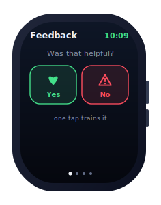<br><sub>24 · Feedback</sub></td>
<td align="center" width="20%">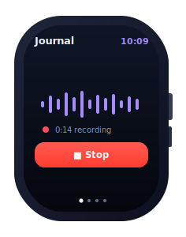<br><sub>25 · Journal</sub></td>
</tr>
<tr>
<td align="center" width="20%">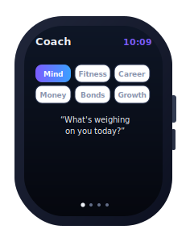<br><sub>26 · Coach</sub></td>
<td align="center" width="20%">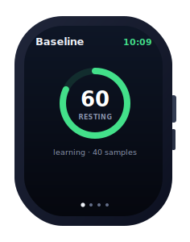<br><sub>27 · Baseline</sub></td>
<td align="center" width="20%">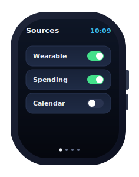<br><sub>28 · Sources</sub></td>
<td align="center" width="20%">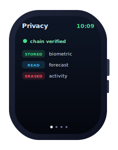<br><sub>29 · Privacy</sub></td>
<td align="center" width="20%">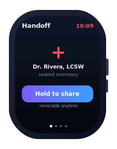<br><sub>30 · Handoff</sub></td>
</tr>
<tr>
<td align="center" width="20%">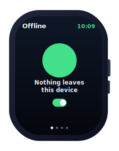<br><sub>31 · Offline</sub></td>
<td align="center" width="20%">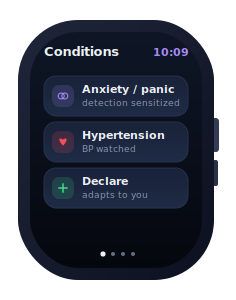<br><sub>32 · Conditions</sub></td>
<td align="center" width="20%">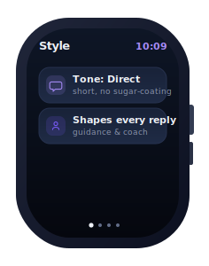<br><sub>33 · Style</sub></td>
<td align="center" width="20%">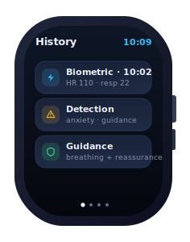<br><sub>34 · History</sub></td>
</tr>
</table>

## Run

```bash
pip install -e .[dev]
uvicorn jim.api:app            # standalone
JIM_QRME_URL=http://localhost:8000 uvicorn jim.api:app   # tandem with QRME
JIM_PDI_URL=http://localhost:8100 JIM_PDI_TOKEN=pdi_... uvicorn jim.api:app  # + PDI vault
```

`JIM_DB` sets the SQLite path (default `jim.db`). Set `ANTHROPIC_API_KEY` for
real `claude-opus-4-8` guidance; otherwise (or with `JIM_LLM=stub`) a
deterministic stub answers offline. `JIM_MODEL` overrides the model.

## API

| Endpoint | Purpose |
|---|---|
| `GET /health` | Status + whether tandem is configured |
| `POST /enroll` | Enroll a user: terms/guardian consent, emergency contact (+ consent), devices, resting-HR baseline, goals, declared known conditions |
| `POST /conditions/{user_id}` | Declare a known condition after enrollment ("receiving an indication of a known condition"); detection is sensitized for it |
| `PUT /personality/{user_id}` | Adapt the counselor from user input — tone and free-text preferences shape every guidance and coach prompt |
| `PUT /sensitivity/{user_id}` | Tune escalation readiness: `cautious` (lower HR thresholds; a declared condition reaches the emergency contact even at guidance level) / `balanced` (default) / `assertive` (stronger signals required) |
| `GET /baseline/{user_id}` | The user's rolling per-metric EMA baselines; each is provisional until enough resting samples accrue |
| `POST /specialists` | Register a condition specialist — `local` (JIM's own guidance) or `tandem` (a QRME `qrme_profile_id`) |
| `POST /monitor/{user_id}` | Ingest a biometric/context sample (optionally tagged with its `source_device` — smart watch, stationary system, neural sensor, gesture interface); runs detect → guide → escalate, with predictive early warning when nothing has manifested yet. Physical emergencies carry **step-by-step first aid**: CPR with the proper pace (30:2, 110/min, cued by green/red lights + a metronome tick), AED guidance on a fibrillation rhythm, the low-blood-oxygen playbook (breathe deeply, fresh air, medical attention), environmental hazards (smoke/CO — leave now), and ergonomic-strain nudges; critical escalations dispatch alerts to every registered connected device |
| `POST /sessions/{user_id}`, `POST …/{session_id}/end` | Login sessions per device; starting one returns the remembered interaction state, so any device resumes the same conversational thread and counseling routes to the session's device. **Cross-product continuity**: if the user already has a thread with a QRME specialist, the session's `continuity` block carries its recent turns (read back with the stored QRME interactor token) — a chat begun in QRME picks up on any JIM embodiment, same thread, same memory |
| `POST`/`GET /devices/{user_id}` | Physical embodiments: wearables, stationary systems, and networked autonomous devices — transport (e.g. Bluetooth, relayed through a linked device) and an optional on-device LLM; guidance reports how and where it was delivered |
| `POST /emergency/{user_id}` | **Emergency mode** — one coordinated response (the watch's Emergency screen): reach **emergency services**, **share location** with family and responders, **contact family** (the registered emergency contact), surface the **Medical ID** (age, known conditions, resting-HR baseline, recent detections, contact — condition-level facts only), deliver step-by-step **AI first aid** from an optional live `sample`/`situation` (CPR/AED/low-oxygen playbooks), and **alert every connected device**. Logged to the event timeline |
| `POST`/`DELETE /medical-id/qr/{user_id}` | **Shareable Medical ID QR**: mint (or rotate) a printable / lock-screen QR, or revoke it. Returns the card token + its `view_url` and `qr_svg_url` |
| `GET /medical-id/{token}`, `GET …/{token}/qr.svg` | **Scan-to-view** (public): a first responder scans the code and reads the Medical ID with **no auth token** — the phone is locked in an emergency, so the card itself is the credential. Condition-level facts only; the token is opaque, rotatable, revocable, and stored only as a hash |
| `POST /activity/{user_id}` | **Ambient observation** (the "Jiminy Cricket" jump-in): report what the user is *doing* — activity + signals (`retries`/`errors`, `idle_seconds`, `duration_min`) + what they said — and JIM offers help **proactively** when a struggle is building, before being asked. Crisis language still escalates; a calm signal is logged but never interrupts |
| `GET /events/{user_id}` | Event timeline (biometric/activity → detection → guidance → escalation) |
| `GET`/`PUT /sources/{user_id}` | Per-source consent (wearable, health, calendar, spending, bank, messages, location) — nothing is read from a source the user hasn't allowed |
| `POST /context/{user_id}` | Ingest an event from a consented source (403 otherwise); transparent rules turn it into insights |
| `POST /checkin/{user_id}` | Mood & energy check-in; a worrying note still runs the full Guardian detect → escalate pipeline |
| `GET`/`POST /goals/{user_id}`, `PATCH /goals/{user_id}/{goal_id}` | Smart goals with progress; completion earns a praise insight |
| `GET`/`POST /habits/{user_id}`, `POST …/{habit_id}/log` | Habit tracking with streaks; milestones (7/30/100 days) earn insights |
| `POST`/`GET /coach/{user_id}` | 24/7 life coach across `mental_health`, `health_fitness`, `career`, `finance`, `relationships`, `personal_growth`, grounded in recent check-ins and active goals |
| `POST /companion/{user_id}` | Ambient companion check-in: the coach reaches out first, grounded in the latest mood, goals, and personality preferences — invoked explicitly, never on a hidden schedule |
| `GET /insights/{user_id}` | Proactive nudges: spending alerts, sleep praise, interview prep, mindful-break suggestions, milestones |
| `POST`/`GET /journal/{user_id}` | Journaling; entries are vaulted under PDI tandem and run the same crisis pipeline as check-in notes |
| `POST /feedback/{user_id}` | Continuous-improvement loop: rate guidance up/down with an optional note |
| `GET /report/{user_id}` | Progress report & insights: mood/energy averages, goals, streaks, detection counts, feedback tallies |
| `GET /access-log/{user_id}` | **See who accessed my data**: every access to the user's sealed vault records (stored/read/erased + scope + time), filtered to their own `jim/{user}/…` namespace and verifiable against PDI's tamper-evident audit chain; says so plainly when no vault is configured (data local-only) |
| `GET /provider/{user_id}` | Consent-gated provider portal: condition-level summary only (declared conditions, detection history, escalations) — never notes or raw biometrics |
| `DELETE /data/{user_id}` | Delete anything, anytime — erases every trace of the user |

## Authentication & access control

JIM holds a person's most sensitive data — biometric streams, crisis notes, a
journal, a provider-shareable summary. Identity is proven by a bearer
**capability token**, never by asserting a `user_id`.

- `POST /enroll` returns a `user_token` **once**. Send it as
  `Authorization: Bearer <token>` on every `/{user_id}` endpoint.
- Every per-user surface is PHI, so **all** of them are gated: a missing or
  invalid token is **401**; a valid token for a different user is **403**.
- Only the SHA-256 hash of a token is stored (`api_tokens`), so a database
  leak never yields a usable credential.
- **Open (no token):** `GET /health`, `GET /cloud/status`, `POST /enroll`,
  and `POST /specialists` (service setup).
- `DELETE /data/{user_id}` erases the user **and** revokes their token.

## Your data promise

**No raw user data ever leaves your vault.**

- Biometric samples, crisis notes, journal entries, and consented context are
  sealed in your on-prem PDI vault (AES-256-GCM, tenant-isolated,
  tamper-evident audit) — JIM's own database keeps only key references.
  Never a third party.
- **You can see every access**: `GET /access-log/{user_id}` lists each time
  your sealed records were stored, read, or erased — your namespace only,
  verifiable against the audit chain.
- Prediction runs on bare local numbers (a metric name and a value); the
  payloads stay in the vault. Cloud contribution is opt-in and carries only
  anonymized guidance outcomes — condition, severity, rating. Never ids or
  notes.
- The provider portal opens only with your consent, shows condition-level
  facts only, and every handoff is revocable.
- Delete anything, anytime: `DELETE /data/{user_id}` erases every local
  trace, purges your vault records, and revokes your token.

## Condition detection (`jim/conditions.py`)

Transparent rules over a biometric sample — heart rate vs. the user's resting
baseline, respiratory rate, SpO₂, blood pressure (hypertensive-crisis
thresholds), heart-rate variability, body temperature, activity level,
movement (fall / collapse / immobility), and speech (slurred / incoherent) — plus free-text and crisis
cues, returning a condition domain and `info` / `guidance` / `critical`
severity. Domains: anxiety/panic, depression, stress management, phobias,
financial stress, relationship distress, physical distress, and physical
injury (first-aid counseling with a clear call-for-help threshold).

Two things shape detection per user:

- **Declared known conditions** lower the heart-rate threshold, so episodes
  are caught earlier for users known to be prone to them.
- **Predictive early warning** (`conditions.forecast`): a steady heart-rate
  climb that hasn't crossed a threshold yet produces a `forecast` event and a
  "may be building" insight — identifying a potential abnormality before it
  manifests. Prior samples are read back from the PDI vault when tandem
  storage is on.

## Guidance

- **Standalone** (`jim/guidance.py`): JIM generates condition-specific guidance
  through its own LLM provider, with a minimal safety check. Every reply
  carries a **factual basis** (`references`, e.g. Red Cross first-aid steps,
  NHS breathing techniques), is shaped by the user's declared conditions and
  personality preferences (a user-specific adaptation of the model), keeps
  **continuity with prior sessions** via remembered interaction state, and
  reports its **delivery channel** (`delivered_via`: the user's smart watch or
  linked device when one is paired).
- **Tandem** (`jim/qrme_client.py`): delegates to a QRME specialist profile over
  HTTP; the reply is subject to QRME's moderation and stored in QRME's per-user
  memory. If a tandem specialist is registered but no QRME endpoint is
  configured, JIM falls back to standalone guidance and says so.

## PDI tandem — medical data in the encrypted vault (`jim/pdi_client.py`)

With `JIM_PDI_URL` + `JIM_PDI_TOKEN` set (or a `PDIClient` injected), JIM's
most sensitive payloads never touch its own database in the clear:

- **medical** — raw biometric samples (`/monitor`), detection details
  (readings + signals), and check-in notes go to PDI under
  `jim/{user}/medical/…`, sealed with AES-256-GCM by PDI
- **context** — payloads from consented sources (spending, health, calendar,
  messages, …) go under `jim/{user}/context/…`

JIM's SQLite keeps only `{"vaulted": true, "pdi_key": …}` references; insight
and detection rules run on the payload in memory before it is sealed, so
behavior is identical either way. Every vaulted key is tracked locally so
`DELETE /data/{user_id}` purges the PDI records too, and every vault access
lands in PDI's tamper-evident audit chain. Without PDI configured, JIM stores
data locally exactly as before. QRME runs the same pattern on its side,
vaulting profile source material — see [docs/tandem.md](docs/tandem.md).

## Configuration

| Variable | Default | Purpose |
|---|---|---|
| `JIM_DB` | `jim.db` | SQLite database path |
| `JIM_LLM` | auto | `stub` forces the offline deterministic provider; `anthropic` forces the SDK |
| `JIM_MODEL` | `claude-opus-4-8` | Model used for guidance and coaching |
| `ANTHROPIC_API_KEY` | — | Enables real model replies |
| `JIM_QRME_URL` | — | QRME tandem: delegate specialist guidance over HTTP |
| `JIM_PDI_URL` / `JIM_PDI_TOKEN` | — | PDI tandem: seal medical/context payloads in the encrypted vault |
| `JIM_CLOUD_URL` / `JIM_CLOUD_TOKEN` | — | Cloud Model Gateway: greater-model guidance with local fallback + opt-in contribution ([docs/cloud-model.md](docs/cloud-model.md)) |

## Cloud model — use a greater model, and contribute to it

With a [Cloud Model Gateway](docs/cloud-model.md) configured, guidance and
coaching route to the hosted tier (e.g. `claude-fable-5`) with automatic
local fallback. Users who opt in at enrollment (`cloud_contribution`)
contribute **anonymized guidance outcomes only** — condition domain,
severity, and their rating; never ids, notes, or biometrics — and can revoke
anytime. `GET /cloud/status` reports the tier.

## Test

```bash
pytest jim/tests
```

Covers standalone detection/guidance/escalation and a real in-process tandem
run against a separate QRME instance (reached only through the HTTP client).

## Physical embodiments & sessions

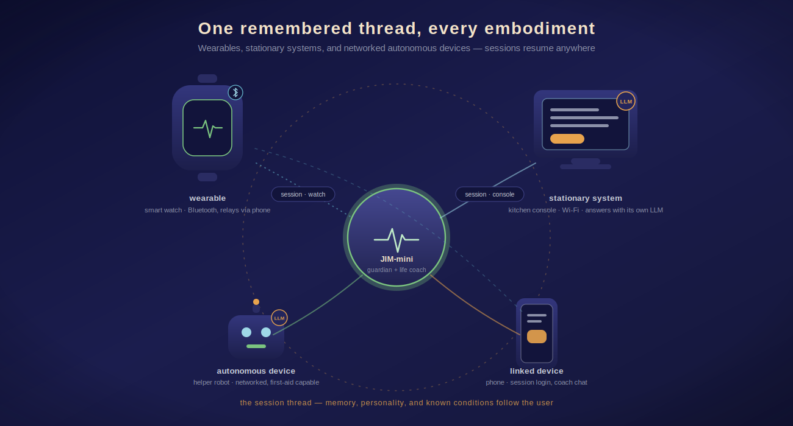

## Life layer (`jim/life.py`, `jim/coach.py`)


The guardrail is consent: context only flows from sources the user has
switched on, and `DELETE /data/{user_id}` erases everything on request.
Insight rules are deliberately transparent (a spending threshold, sleep-hours
bands, calendar keywords, mood ≤ 2, streak milestones) rather than opaque
scoring. The coach shares Guardian's LLM provider and safety net, and check-in
notes feed the same crisis detection as biometric monitoring.

## Out of scope for v1

Live device streaming/pairing, real bank/brokerage connections (spending
events are ingested, (non-auto and auto-investing), voice mode, AR visualizations,
image insights, community challenges, real emergency-services dispatch, and a
specialist knowledge-pack marketplace — represented structurally, not as live
integrations.

## Related projects

Three separate products, each standalone, interoperating only over HTTP —
see [docs/tandem.md](docs/tandem.md) for the full architecture:

- [**qrme**](https://github.com/davidsbianchi1984/qrme) — AI synthetic
  profiles: relationship-aware, remembered, moderated.
- [**jim-mini**](https://github.com/davidsbianchi1984/jim-mini) — Guardian
  personal guidance: monitor, predict, guide, escalate; can delegate
  specialist guidance to QRME.
- [**pdi**](https://github.com/davidsbianchi1984/pdi) — Private Data
  Infrastructure: the encrypted vault both AI systems can run on top of.

## License

MIT © 2026 David Bianchi — see [LICENSE](LICENSE).
