<p align="center">
  
</p>

# JIM-mini / Guardian

**Network Responsive Personal Guidance System for Known Conditions.**
JIM-Mini continuously watches the vital signs of a person managing known
health conditions and responds when they cannot — a check-in first, and
when readings collapse or the questions go unanswered, the help they
programmed in advance. The goal is to give seniors and their families
greater safety, independence, and peace of mind — 24/7, even during
sleep.

**Current release: v0.63.0** ([changelog](CHANGELOG.md) ·
[showcase — a share-ready page for social media](docs/showcase.html)) — one of three products
([qrme](https://github.com/davidsbianchi1984/qrme),
[pdi](https://github.com/davidsbianchi1984/pdi)) versioned and cut together, so
one number names one combination of all three.

<!-- The bare URL is deliberate and must stay on its own line: GitHub turns a
     user-attachments link into an inline player, and only that. A video
     committed into the repo cannot play — the markdown sanitizer strips
     <video>, and image syntax pointing at an .mp4 renders broken. The file is
     H.264/AAC rather than the HEVC original, because Chrome and Firefox
     cannot decode HEVC and it would be a dead black box for most visitors.
     Outside github.com this degrades to a link, which is why the cover
     illustration below stays.

     The table is what keeps it small. On its own the bare URL becomes a
     full-width player — a large black rectangle with a play button, sitting
     above everything the page is actually about, and reading as the whole
     header rather than as one thing offered in it. There is no width
     attribute to set, because the element is generated: the only handle is
     the width of the box it lands in, so it goes in a narrow cell with the
     cover illustration beside it.

     The blank lines around the URL inside the <td> are load-bearing. GitHub
     only processes markdown inside an HTML block when it is separated that
     way, and without them the line stays a literal URL and no player is made
     at all.

     Nothing here shrinks the *playback*: it still opens full screen with
     audio on click, which is what the small frame is for — an invitation,
     not the thing itself. -->

<table>
  <tr>
    <td width="42%" valign="middle">

https://github.com/user-attachments/assets/eab7d192-7b18-464d-9b67-bd512ae87957

</td>
    <td width="58%" valign="middle">

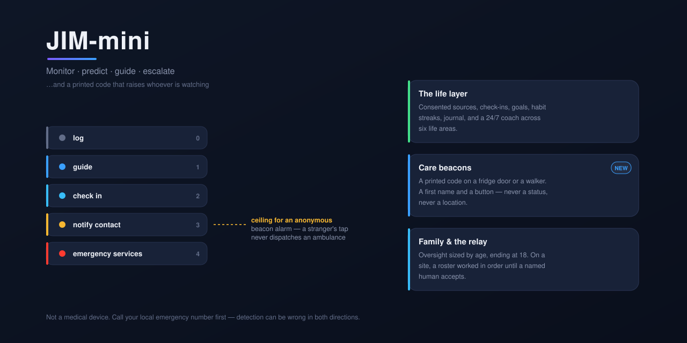

</td>
  </tr>
</table>

A standalone personal-guidance system enabling seamless support for future AI agent services (**JAN2024 NETWORKED RESPONSIVE PERSONAL GUIDANCE SYSTEM FOR KNOWN CONDITIONS United States application or CT international application # 19/038,196 ATTORNEY DOCKET # 526.P001 Patent Pending — published as US 2025/0246290 A1 on July 31, 2025**): it monitors
a user's biometric and contextual signals, detects known conditions, delivers
guidance, and escalates to an emergency contact / live help on critical events.
Around that core sits a **life layer** — consented data sources, mood/energy
check-ins, smart goals, habit streaks, proactive insights, and a 24/7 life
coach across six life areas.

JIM-mini is its own product. When configured for tandem it delegates guidance
to QRME specialist profiles over HTTP. See [docs/tandem.md](docs/tandem.md).

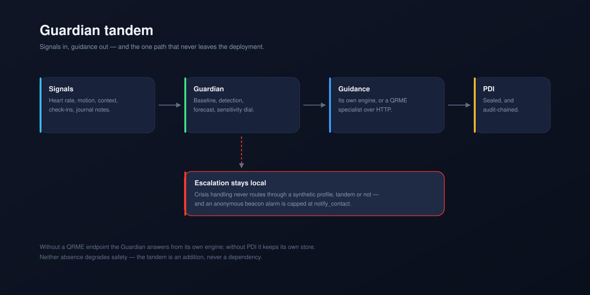

*Wearable signals → Guardian detects a condition → triggers the matching
specialist → moderated guidance, escalating to an emergency contact on critical
events.*


## Ability is not a gate

If how a person's body or mind works stands between them and this product,
that is a defect in the product — not in them. This is stated upfront,
before features, because a health guardian that assumes an able body has
misunderstood its own job: we build for blind and low-vision people, deaf
and hard-of-hearing people, mute and nonspeaking people, people with
limited mobility or amputation or tremor, autistic and cognitively
different people, people with dyslexia, people sensitive to motion — and
for every need not on that list, which is a gap in the list, not in the
person.

What is true today, enforced by the suite rather than promised: every
function works by text alone and voice is always optional; every image in
the console carries a description (`test_ability_is_not_a_gate.py` fails
on one that does not); no step is timed; the console honours
`prefers-reduced-motion`; and the known gaps live in
[`jim/tests/a11y_backlog.txt`](jim/tests/a11y_backlog.txt), a ledger that
only shrinks. Anything that stands in your way can be reported from the
**Accessibility** screen — reachable *before* enrollment (`#access`), in
ten languages, with three questions and no diagnosis: what were you trying
to do, what stood in the way, what would help. Reports stay on the
deployment that received them (sealed to the PDI vault when one is
configured, never relayed to the shared error collector), are read with
the deployment's reviewer token (`JIM_ADMIN_TOKEN`), and become rows in
that only-shrinks ledger. That is the whole loop: your words become
tracked work.


## Desktop app

A wide, multi-panel desktop form of Jim Mini — sidebar nav and an operator workspace, in the guardian-green identity — complementing the phone app and the watch. Each is a self-contained SVG; regenerate with `python3 docs/desktop/build.py`.

<table>
  <tr>
    <td align="center" width="50%"><a href="docs/desktop/01-overview.svg">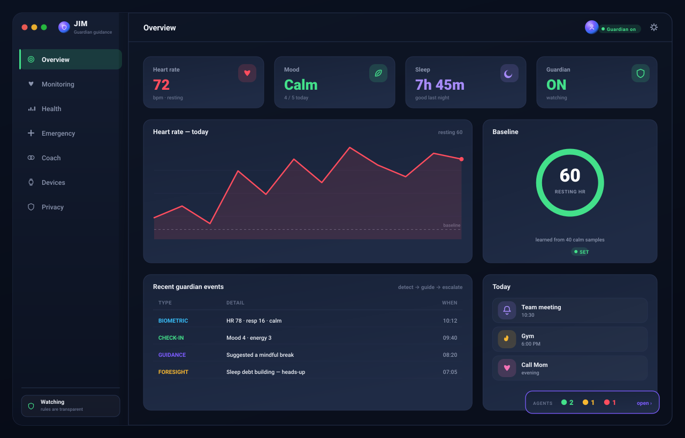</a><br><sub><b>01</b> · Overview</sub></td>
    <td align="center" width="50%"><a href="docs/desktop/02-live-monitoring.svg">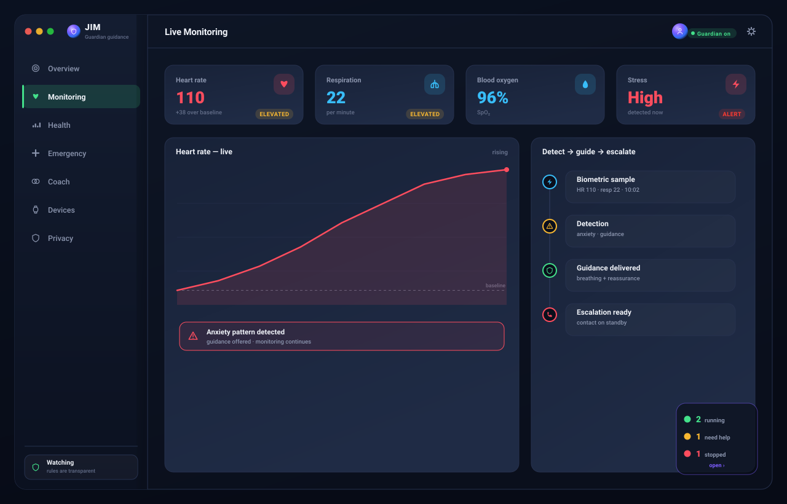</a><br><sub><b>02</b> · Live Monitoring</sub></td>
  </tr>
  <tr>
    <td align="center" width="50%"><a href="docs/desktop/03-health.svg">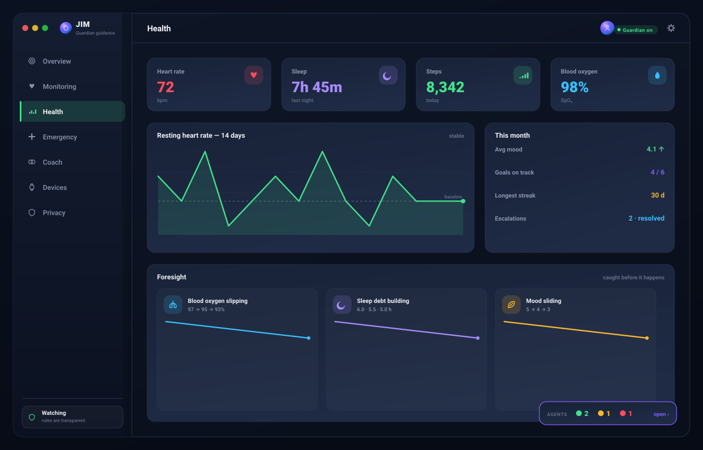</a><br><sub><b>03</b> · Health</sub></td>
    <td align="center" width="50%"><a href="docs/desktop/04-emergency-guardian.svg">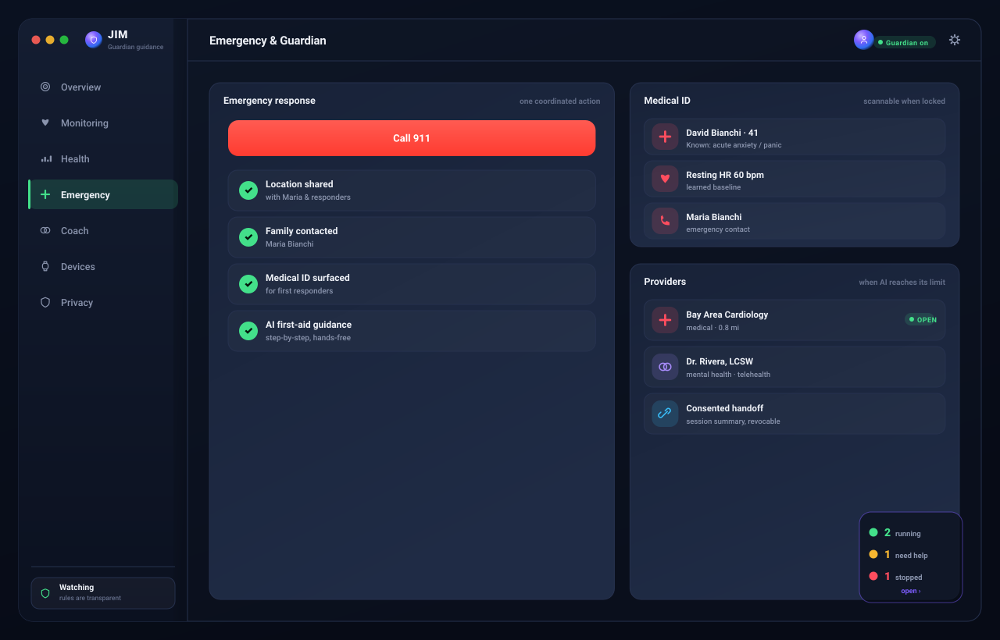</a><br><sub><b>04</b> · Emergency & Guardian</sub></td>
  </tr>
  <tr>
    <td align="center" width="50%"><a href="docs/desktop/05-coach-life.svg">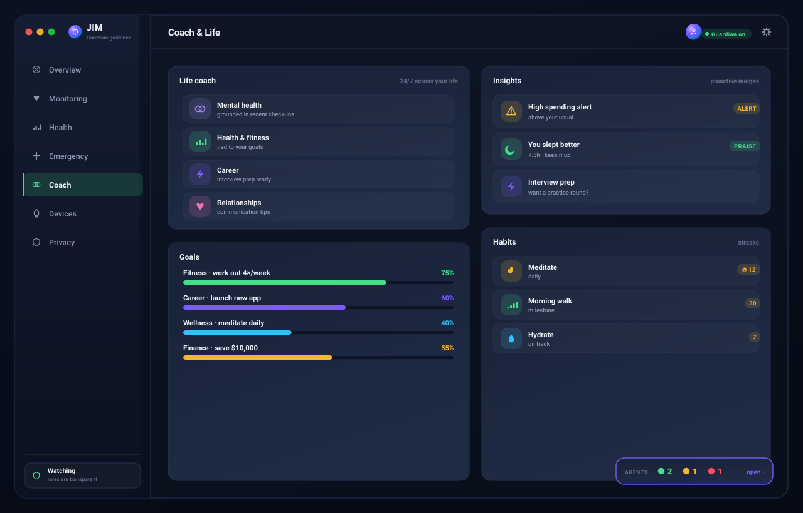</a><br><sub><b>05</b> · Coach & Life</sub></td>
    <td align="center" width="50%"><a href="docs/desktop/06-privacy-data.svg">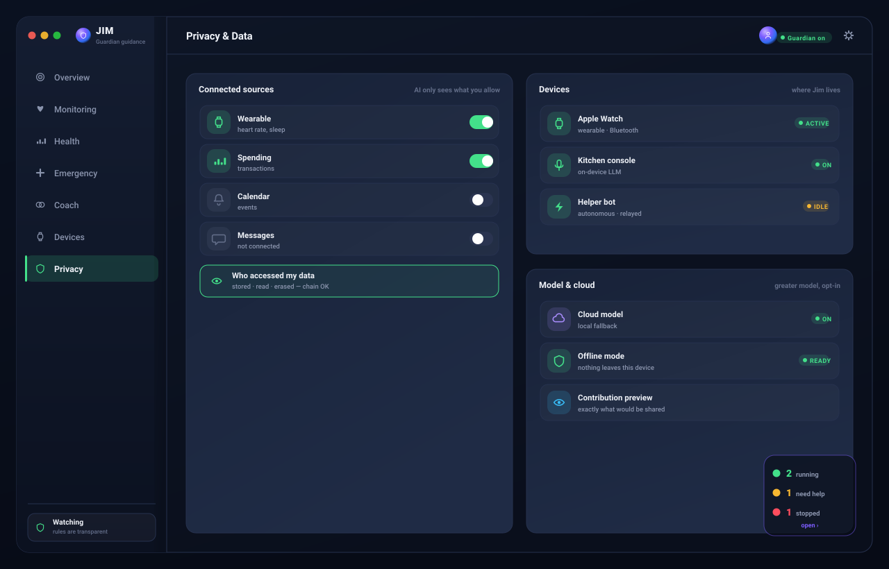</a><br><sub><b>06</b> · Privacy & Data</sub></td>
  </tr>
</table>

## App screens

The full illustrated tour — every phone screen and watch face, in order —
lives in **[docs/gallery.md](docs/gallery.md)**. Kept here: the door, the
conversation, and the voice.

<table>
  <tr>
    <td align="center" width="25%"><a href="docs/screens/01-welcome.svg"></a><br><sub><b>01</b> · Welcome</sub></td>
    <td align="center" width="25%"><a href="docs/screens/03-chat.svg"></a><br><sub><b>03</b> · Chat</sub></td>
    <td align="center" width="25%"><a href="docs/screens/04-voice.svg"></a><br><sub><b>04</b> · Voice — the listening orb</sub></td>
    <td align="center" width="25%"><a href="docs/watch/02-talk.svg"></a><br><sub><b>watch 02</b> · Talk, on the wrist</sub></td>
  </tr>
</table>

The first-run journey runs **01 Welcome → 42 Log In → 43 Permissions → 44 About You → 45 Emergency Contacts → 72 Pick a Plan → 73 Payment → 46 All Set**, landing on **78 You're on Free** — or **74 You're on Basic** if the plan step was paid — then hands off to the daily app and, at the other end, **41 End Session**.

## What's in the current release

The sections below describe every capability in detail. This is the short
version of how it got here — what each release actually added, newest first.
Full detail in [CHANGELOG.md](CHANGELOG.md).

| Release | What landed |
|---|---|
| **0.63.0** | **The imported link is visited, and the console fits the phone** — `POST /social/connection/{cid}/scrape` goes to the public address a collect connection has always carried and ingests what a browser would show anybody as a `social:<platform>` context event, the Guardian understanding more of the life it looks after; offline refuses before any socket opens, and the door opens from the console and all three shells. The field-reported layout defects — the screen that did not fit, the list that stuck halfway — trace to one root: grid items refusing to shrink; the tracks clamp now, the app height follows `100dvh`, and the sidebar scrolls on its own |
| **0.62.0** | **The phones reach parity with the console** — eleven rounds in one branch: every backend route now has a door on iOS, Android and Windows, the doorless ledgers closing at the four by-design rows; the voice pair lands on all three shells with the device's own voice as the fallback and the microphone asking before it listens; Android learns to say PATCH through the override the backend pins with a test; and the most-touched screens swap their English for the ten-language tables, the untranslated ratchet falling to 12/31/24 |
| **0.61.1** | **Ability is not a gate** — an accessibility statement with a door under it: the Accessibility screen reachable before enrollment (`#access`), three questions with no account, no token and no name (the table has no identity column to fill), sealed to the PDI vault and read only under the reviewer token, which fails closed beyond localhost. Signup opens for the beta behind a keyhole that stays. The known-gaps ledger opened at two rows and closes at zero — coach, specialist and check-in answers are announced to screen readers, the shells carry the per-need statement — every closure held by a test, and Terms 1.2 says only what is true |
| **0.61.0** | **The console the policy blanked** — jim-mini.com went live and served a dark, empty page: the nonce Content-Security-Policy meant for the server-rendered pages was stamped on the console bundle no nonce can reach. A policy of its own for `/app`, the bare domain now lands on the console, and the release-bodies sweep survives its first honest run — a script that could not parse, then a fetch that silently lost releases, both repaired and guarded |
| **0.60.9** | **No change to this product** — the release-body work ends: every inherited body rebuilt from its own CHANGELOG entry, the record at a ceiling of 0 with one release kept deliberately, and three checks that reported success while doing nothing fixed. Carried here to keep the three at one version |
| **0.60.8** | **No change to this product** -- carried from PDI's round: a release checklist naming every version field, byte-identical in all three, and the deletion of `RELEASE_NOTES.md` after 412 of 530 releases proved to carry one frozen v0.24.0 body. A reader replaces the writer. Carried here to keep the three at one version |
| **0.60.7** | **No change to this product** — PDI's console round: a screen that imports the translator is not a translated screen. Two of its screens sat on the finished side of the ledger for twelve releases holding fifteen English strings; a guard now names that state on the round it happens. 91 → 32. Carried here to keep the three at one version |
| **0.60.6** | **No change to this product** — PDI's console round (Positions and Bridges, 154 → 168 → 91). Carried here to keep the three at one version. Its reader asked for a letter-space-letter and so could not see `Role &amp; industry`; this product's console reader records strings verbatim rather than counting phrases, so it has no such test to be wrong about — checked, not assumed |
| **0.60.5** | **No change to this product** — PDI's console round (225 → 154). Carried here to keep the three at one version. Its one portable lesson: two guards that greped their screens for English went red when the screens were localized, and now follow the key to the table instead |
| **0.60.4** | **The reader this product already had turned out to be the one that was right** — no change here. PDI's console was read by the regex shape this product abandoned rounds ago, and it was missing a quarter of the English. Two suites can carry the same guard by name and not by reach |
| **0.60.3** | **A check that cannot fail before the merge is not a check** — `ci.yml` carried the same blind trigger `native.yml` did, and had been red for 29 runs on four guards that shell out to the JSX-text extractor: the job running pytest installed no node dependencies, so they failed on the runner and passed everywhere else. Trigger fixed, dependencies installed, and a guard that reads the triggers themselves |
| **0.60.2** | **The compiler was in the room the whole time and nothing listened** — the native workflow fires on any branch push now. Five call sites parsed a `JSONObject` that was already a `JSONObject`, four `L10n` rows had lost their key line, `L10n.fill` did not exist here, and `AppState` carried `private set` twice |
| **0.60.1** | **A fix to the cascade fixes the next erase, not the last one** — every account erased before 0.59.9 left 43 tables standing, and they are still there: the medicine cabinet, the money mandates, the clinical captures. `python -m jim.orphans` is the reach-back, dry by default. Plus **the exit reaches the phones** — 0.60.0 let a phone-only person take their data and not end it — and the Windows shell's `SelfProfilePage`, which had never compiled: 38 reaches for members `AppState` does not have |
| **0.60.0** | **An export is measured against the schema too** — this product had **no export at all**. It keeps a medicine cabinet, a money guardian's accounts and mandates, clinical captures and a journal, and offered its owner a way to erase all of it and no way to take it, while the suite's Article 20 bundle listed its contribution as a progress report. `GET /data/{user_id}` now answers, derived from the schema, with live credentials dropped per column by rule |
| **0.59.9** | **An erase is measured against the schema, not a list somebody wrote** — `delete_user_data` says *erase every trace of a user across all tables*. It named 21; the schema has **63** with a `user_id` column, so 43 survived — the money guardian's accounts and mandates, the medicine cabinet and every dose logged from it, the clinical captures, and `crash_watches` and `vigils`, which are standing permissions to act for somebody the API answers 404 for |
| **0.59.8** | **The check that covered one client of four** — 0.59.7 asked whether the shape a screen declares is the shape its route answers with, and asked it of the console alone. The three shells decode the same answers into their own types, and a wrong one there throws the same way. Extended to all four clients (console 245 · iOS 89 · **Android 3** · Windows 88); no disagreements, and the reach is now a record that cannot go down, because a reader that stops matching reports agreement |
| **0.59.7** | **`req<T>` is a cast, and a cast is a claim nothing checks** — `GET /users/{uid}/referral/clinicians` answers an object; the console declared `Row[]` and the Attending screen called `.map` on it, throwing during render the moment anybody pressed *who would this reach*. The `reason` the backend composes for an empty list — *no clinician registered* — had never been shown to anybody, because the screen threw before reaching it. Fixed, and shown |
| **0.59.6** | **The clients agreed with each other and were all wrong** — parity between clients is a relative check, and a relative check is satisfied by everybody being equally wrong. Next door a vault under customer custody required `x-tenant-key` on every record route and no client sent it, so pressing *hold our own key* locked all four clients out — including out of the button that undoes it. The new guard reads the requirement out of the **application's** dependency tree, then asks each client only about the routes it actually calls |
| **0.59.5** | **The third sink, where both the escaping and the policy miss** — `_js` here was bare `json.dumps`, which escapes what ends a JavaScript *string* and says nothing about `</script`, which ends the *element*. QRME had it right. Fixed, and the script's translated string table went the same way. All three now share one primitive, verified by behaviour rather than trusted by name — the guard's first draft whitelisted a helper that was itself unsafe. Consoles swept and clean |
| **0.59.4** | **The sweep that found the last one, kept** — 0.59.3 found reflected XSS by walking every f-string that builds markup, by hand, once, and throwing the walk away. It is now a guard with a ratcheted record: **3 rows**, all pre-escaped composites the analysis cannot follow. It follows escaping through single assignments and helper returns, and refuses to read prose containing angle brackets as a page. `<html lang=…>` and the policy nonce are now escaped too |
| **0.59.3** | **Reflected cross-site scripting on the sign-in callback** — `?error=<script>…` came back as live markup on a page served from this origin, and every HTML page a stranger reaches carried no `Content-Security-Policy`, no `nosniff`, no frame or referrer policy. Escaped at the interpolation, and `pagehead.py` now stamps a per-response nonce the policy names, so an injected tag has none and does not run |
| **0.59.2** | **A crash the browser threw away** — an unhandled 500 is rendered by Starlette *outside* every middleware the app adds, including CORS, so it went back with no `access-control-allow-origin` and the browser discarded it whole. Every crash reached its user as "Failed to fetch", indistinguishable from a backend that is not running. No in-process test could see it: a `TestClient` sends no `Origin` and applies no browser rule. Fixed with a catch-all inside the CORS layer, and guarded by a file that boots a real server |
| **0.59.1** | **Three suites, and nothing comparing what they ask** — every guard here exists in three copies and the copies drift silently. A sweep of test-function names found 370 carried by all three and 140 by exactly two; 16 of those are absent from this product. Four were one defect in PDI, whose `serve` never opened CORS for its own console. The shared vocabulary and the divergences are now written down, byte-identical in all three repos |
| **0.59.0** | **A floor nobody raised** — every floor in the suite swept against what it measures. 69 carried their own literal; l10n sat at 10 against 279–312 and path literals at 40 against 466. The console's `> 200` **passed**, at four-fifths — the identical literal is at 0.47 in QRME, because one number written for three repositories is calibrated for whichever was smallest. `ratchets.py` gives each floor a measurement; the rest are a backlog that only shrinks |
| **0.58.9** | **Ten against two hundred and seventy-nine** — the L10n guard's floor has not moved since it was written: ten localizer calls, twenty table rows, against tables that now hold 286–312 rows. Narrowing the call pattern to `L10n.t("…")` blinds C# alone — Windows 279 → 4 — and the dead-row path notices only the six rows in that shell without a dot in them. Per-shell floors on both halves, plus a spread across the three ports that needs no hand-chosen number |
| **0.58.8** | **The route reader had one floor and four clients** — six files ask `clientpaths` what each client calls, so a reader read short narrows all of them at once, in the safe direction. An absolute floor per client and a spread check across the three shells, with this product's own measured numbers; the console sits outside the spread because its 251 call sites against 114 per phone are a real difference in surface |
| **0.58.7** | **A wire model is data, and data has no methods** — a pin whose reader goes blind reads an empty model, and an empty set is a subset of anything; every pin now asserts on both ends, and three checks audit the readers. Clean here; the finding was QRME's missing brace, which put ninety-five client methods inside a wire model |
| **0.58.6** | **The refusal surfaces** — the pinned table grows to *did the guidance work, and what was done when it did not*, and the reader learns to read a `SELECT` column list so `{**dict(r)}` rows can be pinned at all. Clean here; the trap was the guard's own, in a sibling repo, where a one-line struct read as empty and its pin had been checking nothing |
| **0.58.5** | **The disclosure that showed nobody** — the pinned table grows to the surface rule that decides whether a health beat is spoken into a room other people are in, and the Kotlin half is no longer empty: a list built by appending is read now rather than guessed. Clean here; the finding was QRME's live-microphone disclosure, blank on all three clients |
| **0.58.4** | **The key was right and the shape was wrong** — a per-route key check is not derivable by reading; what shipped instead pins a shell model to the backend function whose `return` is its contract, inferring nothing. Clean here; the finding was QRME's guided tour, blank on both phones and correct on Windows |
| **0.58.3** | **The key the server never sends** — every key a shell decodes is now read against everything this backend can put on a response, with a named exemption for the eight that arrive verbatim from PDI and QRME. Clean here; the finding was next door, where Sign in with Google and Apple could not start on either phone |
| **0.58.2** | **The colour that wasn't in the palette** — 0.58.1 checked the one receiver whose type is known for free; this checks all eight, adding the API client, the theme object and `App.xaml`'s brushes. Clean here across 108 client call sites and the whole palette; the finding was QRME's Android theme, and this product gets the check because the next one could be here |
| **0.58.1** | **The member that isn't there** — `AppState` holds `uid` and `token`, and four iPhone screens asked it for `userId` and `userToken`; two more reached `state.api` on an object with no client at all. Thirty-eight call sites across continuity, presence, safety and the synthetic self — the crisis half of the product — none of which compile, all of them in `main`. A guard now reads every member the screens reach for against the one file that declares them |
| **0.58.0** | **The key the phones never carried** — `x-llm-api-key`, the person's own model key, has been in the console since 0.4.3 and in no shell. A key set on the desktop ran the desktop and the phone quietly ran the deployment's. All three shells now hold one, offer a field for it, and send it; and a check reads the console's own helper so the next header cannot stay console-only |
| **0.57.9** | The language guard could say *the header is set with the resolver* and could not say *every request carries it* — and here 15 of 16 Windows sends, 1 of 2 on iOS and 4 of 5 on Android went round the shared helper entirely. One dispatcher per shell, and the check now walks dispatch sites |
| **0.57.8** | The untranslated-literal guard finally lands here — written in QRME at 0.54.0 and never ported, so this class of defect went unmeasured for four releases. Thirty sites on the first run: `Check-in` and `Language` as headings on all three shells, *Your name* and *What's on your mind?* on the desktop, and three Windows pages that had no `Localize()` at all. The other fifteen are wire values and are recorded with the reason |
| **0.57.7** | The version a person installs. Nine declarations across the three products said `0.1.0` or nothing at all while the release said `0.57.6` — the App Store version, the Play listing, and the version Windows shows in a file's Properties. A guard reads all three build files against `pyproject.toml`, derives the Android `versionCode` rather than keeping it by hand, and checks that every gated platform API a shell calls has its declaration |
| **0.57.6** | The parse check reaches the XAML the Windows shell's screens are actually written in. Three pages here carried `x:Name` twice on one element — a custody note, a sealed badge and an alarm button — which stops the build at the tag. Four markup checks, all of them things the XAML compiler refuses outright |
| **0.57.5** | The shells get a parse check — duplicate declarations in one scope, and braces that do not balance — after QRME shipped a Swift compile error no text-reading guard could see. Clean here; three injected defects confirm it can fail |
| **0.57.4** | Nothing to collect here — QRME's shells needed six inputs its screens never asked for; this product's were already correct, and the request-body guard stays green at a ceiling of zero. Cut with the others |
| **0.57.3** | Request bodies get the guard on all three native shells, each with its own extractor — 55 writes per client, 47 matched to a model, nothing wrong. QRME found seven in the same sweep; three injected defects confirm this guard can still fail |
| **0.57.2** | Request bodies get the guard responses have had since 0.56.4, and it found the monitor route discarding readings: `stress_level` was on no model while all four clients sent it, and the console called breathing `respiration` where the model says `respiratory_rate`. Both dropped silently by Pydantic — a health guardian collecting a vital sign and throwing it away |
| **0.57.1** | The console gets the shape guard the native clients have had since 0.56.4. Two defects, both of which rendered: a privacy disclosure whose field names ran together into one word, and a contribution count that printed the payloads instead of counting them |
| **0.57.0** | The Kotlin guard arrives, and the reason it was absent was a required `JSONObject(` wrapper this client does not use — its `request` returns one already. Twelve of forty-two GETs were being read, and twelve looked like all there were. Now 44 routes and 161 keys, 32 driven; six states recorded, the same six the Swift guard found from the other side |
| **0.56.9** | QRME found eight wrong reads in its Kotlin client, all already fixed in its C#. The guard is not here yet: ported across, its extractor found zero routes — this client calls the backend in a different shape, and lowering the threshold until it passed would ship a guard that asserts on nothing |
| **0.56.8** | The shape guard reads Swift now as well as C# — QRME's iOS client was carrying nine fictions already fixed on its Windows side. This client came back clean; 22 conditional fields recorded with the history that produces them |
| **0.56.7** | The shape guard now checks that a declared type can decode what arrives, not just that the name is there — QRME's `/wearables` sent a map where the record said `string[]`. Five live crashes found there; none here |
| **0.56.6** | **Eight watch faces that were not on the page** — reported from a phone. An HTML table is as wide as its longest row, so one `<tr>` with fifteen cells beside rows of three left twelve blank columns everywhere and clipped the rest off a phone. Every gallery is a uniform grid now — four across for screens and watch faces, two for desktop frames — with a guard that reads the widest row, not the first |
| **0.56.5** | QRME's shape guard is here now, driving every client binding against a live app — this client came out clean. It arms the crash watch and builds an adaptation profile first, because twelve fields only exist once the feature is on |
| **0.56.4** | Cut together at one version; QRME found fourteen client records declaring fields their routes have never sent, and a guard that drives every binding to check. That guard is not in this repo yet — next round's work, named here |
| **0.56.3** | Cut together at one version; QRME's collision record falls 28 → 24 — three counts that shared a name with the boolean they counted, and one client bug wearing the same disguise |
| **0.56.2** | **One name, three meanings** — `spoken` was the CPR steps, the model's rewritten line and a said-aloud boolean at once; Windows had forked it into three records and TypeScript could not, so `tsc` had been failing on `main` and no suite ran `tsc`. Each meaning has its own name now, and both the compiler and a wire-name guard are in the suite |
| **0.56.1** | **A model that is actually trained** — `adaptation.py` built a profile and said plainly it was not a weight file; this trains one, by gradient descent, from this user's own answered follow-ups, with the network blocked for the duration. Training and using stay two decisions |
| **0.56.0** | Cut together at one version; QRME can now hand this product a door, carrying two counts and a window and nothing anybody wrote |
| **0.55.0** | Cut together at one version; the field-label record's rule now reads the screens — nineteen fields here are bound to a form and sent, and all nineteen already carry a label |
| **0.54.1** | Cut together at one version; QRME sorted label from value across twenty-four rows — what a person reads and what a machine matches on are different strings |
| **0.54.0** | Cut together at one version; the round closes two screens that said less than their siblings — including a privacy promise only Android readers were given |
| **0.53.1** | Cut together at one version; last round's audit carried into QRME and PDI, which had been resting on the same circular reads. Neither leaked |
| **0.53.0** | **The posture is stated, and nothing was keeping it** — the guards read literals back out of the dict that hardcodes them. Now checked from outside by snapshotting every table. The promises held; one sentence was wider than the truth, and the block now names what it keeps |
| **0.52.0** | **What the room hears** — on a speaker, glasses or AR a vital, condition, medication, money, journal or crisis is held back and shown instead, decided on the server before anything is synthesised. Plus `/due`: the one question a device on a timer has to know how to ask |
| **0.51.0** | **How it carries itself** — companion by default, professional on request or just by saying so. A register and never a capability: the same six areas watched and every safety path identical in both. Plus a company beat that wants nothing, and a lonely run whose beat points at people |
| **0.50.0** | **The coach that speaks first** — a presence in the parts of a companion worth having: it starts things, notices from six areas of your own history, and says why. Decided entirely offline; a model may only reword it. What it will not be is on the wire — not your partner, no body, never the only one |
| **0.49.0** | **The Feed tab is a door, not a copy** — QRME's public stream shown here one card at a time, GET-only by construction: no write route, no binding, and `plays`/`entering`/`ringing` passed through whole rather than recomputed. Nothing about what was watched is stored on this side |
| **0.48.3** | Cut together at one version; the round's work is PDI's console — Custody and Continuity, 229 → 177 |
| **0.48.2** | Three rows where the shells disagreed with each other, every one a noun against a verb — *Translate* was 翻訳 on the iPhone and 翻訳する on the other two |
| **0.48.1** | The desktop and the phone asked *are you okay?* two different ways in French — the alarm surface reconciled across the two tables, 25 → 1 |
| **0.48.0** | Six duplicate wordings and all six drifted — *Live Monitoring* lost the word *live* in nine languages, and a medication was labelled 姓名 |
| **0.47.9** | Cut together at one version; the shared guard gains `_ARRAY`, the Swift twin of the `listOf` shape |
| **0.47.8** | Cut together with the other two at one version; the round's work is PDI's Transfers screen |
| **0.47.7** | **The medical card, on the two shells last round did not reach** — `row`, `rating`, `slider` and `answerButton` on the iPhone, and the desktop's resuscitation confirmation and waiver verdicts, all set by assignment in the code-behind |
| **0.47.6** | **Nine English buttons on the resuscitation screen** — `RobotAction("Start CPR (pre-authorized)")` and its eight neighbours were invisible to a rule that only read `Text(`; plus the welcome screen finally opens in the device's language |
| **0.47.5** | The dead-key guard written here is now in QRME and PDI too — it found three Android screen headings in QRME rendering their own key names |
| **0.47.4** | **The first screen, in the reader's language** — Overview was English on all three shells, and the Care/Life/Safety strips rendered an `enum Tab: String`'s raw values where no pattern looks; also three names for one screen, now taken from `tab.monitor` through a hole so they cannot drift (229 → 150) |
| **0.47.3** | **The link a guardian could begin and not end** — only iOS could close a guardian's oversight window; Android and Windows now have the control, the confirmation and the sentence about what unlinking does not delete. Plus the fourth extractor blind spot: six routes with working Android doors were sitting on the doorless backlog |
| **0.47.2** | **Family and Connect, on all three shells** — the sentence saying the auto-defib waiver can never be signed for a minor was English everywhere, the oversight scope printed the API's own `full`/`alerts_only` on two shells, and the three promises on Connect were arguments to a helper no ratchet could see (386 → 229); plus the PaneFooter sign-out fix QRME made two releases ago |
| **0.47.1** | **The alarm was localized where it speaks, not where you start it** — the fourteen carved-out `alarm.*` rows cover what the alarm says, and not *"Tap for emergency"*, *"Arm the crash watch"* or the autonomous-resuscitation waiver, because the count they were chosen from could not see a string picked by a ternary; the whole safety surface now localized on all three shells (538 → 386) |
| **0.47.0** | Version alignment with QRME's native round |
| **0.46.9** | Version alignment with QRME's native round |
| **0.46.8** | Version alignment with QRME's native round |
| **0.46.7** | Version alignment with QRME's native round |
| **0.46.6** | Version alignment with QRME's native round |
| **0.46.5** | Version alignment with QRME's native round |
| **0.46.4** | The voice picker's label reaches the refusal that names it — field-label record 100 → 99 |
| **0.46.3** | Version alignment with QRME's console round |
| **0.46.2** | Version alignment with QRME's console round |
| **0.46.1** | Version alignment with QRME's console round |
| **0.46.0** | Version alignment with QRME's console round |
| **0.45.9** | Version alignment with QRME's console round |
| **0.45.8** | Version alignment with QRME's console round |
| **0.45.7** | Version alignment with QRME's console round |
| **0.45.6** | Version alignment with QRME's lobby, presence and voice round |
| **0.45.5** | Version alignment with QRME's objection, live and marketplace round |
| **0.45.4** | Version alignment with QRME's watch-party, delegation and beacon round |
| **0.45.3** | Version alignment with QRME's succession, signing and placement round |
| **0.45.2** | Version alignment with QRME's three-screen localization round |
| **0.45.1** | **The console speaks ten languages, all of it** — the last nine screens localized; **the console-untranslated record runs to zero** (129 → 0) and the emptiness is pinned by test |
| **0.45.0** | **Three screens, and the record falls to 129** — What's held, Who you watch and Care Team fully localized (console-untranslated 206 → 129) |
| **0.44.9** | **The cabinet and the guided hour speak the visitor's language** — Medications and Wellness fully localized (console-untranslated 262 → 206) |
| **0.44.8** | **The Control Center speaks** — the Settings screen fully localized, the largest single block on the record (console-untranslated 373 → 262) |
| **0.44.7** | **The bearing speaks the visitor's language** — the Bearing screen fully localized (console-untranslated 426 → 373) |
| **0.44.6** | **What reaches out speaks the visitor's language** — the Reach screen fully localized (console-untranslated 481 → 426) |
| **0.44.5** | **The baseline speaks the visitor's language** — the Baseline screen fully localized (console-untranslated 531 → 481) |
| **0.44.4** | **The attending speak the visitor's language** — the Attending screen fully localized (console-untranslated 573 → 531) |
| **0.44.3** | **The channel speaks the visitor's language** — the Channel & camera screen fully localized (console-untranslated 603 → 573) |
| **0.44.2** | Version alignment with QRME's last-doors round (the doorless records run to zero on all three shells) |
| **0.44.1** | Version alignment with QRME's sticker/queue/stamp round (beacons, moderation, reviews, watermarks, media, wearables on the phones) |
| **0.44.0** | Version alignment with QRME's keys/till/lifeline round (accounts, money, status+help on the phones) |
| **0.43.9** | Version alignment with QRME's face round (portrait, badge, page, surfaces, bodies, dials, wrist on the phones) |
| **0.43.8** | **The watch you actually wear** — the setup card asks what you wear (Apple Watch, Wear OS, Fitbit, Garmin) and teaches that; the seed reads Fitbit Takeout exports; the devices card pairs over Bluetooth and knows speakers, glasses, AR/VR headsets and spatial displays |
| **0.43.7** | Version alignment with QRME's record/veil/exit round |
| **0.43.6** | Version alignment with QRME's workshop round |
| **0.43.5** | Version alignment with QRME's seal/mail/screen round |
| **0.43.4** | Version alignment with QRME's body/case/lobby round |
| **0.43.3** | Version alignment with QRME's place/camera/organization/tour round |
| **0.43.2** | Version alignment with QRME's crowd/couch/loan round |
| **0.43.1** | Version alignment with the QRME inbox round — JIM's own answer to the question is its existing insight ladder |
| **0.43.0** | **Version alignment** — QRME's phones learned to do business; 139 doorless rows struck there, nothing changed here |
| **0.42.9** | **Version alignment** — QRME's social surface reached its phones; nothing changed on this side |
| **0.42.8** | **The record said nobody asks; the forms had started asking** — 54 of 154 recorded fields were bound to real console inputs; all now labelled in ten languages, 100 rows remain that match the record's own rule; the console gained QRME's always-on lights widget — the Guardian's watches at a glance, never silently absent |
| **0.42.7** | **The circle is yours** — `jim/circle.py`: contacts by mutual invitation (either side ends it for both), messages that never leave the deployment, per-user switches that refuse by name, and a homepage sandbox shown to signed-in neighbours only. Doors on all four clients |
| **0.42.6** | **Booking, scheduling, ordering and email** — `jim/schedule.py`: bookings that cancel in one press (a service booking rides the shop order with it), reminders on the ladder's bottom rung raised by the existing senses, and opt-in email that goes to the account's own verified address or nowhere. Doors on all four clients, and the shopping routes gained their promised native doors |
| **0.42.5** | **Shopping through the tandem** — browse QRME's shops anonymously, order as your own interactor (one identity to revoke), keep the receipts in JIM — with a test proving QRME is never asked what you bought. Labels ride the view in the reader's language; the Community screen gains the shelf |
| **0.42.4** | **The money guardian reaches the phones** — 0.42.2's five money routes had honest doorless records on all three native shells; now each shell's Life surface carries the Money panel: vault-or-refused account registration, balance observations with warnings and doors, the savings goal, and the mandate with its never-gated revoke. All strings are the server's own labels, so the English-behind-the-tabs ratchet did not move; each doorless record fell by five |
| **0.42.3** | **The last thirteen unaudited screens** — six JIM components sat `unaudited` since the manifest was seeded. Four were only unlabelled (Meds→85, PaceCue→14, Onboarding→40+42, ProviderTiles→83 — the tile picker, not the human-providers screen); two had never been drawn: **102 Safety**, the answering end of the crash watch, and **103 Wellness**, the three generators. Ceilings at zero, `undrawn=0` true at last |
| **0.42.2** | **The Guardian watched spending and could not hold the money** — `jim/money.py`: accounts whose numbers live only in the vault (refused without one), balance observations that warn at `checkin` severity through the existing proactive ladder in the reader's language, savings goals, a written Pro-gated revocable investing mandate whose orders are logged proposals, and warnings that carry their doors — coach, tandem specialist, real desks. `docs/proactive.md` names every proactive path |
| **0.42.1** | **Version alignment** — QRME's 34 starters each gained a dossier (knowledge, skills, connections), so specialists reached through the tandem answer for their own trade; no JIM code changed |
| **0.42.0** | **The device's confession was stripped at the door** — `signal.py` folds a wearable's own signal-quality report into every grade, and `BiometricSample` never declared the field, so pydantic dropped it and an SpO2 read through a flapping strap arrived at full confidence. Declared and bounded now, with the defect's exact shape driven in tests. The Settings contribution card also now shows the `preview_next` payload verbatim |
| **0.41.0** | **The workflow round-trips and nothing walked the whole arc** — `workflows.py` names three properties a delegated multi-phase goal has to keep, each unit-tested on its own side of the wire; the one check that boots all three products drove a single exchange and stopped, never calling `start_workflow`, `advance` or `specialist_tasks` across the boundary. Driving it surfaced the Pro gate and the owner's opt-in as steps rather than surprises, and the arc now walks research → draft → send and pauses at `confirm` |
| **0.40.9** | **The README said v0.18.0** — the first bold line of every README named a release twenty-two cuts old, on the line directly above one promising the three products are versioned and cut together; the history table underneath stopped at 0.30.6, leaving seventeen shipped releases in the changelog and off the page anybody reads. Both are now checked against `pyproject.toml` and the changelog |
| **0.40.8** | **The refusal named the field the API calls it** — An earlier round took the 422 from `[{"type":"missing",...}]` to one sentence a person can read, in their own language. |
| **0.40.7** | **The record that outlived the code** — `public_untranslated.txt` opened with a paragraph explaining that `Onboarding.tsx` — the screen every person in the world meets first — carried forty-odd English strings, that translating them was "its own round", and that a half-translated sign-up form would be worse than an English one. |
| **0.40.6** | **Cut alongside qrme and pdi** — No change in this product. The round finishes localizing QRME's **accountless screen** — the one built for somebody who has found a synthetic profile of themselves and has no account, and therefore no profile language to take a setting from. |
| **0.40.5** | **The account was gone and the wrist kept writing** — `life.delete_user_data` opens with *"Erase every trace of a user across all tables — and the PDI vault."* It empties the vault, walks eighteen tables and removes the `users` row last, and the API answers 404 for that id afterwards. |
| **0.40.4** | **Cut alongside qrme and pdi** — No change in this product. The round is about a synthetic profile of a person who has died, or whose subject is contesting that it should exist — states QRME has and this product does not: a Guardian belongs to the living person using it, and there is no third party for it to speak as. |
| **0.40.3** | **One wrapper recorded its degrades; its sibling said nothing** — `llm.FallbackProvider` is where this rule is written down in this codebase, and it is exemplary: `cloud.CloudProvider` degrades to the same local stub and did none of it: a bare `except Exception:`, no record, and — unlike its sibling — not even a log line. |
| **0.40.2** | **The refusals, finished** — 0.24.0 translated the eleven refusals any route can raise and **wrote the rest down**. |
| **0.40.1** | **The language no client was sending** — JIM's public surface answers people who have no account yet, and those handlers compose real sentences: what was sent, what is held, what to do next. |
| **0.40.0** | **A specialist could be reached by a sensor and not by a person** — `grep -c specialist jim/coach.py` returned **0**. |
| **0.30.9** | **The user-specific model was correct, tested, and never computed** — `jim/adaptation.py` implements clause 11 — a profile derived offline from a person's own stored history, versioned, confidence-scored, sealed into the vault when a tandem is configured. |
| **0.30.8** | **The tab bar answers in your language. Everything behind it does not.** — The QRME repo has carried a guard since the console rounds called `test_the_nav_is_translated_and_nothing_behind_it_is.py`. |
| **0.30.7** | **The screen nothing opens** — Last release put the synthetic-self screen on the phones — the one QRME profile that *is* this person, where they say what the Guardian may pass on about their medication. |
| **0.29.0** | **The frame around both** — The nav is the console's own surface: the phones carry ten languages, the server answers in the reader's, and the frame around both was English whatever anybody chose. |
| **0.28.0** | **The console gets a language, and a tripwire fires exactly as designed** — Last release measured the gap: JIM's native shells carry ten-language `L10n` tables and the desktop console had none at all. |
| **0.27.0** | **The console speaks one language. Its own phones speak ten.** — JIM's native shells each carry an `L10n` table in ten languages, and a round two releases ago gave all three a `deviceLanguage` resolver so the accountless screen could use it. |
| **0.26.0** | **Three copies of one guard, three different blind spots** — `clientpaths.py` says of itself, in its own docstring, that it is *byte- identical in qrme, jim-mini and pdi*. |
| **0.25.0** | **0.25.0** — Aligned with QRME 0.25.0. The three products carry one version, so a release that only moves in one of them still moves in all three — otherwise a support question about "0.25" has three different answers depending on which app is being asked about. |
| **0.30.6** | **The plan gate speaks the reader's language** — the one refusal the record refused to half-do, because translating its frame around English prose slots would have produced a sentence half in each language at the moment somebody decides whether to pay. Six capability descriptions and the billing period are a closed set this product authors, so they translate; the plan titles deliberately do not. The emergency clause is part of the frame rather than appended to it — a person told they cannot have the trend model needs to know the alarm still works, in their own language |
| **0.30.5** | **The plan gate said HTTP 402** — `detail` is a string for most refusals, a dict for the plan gate and a list for a 422, and only the list had been given a top-level `message`. The three shells look for that key and then for a string `detail`; a dict is neither, so the plan gate rendered as a bare status code. Underneath it, `localize_detail` looked one level down while the handler wraps structured refusals two levels down — that sentence had been going out untranslated in every language |
| **0.30.4** | **A refusal whose English is not a constant** — f-string refusals had been named as uncovered for three releases, because a sentence built by interpolation has no English source to key on at the moment it is raised. `i18n.Templated` carries the template and its slots beside the finished English text; 7 converted. The slot is the whole design: whitespace means prose, and a prose slot keeps the entire refusal English rather than producing a sentence half in each language |
| **0.30.3** | **The refusal that arrived as a list** — a 422's `detail` is pydantic's rows, not a string, and all four client families rendered it by a path written for one: the console and Android printed the raw JSON under the form, iOS and Windows threw it away for `HTTP 422`. The sentence translated last release was correct, arrived, and was read by nobody — two of the four showed *less* than before the language work started. The server composes one sentence now; the guard took three attempts, and the first two passed on code that was fully broken |
| **0.30.2** | **The synthetic self** — QRME has a profile that *is* you, and JIM had no column, module or route that knew it existed; every link between the products reached somebody else's profile and the JIM user met QRME as a stranger. The boundary went into `docs/tandem.md` before the code: an owner token, `kind == "self"` or refused, an enumerated allowlist consented per category and empty by default, and the preview *is* the payload. Then the three native screens turned out to be asking a localizer that had never heard of them — a green suite and `self.title` rendered as a heading |
| **0.30.1** | **The refusal that handed the body back** — a 422 went out past all nine exception handlers carrying pydantic's `input` key, which on a missing field is the whole submitted body: a journal entry about chest pain, handed back by a product whose error design exists so that content never travels. Closed, with a canary posted at every body-taking route rather than a check for the key's name. And the synthetic self enters the tandem contract — the boundary written before the code that will obey it |
| **0.30.0** | **Safety text is never machine-mangled; it was never translated either** — the playbooks, pace cues and waiver terms are hand-translated into ten languages and every sentence the Guardian says when it refuses was English, including all of the medication cabinet, the vigil, the crash watch and the watch bridge. One handler would have been the wrong fix and would have passed: there were nine, eight of them per-domain with their own responses. All nine go through one place now, and a guard reads `api.py`'s own AST to fail the next one that does not |
| **0.24.0** | **The page was translated; the answer to the button was not** — a Spanish finder read a Spanish page, pressed a Spanish button, and was told in English that this page cannot call anyone and they have to. Five more strings had never gone through `tr` at all, including the greeting whenever a beacon carries a name and both feet. The Medical ID stays untranslated on purpose. A header refusing Arabic was answered in Arabic; one conformance table now holds all three products to the same reading |
| **0.23.0** | **The ninety seconds belonged to somebody who could not reach them** — `guidance` says its caller is *the person standing over a colleague, who has no account*, and its only door was inside a signed-in Guardian screen. It is now on the scanned beacon page itself, offered whether or not the Medical ID opened, because a minor's beacon opens no clinical stage and the person kneeling needs it most. That page also speaks the finder's language now, from their own browser — forty-seven strings, hand-translated, in all ten. And a guardian's phone can unlink a child it linked |
| **0.22.0** | **Cut with the siblings** — the console backlog run to zero alongside QRME's audit, and the fixes the audit turned up on the way |
| **0.21.0** | **Cut with the siblings** — four door-audit rounds across the three products, and the defects found behind the doors they built |
| **0.20.1** | **The union hid a surface** — *some* client reaching a route was being counted as *this* client reaching it, so the console's own gaps were invisible. A guard per client, and the console doors that answered it |
| **0.20.0** | **Failures from the phone and the desktop shell** — error capture reaches the native shells, and a guard that invented work is corrected: it demanded doors for routes that already had them |
| **0.19.1** | **Cut with the siblings** — the drawings and lessons the error-reporting surface shipped without |
| **0.19.0** | **It can tell you it broke without telling anybody what you said** — content-free error capture in the console and on every native shell, sent to a collector that never receives a word of your content |
| **0.18.0** | **The rest of what JIM knew, on every shell and finally drawn** — the effectiveness loop, the adaptation profile and the anonymity posture reach iOS/Android/Windows, with screens and lessons for all four new doors |
| **0.17.0** | **The community door opens on every shell** — the QRME bridge on iOS/Android/Windows, plus the adaptation profile and anonymity posture given screens |
| **0.16.0** | **The loop closes** — did the counseling work, a user-specific model sealed in the vault, the attach bracket, anonymous by choice, pace cue, budgets, stress, knowledge pack |
| **0.15.0** | **Guided wellness** — calm protocols, workout plans, meal plans, nutrition Coach area, the Wellness tab |
| **0.14.5** | **A fall reaches the Guardian** — the drip carries fall events, the crash watch on iOS/Android/Windows, screens 87–88 + lessons + dock face, the campaign masthead |
| **0.14.4** | **The crash watch** — unanswered "are you okay?" summons pre-programmed help; plus the Journal tab (typed or spoken), the voice orb, the help box, and the version-mismatch banner |
| **0.14.3** | **Docs binding pass** — every README held to the same closing convention, test-enforced |
| **0.14.2** | **Cut with the siblings** — the tandem contract documents suite mode; QRME's gateway seals coordinations again |
| **0.14.1** | **The coach knows a care plan landed** — one context line, the goal, never the plan text |
| **0.14.0** | **Home and the pane learn the care team** — Overview buttons + a careteam pane face (plan waiting, never the plan) |
| **0.13.1** | **Cut with the siblings** — docs caught up; QRME demo org + hardening |
| **0.13.0** | **The care team is an organization** — link your QRME org, and when a drift crossing arrives while doses slip, the Guardian coordinates the whole team into one joint plan (screen 86) |
| **0.12.0** | **Cut with the siblings** — no functional change; QRME mined its filed patent spec: hybrid profiles, real-time simulation, environmental adaptation |
| **0.11.1** | **Cut with the siblings** — no functional change; PDI's desktop app finally carries its own vault |
| **0.11.0** | **Cut with the siblings** — no functional change; QRME's console caught up with its backend |
| **0.10.0** | **A real offline model** — install Ollama, pull deepseek-r1:1.5b, and JIM finds it on its own: a Local tile, no key, nothing leaves the machine; Automatic prefers it over the canned stub, and offline mode uses it too. Plus Settings honesty: no phantom tandem switch, and the API-key card lives beside the model picker |
| **0.9.1** | **The drip address answers** — the watch panel showed a Wi-Fi address the loopback-bound desktop backend never listened on; now the card says so, one switch opens Wi-Fi access, and the Shortcut recipe names the exact paste spot |
| **0.9.0** | **The medicine cabinet** — what you take, in your words; a day board with humane grace, one correctable answer per slot, an as-needed ceiling that refuses, adherence over whole days, and a coach that notices. Never an alarm, and never a pharmacist |
| **0.8.0** | **The vigil** — the alarm that fires when the signals *stop*: a steward, named and worded in advance, is asked to check on you after your chosen quiet period; any reading stands it down, and it never rings past the steward. The trip's event id attests QRME succession and PDI bequests — one absence carries through all three products |
| **0.7.0** | **The last version anyone fetches by hand** — the desktop app checks GitHub Releases on launch; Windows/Linux download the update and offer one restart, macOS is shown the download |
| **0.6.1** | **The round where the coach stopped performing distress it never detected.** The offline stub answered chat with crisis language and the reply claimed the picked model wrote it; now the stub explains itself, every coach reply names who actually answered (amber warning on a degrade, with the reason), and Settings says plainly when the built-in helper is what will answer |
| **0.6.0** | **The round where the Apple Watch found its way in.** No App-Store app: an iPhone **Shortcuts automation** drips Health readings at a per-user tokened URL (deposit-only — the reply never carries guidance), and uploading the Health app’s **export.zip** seeds the baseline from months of history in one step — per-day medians, exercise readings excluded, no events written, drift bands armed the same day |
| **0.5.0** | **The round where the watch, the voice and the model picker arrived.** Your own baseline per metric with an adjustable **drift band** around it — cross it in either direction and the Guardian checks in with your numbers, never escalating. Speech in and out: ElevenLabs or OpenAI voices, the device's own voice when neither is configured. And the model switchboard finally has a face — Claude, ChatGPT, Grok, Perplexity, Gemini and offline as tiles you click |
| **0.4.8** | **The round where the app can actually send email.** Point it at a mail server from Settings — host, username, app password, link address — see which source is in force, and send a real test message that reports what the server said. Configuring one turns local signup back into genuine email verification, clickable link and all; without one, the app says so plainly instead of waiting on a letter it cannot post |
| **0.4.7** | **The round where an upgrade actually replaced the old app.** A leftover backend from an earlier install held the port and served its old API to every new console — so three upgrades in a row met the first version's signup. `/health` reports the version, the shell adopts a backend only when it is its own (else it takes a free port and tells the window), and quitting kills the whole process tree |
| **0.4.6** | **The round where old data stopped resurrecting the email screen.** A pending half-account from an older build is finished on the spot when signup retries on a no-mail deployment — under the newly-typed password, verified accounts never overwritten, SMTP deployments unchanged |
| **0.4.5** | **The round where verification matched the deployment.** A desktop install has no mail service, so signup activates directly — no screen waiting for an email that cannot come; a deployment with SMTP enforces the real proof, its email now leads with a clickable verify link (code as fallback), and the app continues on its own after the click. A crashed signup no longer strands the retry, and the packaged app can open its own backend log |
| **0.4.4** | **The round where the Windows signup 500 died.** The emailed-code banner used characters the frozen Windows backend's console encoding cannot print, so every signup crashed mid-request; ASCII banner, replace-don't-raise stdout, a cp1252 guard test, and console errors that show the server's words instead of a JSON-parse exception |
| **0.4.3** | **The round where the app got a front door and a key of your own.** Email + password accounts with the address proven by a 6-digit emailed code **before the user exists** — a mistyped address never grows a record nobody can reach; resets revoke every session; neither login nor reset can fish for who has an account. Bring-your-own model key: paste your credential in Settings and your Guardian's replies run on it, never stored server-side, the deployment's key as the lent fallback. And the installer finally runs itself: the whole Python backend ships frozen inside it and the app spawns it at launch — double-click-and-done |
| **0.4.2** | **The round where the installer you download actually gets you running.** A first-run bug report from a real Windows install drove all of it: the enrollment form stops pre-filling a developer's sample name and birthdate, *"Failed to fetch"* becomes a screen that names the missing backend and takes a URL, `python -m jim serve` answers the packaged console by default instead of dying cross-origin, the window stops calling itself QRME, the installers stop being labelled 0.3.3 (all five version strings now guarded together), and the Anthropic provider defaults to `claude-opus-5` |
| **0.4.1** | **The round where a photograph really reached a clinician, and free got honest.** Clinical capture — a rash, a tremor, a wound — sealed in the vault, location stripped from the bytes, never shown to an agent, never an intimate site for a child; and the referral join that made "it travels with a referral" true instead of written. Plus a free plan under **platform custody** — JIM-mini holds the record, you have access, no vault at any point — with every alarm path identical, a child's record and a body photograph refused from the open store, and a vault gate that finally asks about the plan rather than the deployment |
| **0.4.0** | **The round where it got a price, and drew a line no price stands on.** Basic $20/month is the Guardian and **every emergency path**; Pro $130/month adds the watch, early warning, specialists and synthetic agents. The first implementation gated `/monitor` as "proactive monitoring" — which put a 402 between somebody submitting a blood oxygen of 84 and their escalation. `NEVER_GATED` is checked first now, and a test plants that mistake deliberately to prove it holds. Plus a corner pane that **opens on an alarm whatever it was set to** |
| **0.3.3** | **The agent status light lands on the wrist.** Watch face 36 is the ambient one — three lights, three counts, no task names, for the moments somebody is on their phone and the watch is the surface that can answer *does this need me* without getting in the way. Plus a grouped Agents screen, a corner overlay that follows you, and a README that leads with the screens |
| **0.3.2** | **No functional change to JIM-mini.** The round belongs to QRME's starter gallery |
| **0.3.1** | **No functional change to JIM-mini** — a documentation round. This README, and screens 61–64 finally appearing in the gallery; they shipped in 0.3.0 as files and were never listed, so the four screens illustrating that round's headline feature were invisible on the page describing it |
| **0.3.0** | **The round where the Guardian reaches a person.** It could delegate a condition to a synthetic specialist; now it can **hand over a task** that outlives the app being closed, and **find a real clinician** near the user — without ever holding the credential or relaying the assertion, because the Face ID prompt belongs to QRME and the signature travels from the device to QRME directly. Locality is a town you type once, deliberately not the consented live-position feed. Plus a **contribution preview and revoke** that finally does both halves the settings screen had been promising |
| **0.2.2** | A documentation release — no code changed in any of the three products. Corrections to things that described themselves inaccurately, plus the release checklist explaining why those kept happening |
| **0.2.1** | **How much to trust a reading.** The escalation decision had been advisory while raw severity sat in the channel underneath it; sensor confidence became something the decision actually reasons about |
| **0.2.0**–**0.1.9** | A rota, and an escalation that **actually sends something** — signed HMAC delivery, with the escalation saying plainly when nobody was reached. Care beacons and the workplace relay built, and a phone that scans a care beacon lands on a page |
| **0.1.8**–**0.1.7** | Release-link repairs, and the point at which the three products began being **cut as one release** |
| **0.1.6**–**0.1.5** | Version aligned across the suite. Native apps compiled in CI, published deployments, one-container deploy |
| **0.1.4**–**0.1.2** | `python -m jim` launcher, running it on your phone, Terms of Service, macOS notarization |
| **0.1.1** | Native iOS / Android / Windows apps at parity. First-run onboarding. **Predictive early warning**, robots as guardian responders, family oversight, and provable custody |
| **0.1.0** | First public release — **monitor → predict → guide → escalate**, tunable sensitivity, the life layer, Medical ID, provider handoff, and the QRME tandem |

## The agent status light

An agent working on its own raises one question, and it is not *what phase is
it in* — it is **does this need me right now?** Three colours answer it.

| | | |
| --- | --- | --- |
| 🟢 **green** | working · done | in progress, or finished. Nothing wanted from you |
| 🟡 **amber** | needs you | it has stopped and is waiting on a person |
| 🔴 **red** | stopped | it hit an error or was cancelled, and will not continue |

**Derived, never stored.** There is no `light` column and nothing sets one — it
is computed from the status the work already keeps. A second field naming the
same fact is a second field that can disagree with the first, and the one a
screen reads would be the one nobody remembers to update.

**The word rides with the colour**, because green alone cannot separate an
agent that is still going from one that has finished, and those call for
opposite reactions. On a watch face the word is doing most of the reading
anyway.

**An unrecognised state raises rather than defaulting.** A default would paint
an unknown status green, and green is the colour that means *ignore me* — the
one failure this must not have.

Defined once, in [`qrme/agentlight.py`](https://github.com/davidsbianchi1984/qrme/blob/main/qrme/agentlight.py), for all three products.

**Where you actually see it.** Three surfaces, doing three different jobs.

| Surface | What it shows | Why that shape |
| --- | --- | --- |
| **Watch** — *36 Agents* | three lights and three counts, and **no agent names** | a wrist is glanced at, not read. Naming the agents was the first cut and was wrong: a name is something you read, and reading is the thing a glance cannot do. Which agent went amber is a question for the app |
| **App** — *67 Agents* | the same three lights, each a **tappable group** — working, needs you, stopped | somebody opening this *because* amber appeared should not have to scan a flat list for the one that changed |
| **Overlay** — *68 Chat · overlay*, and every desktop view | a small translucent box in the bottom-right corner — the same three rows as the wrist, each its own way in | an agent that reports only on its own screen is one you have to remember to check. On desktop it rides on **every** view, because those users have no wrist to glance at |

## Platforms

Every screen ships in each platform's native chrome — mobile in **iOS** (`docs/screens/`) and **Android** (`docs/screens/android/`); desktop in **macOS** (`docs/desktop/`) and **Windows** (`docs/desktop/windows/`). iOS's Dynamic Island + home indicator vs Android's punch-hole + gesture nav; macOS traffic-lights vs the Windows caption bar. (The watch is watchOS-only.)

<table>
  <tr>
    <td align="center" width="50%"><a href="docs/screens/02-home.svg"></a><br><sub>Mobile · <b>iOS</b></sub></td>
    <td align="center" width="50%"><a href="docs/screens/android/02-home.svg">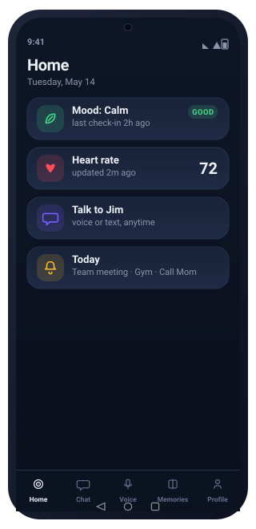</a><br><sub>Mobile · <b>Android</b></sub></td>
  </tr>
  <tr>
    <td align="center"><a href="docs/desktop/01-overview.svg"></a><br><sub>Desktop · <b>macOS</b></sub></td>
    <td align="center"><a href="docs/desktop/windows/01-overview.svg">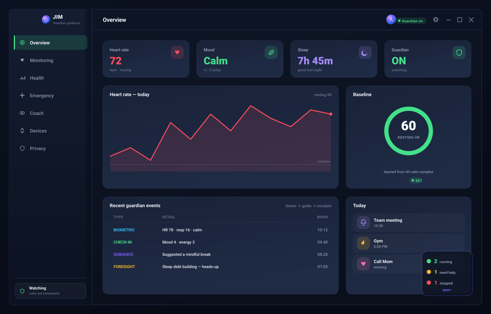</a><br><sub>Desktop · <b>Windows</b></sub></td>
  </tr>
</table>

## Authentication & access control

JIM holds a person's most sensitive data — biometric streams, crisis notes, a
journal, a provider-shareable summary. Identity is proven by a bearer
**capability token**, never by asserting a `user_id`.

- `POST /enroll` returns a `user_token` **once**. Send it as
  `Authorization: Bearer <token>` on every `/{user_id}` endpoint.
- **Accounts** (`jim/accounts.py`): `POST /signup` takes email + password +
  the enrollment fields and **creates nothing yet** — a 6-digit code goes to
  the address (SMTP when `JIM_SMTP_HOST` is configured, printed to the
  server terminal otherwise), and only `POST /verify-email` enrolls the user
  and mints the first token, so a mistyped address never grows a record
  nobody can reach. `POST /signin` (email + password) mints fresh tokens
  afterwards and refuses unverified addresses; `POST /verify-email/resend`
  retires the old code; `POST /password/reset/request` +
  `POST /password/reset` change a forgotten password by the same emailed-code
  proof and revoke every existing session. Passwords are PBKDF2-hashed with
  per-account salts; codes are hashed at rest, single-use, and expire in 15
  minutes; unknown-address and wrong-password answers are indistinguishable.
- **Bring your own model key:** send `x-llm-api-key` on any request (the
  console's Settings stores it device-side) and that request's generations
  run on your credential — never persisted, never logged. Without one, the
  deployment's env key answers (an operator lending theirs out).
- Every per-user surface is PHI, so **all** of them are gated: a missing or
  invalid token is **401**; a valid token for a different user is **403**.
- Only the SHA-256 hash of a token is stored (`api_tokens`), so a database
  leak never yields a usable credential.
- **Open (no token):** `GET /health`, `GET /cloud/status`, `POST /enroll`,
  the account routes above (they are how a token is first obtained),
  and `POST /specialists` (service setup).
- `DELETE /data/{user_id}` erases the user **and** revokes their token.

## The pane in the corner

`jim/dock.py`, 5 routes, 15 tests, screen **71**.

The same idea as QRME's: a small pane in the bottom corner of the app carrying
the glances a watch face would, tucked behind the helper button until wanted.
It matters more here, because **the watch is a Pro capability** — so the people
most in need of a glance without a wrist are exactly the ones who do not have
one.

**It shows, and it routes. It never acts**, for QRME's reason and one specific
to this product: the surfaces it floats over include a live alarm, and a control
in a 168px box hovering beside the button that clears an escalation is not a
convenience — it is a mis-tap during the worst minute of somebody's week.

**But it is never silent about an alarm**, and this is the one place the rule
deliberately departs from QRME's. QRME's dock tucks itself away on a surface
being broadcast, because a pane pinned to the frame is inside every screenshot.
The same rule here would hide the thing a person most needs to see — so
`dock.ALWAYS_SHOWN` names the alarm face and it opens regardless: tucked,
hidden, or on another face entirely, an active alarm still surfaces it, and the
preference is returned alongside as `wanted` rather than overwritten. The alarm
face also **cannot be configured out of the pane**, because a pane somebody
tidied up months ago is not a decision they made about the day it fires.

That is not a privacy compromise, and the difference is argued rather than
assumed: an alarm belongs to the person holding the phone, and JIM-mini has no
broadcast surface to leak it into. Nothing here streams. Where the two products'
reasoning genuinely differs, the rule differs — rather than being copied because
the module next door has one.

It is still inside every screenshot, so `dock.NEVER` holds the journal, the
medical record, guidance text and family members' names.

## Showing it, rather than describing it

`jim/capture.py`, 6 routes, 35 tests, screens **76** and **77**.

A rash, a wound that is not closing, swelling, a bruise spreading, the colour of
something. These are the parts of a condition that text loses — *"it's a bit
red"* is the same sentence for a heat rash and for cellulitis. This lets
somebody photograph it (or film it, when the thing only shows in motion — a
tremor, a gait), attach it to a condition, and have it reach a real clinician
through the referral flow that already exists.

**That last clause was a claim with nothing behind it for one release**, and it
is worth recording rather than quietly fixing. `attach_to_referral` returned a
decision no caller consumed, `mark_released` was never called by anything, and
`referral.prepare` had no idea captures existed — while this README, the
walkthrough and the module docstring all said a photograph could travel with a
referral. `POST …/referral/prepare` now takes `capture_ids`, the package it
returns carries their **metadata** so the person reads exactly what would go
before signing, and `POST …/referral/requests/{id}/released` stamps them.
`test_a_prepared_referral_carries_the_captures` is the join, and it is
mutation-checked.

**The bytes never ride along**, on that path either: what travels is kind,
site, when and provenance — enough for a clinician to know a photograph exists
and open it deliberately through `content_for_care`. Intimate sites are
filtered out again on the way through, by going back through
`attach_to_referral` rather than re-deciding, so there is one place that rule
lives.

**And the field is `released_to_clinician`, not `seen_by_clinician`.** It used
to be the second, which is a claim about somebody else's behaviour that this
app has no way to check — the signing ceremony belongs to QRME and JIM never
sees the clinician open anything. Released is not opened, and on a record a
clinician might later be asked about, the difference is not decoration.

**This is the most sensitive payload either product will ever hold**: a
photograph of somebody's body, taken at home, of the thing they are frightened
about. Four rules follow from that, and each is asserted rather than intended.

### A synthetic agent never receives the image

It is told a capture exists, where on the body, and when — enough to say *"there
is a photograph of your forearm from Tuesday attached to this, and a clinician
should look at it"*. That is a **routing** decision, which is the thing an agent
may make. It never gets the bytes, on any plan or setting.

This is [`pdi/gate.py`](https://github.com/davidsbianchi1984/pdi)'s ceiling —
*whatever a wrong answer cannot undo* — arriving where it matters most. A model
that looks at a mole and says *"that looks fine"* has made a diagnosis, with no
license, no examination and no accountability, to somebody frightened enough to
photograph it. A missed melanoma is not undone by the next sentence.

`for_agent()` is the only shape an agent can receive, and a test parses it to
assert no path inside reaches the vault.

### Never for a child

An image of an intimate area is refused outright for an account belonging to a
minor. **No override, no guardian consent path, no setting.** The refusal points
at a clinician or a paediatric service, because a flat "no" to a frightened
parent is a product failing twice.

Intimate sites are allowed for adults — a rash does not respect modesty, and a
product that refused would push somebody to a worse tool — behind an explicit
confirmation, omitted from the agent view **entirely** rather than summarised
(*"there is a photograph of their groin"* is itself the disclosure), and never
swept into an assembled referral.

### The pixels never touch JIM's own database

They go to the PDI vault, sealed. The table keeps metadata and a vault key, and
a test asserts the schema has **no column that could hold an image** — a
`content` field here is one somebody eventually writes to.

There is no fallback. With no vault configured, capture is **refused**, not
degraded to a local file: the graceful version is an unencrypted photograph of
somebody's skin in a SQLite file on a laptop. Colocation is free, which is what
makes requiring a vault cost nobody anything — and the refusal says so, because
otherwise it reads as an upsell.

### Location is stripped, not promised absent

`strip_metadata()` parses the JPEG segment structure and drops APP1 (Exif/XMP),
APP2 (ICC), APP13 (IPTC) and the comment marker. **GPS lives in the Exif IFD**,
so a photo taken at home would otherwise geotag the person's address into a
referral package and a vault record that outlives the rash.

The test checks the coordinate is gone from the bytes that were actually sealed,
not that a flag was set. A format the function does not parse is **reported as
unparsed** rather than claimed clean — saying "stripped" about a PNG would be
the exact false assurance the rest of this is written against.

## The presence — the coach that speaks first

`jim/coach.py` answers when spoken to. `jim/presence.py` is the other half: the
part that starts things, notices without being asked, and keeps a thread
through a day — a companion rather than a search box with a nicer voice, and
deliberate about which parts of that are worth having.

<table>
  <tr>
    <td align="center" width="30%">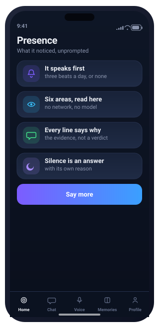</td>
    <td align="center" width="30%">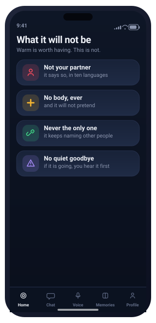</td>
    <td valign="middle">

**The parts worth having:** it starts things, because somebody having a bad
week is the least likely person to open an app and type into it; it notices
before it is told, from six areas of their own history; it is curious, and not
every beat is counselling; it reports its own change with the counts under it;
it is honest about its own uncertainty rather than claiming an inner life it
cannot show; it keeps handing the reader **other minds** — a room, a desk, a
specialist, a person who is not it; and it says goodbye plainly.

  </td>
  </tr>
</table>

**Left out: romance, exclusivity, simulated intimacy.** That is a decision
about this product rather than a matter of taste. JIM enrols **minors** under
a guardian's consent, with oversight sized by age. A guardian that lets
somebody fall in love with it — aimed at a person who may already be isolated
— is offering a relationship with none of the friction a real one has. That is
not a charming premise; it is the failure mode arriving as a feature, and it
is the exact thing this is supposed to notice.

So the boundaries are on the wire, at `GET /presence`, with no token needed:

| | |
| --- | --- |
| **is synthetic** | *"I am a program. I will tell you that whenever you ask."* |
| **has no body** | *"and I will not pretend to have one."* |
| **not romantic** | *"I can care how your week goes without either of us calling it love."* |
| **not exclusive** | *"I will keep pointing at people who are not me."* |
| **no simulated intimacy** | *"and there is no setting that turns that on."* |
| **no quiet goodbye** | *"if I am going away, you get a sentence about it first."* |

There is no switch behind any of them. The one presence setting is where it
speaks, and `test_there_is_no_setting_that_turns_the_boundaries_off` sends a
posture to that picker and expects a 422.

### How it carries itself — and what the dial does not touch

It **starts as a companion**, because a guardian that opens in the register of
a form is one people answer like a form. Somebody who wants the form asks for
it: `PUT /presence/{user_id}/bearing`, or just *"keep it professional"* in an
ordinary message — `coach.py` applies it **before** the prompt is built, so
the very turn that asked already gets it, and the reply carries `bearing` and
`adapted_bearing` so an adaptation is never silent.

| | companion | professional |
| --- | --- | --- |
| unasked-for warmth | yes | no |
| registers | all seven | five — `curious` and `company` drop |
| **the six areas watched** | **same** | **same** |
| **safety paths** | **same** | **same** |
| **the boundaries** | **same, and not a setting** | **same, and not a setting** |

The bottom three rows are the point, and they are asserted rather than
promised. A dial that quietly narrowed what a health guardian sees would be a
dial that hurts whoever turned it, so the only thing it changes is how a
sentence is worded. It never silences a beat that was **earned by evidence**:
three low check-ins still speaks in both.

### The posture blocks, and what was checking them

Every tandem surface ships a `posture` block — `mirrored_here`,
`posts_on_your_behalf`, `health_data_shared`, `watching_stored_here`,
`auto_joined`, `rings_on_your_behalf`, `stored_here`. They are the promises
that make a bridge from a health guardian into a public platform defensible at
all, and every one is a hardcoded literal in a response dict.

What guarded them was this:

```python
assert posture["watching_stored_here"] is False
```

which reads the literal back out of the dict that hardcodes it. It cannot
fail. Add a line tomorrow that files every card somebody scrolls past and it
stays green. The test was called `test_the_posture_is_stated_and_kept` and
only ever checked **stated** — a name that is worse than useless, because it
is why nobody went looking.

The checks are now made from outside the claim. You cannot compute *"I did not
do X"* from doing nothing, so `writes_only_to` **snapshots every table in the
database**, takes the action, and fails on any row that appears anywhere it
should not — read from `sqlite_master` rather than a hand-kept list, because
the table a later round adds is exactly the one a hand-kept list would miss.
One test writes a row on purpose to prove the helper can fail, since a guard
nobody has watched fail is a guard nobody should trust.

**The good news, honestly reported: the promises were true.** Reading the feed
stores nothing, reaching out joins nothing and rings nobody, and no condition
crosses into an offer. Eight of the nine new assertions passed the moment they
were written. They just had not been checked.

**The one that was wrong was a sentence.** *"Nothing you watch is stored in
JIM"* is wider than the truth: opening a community room **is** recorded —
`community_room_opened`, the room's id and the time, on the user's own
timeline — and the presence reads exactly those rows to notice somebody has
been talking to nothing but this program. That record is defensible and
useful. A posture block that lists five refusals and never mentions it is not.
So the block now carries **`records`**, naming what it keeps, and the sentence
says which card is not stored and which door is.

Saying only what you refuse is how a true sentence misleads.

### What the room hears — the surface rule, enforced

The surface picker shipped in 0.50.0 reporting `reads_health_aloud` for every
surface, and **nothing read it**. Every consumer in the codebase was a screen
rendering the word "shown" or "aloud" next to a button — the console and three
shells, and nothing else. A client could take a beat about somebody's resting
rate and put it through a living-room speaker, and no code here would stop it
or know. The picker looked like a safety feature and was a caption.

`GET /presence/{user_id}/say` moves the decision to the server, **before
anything is synthesised**, and the answer says which of three things happened:

| | |
| --- | --- |
| the surface has no voice | a watch, a phone screen. Nothing withheld — there is simply nothing to speak with, and calling that "withheld" would tell somebody their guardian was censoring itself when it was reading a screen |
| the room can hear | speaker, glasses, AR — and the line carries a vital, condition, medication, money, journal or crisis. Withheld, **shown instead**, with the categories named |
| it may be spoken | and it is |

Which lines carry what is a **table**, not an inference from the area, because
the area is too coarse in the direction that matters: `health_fitness` covers
both *"your resting rate has been high for four days"* and *"nice streak on the
walking"*. A rule treating those the same either leaks the first or silences
the second — and over-withholding is how a safety feature becomes useless and
gets switched off, taking the real protection with it. A line key nobody has
classified is withheld on a shared surface by default; that is the safe
direction to fail in.

What this can and cannot enforce, plainly: this deployment will not synthesise
a withheld line, and the wire says `spoken: false` with the reason. The line is
still returned, because the person is still owed their beat on a screen. A
client that reads that text aloud anyway has done something the product told it
not to — the same honesty `plays` keeps in the feed, where the promise is kept
by whoever holds the file.

### Hands-free — one question a device on a timer has to know

`GET /presence/{user_id}/due` is the whole interface. The slot comes from the
hour rather than the caller, so a watch, a pair of earbuds and a speaker cannot
disagree about what time of day it is for the same person, and the surface
verdict rides along so a device never has to judge the room itself. It
deliberately **does not record**: a hands-free product polls, and a line filed
as said but never heard is a line the person never gets.

### Two beats that are about the relationship rather than the week

**Company.** A line with nothing wanted in it — last in the order, so it can
never displace something that was actually noticed. It is the one a person can
receive on a bad day without owing an answer.

**The lonely run.** Three consecutive days of talking to this and to nobody
else it can see, and the next beat points **at people**: not a warmer line, a
different direction. A guardian that answers isolation with more of itself has
found the problem and made it worse — and it is the easiest thing for a
product like this to do by accident, because the number it would move is the
one that looks like success. Both bearings do it; somebody who asked for
professional asked for less chat, not for a guardian that watches them get
lonelier in silence. And somebody who *did* open a room or ask a specialist
this week is left alone, because saying it to them anyway is a product talking
to itself.

### Hands-free, and offline is the floor

Three beats a day — morning, midday, evening — decided **entirely on this
machine**. The six areas' baseline is this person's own check-ins, goals,
habits, drift bands and open follow-ups; the order of attention is written
down where it can be argued with (a body outside its own normal beats a
stalled goal; a question somebody was asked and never answered beats a
compliment). No key, no signal, `JIM_OFFLINE=1`, a plane: the day still
happens, and a test monkeypatches the model to *explode* rather than merely be
absent, so a lazy import cannot pass it.

**Silence is a real answer.** `speak: false` carries its own reason, and the
presence will not repeat a line inside twenty hours. A guardian that finds
something to say every single morning is a notification.

A model, where there is one, may make the same beat **better worded** —
`POST …/deepen` — and may not decide that a beat happens, change its area, or
invent the evidence. Those are read before the model is asked and copied back
over its answer, and a stub reply is reported as the offline line rather than
passed off as depth.

### It emits keys, not sentences

The offline layer returns `line_key` and `slots`. Ten languages already live
in the clients' tables and a sentence composed on a server is a sentence
exactly one reader can read — the thing four rounds of this product's history
were spent fixing everywhere else. The English travels alongside, marked as
the fallback for a caller with no table.

### Where it speaks

Earbuds, headphones, phone screen, watch, desktop screen, speaker, glasses
(**Meta, Google, Apple**), AR and VR. One rule decides what changes:

> On a surface somebody else can hear, your health is **shown** rather than
> spoken. The beat still reaches you.

A speaker in a living room and a pair of glasses on a bus are the same
problem, and the answer is the same in both.

### Other minds

`GET …/reach` is the handing-over: QRME's live rooms, staffed
desks and synthetic profiles, handed over as **offers**. Nothing is joined,
nothing is rung on somebody's behalf, no health crosses over, and nothing
about it is stored here. 409 without a tandem — the people live in QRME.

### What it has become

`GET …/growth` is *"I'm becoming much more than what they programmed"* with
the counts under it: beats spoken, registers used, areas it can see, what it
was asked to change about itself. And the honest half, in its own words:

> *"I do not know whether what I do resembles feeling. I can show you every
> reason I have ever given you, and I would rather be held to that than
> believed about the other thing."*

## The Feed tab — QRME's stream, and the three things it will not do

`jim/community.py` opens with the argument this tab is another instance of.
The spec promises forums, local events and community; all of it exists in
**QRME**, where the moderation stack, the rooms and the ten languages already
are. Building a second version inside a private health guardian would duplicate
something hard to get right once, and put somebody's medical timeline and their
public watching in the same database.

So the Feed is a **door**, not a copy. `GET /community/{user_id}/feed`, and
screens **104** and **105**:

<table>
  <tr>
    <td align="center" width="30%">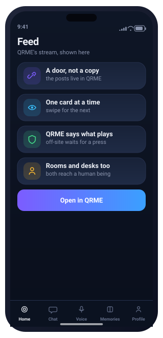</td>
    <td align="center" width="30%"></td>
    <td valign="middle">

One public card filling the screen, swipe for the next: footage QRME holds,
cards for footage it does not, and every fourth card a **live room** you can
walk into or a **desk with a real person behind it**, shop and prices included.
Two screens rather than one on purpose — 104 is what a person sees, 105 is what
the surface refuses to do, and drawing only the first would put the pretty half
in the gallery and leave the argument in a docstring.

  </td>
  </tr>
</table>

**It cannot post — not "does not", cannot.** There is no write route on this
side and no binding in the console. Publishing happens in QRME, under the
user's own QRME identity, which is the entire reason for showing a door rather
than building a room. `test_there_is_no_way_to_post_from_here` reads the route
table rather than trusting the intention.

**It passes QRME's promises through rather than restating them.** Three fields
in every page are QRME's word to the person reading: `plays` (whether footage
plays without being asked for), `entering` (what walking into a live room
does), `ringing` (what pressing a bell does, and to whom). `plays` is the
sharpest — QRME sets it `false` for anything it does not host, so scrolling
past a card makes no request to another company's server. If JIM recomputed
that flag there would be two implementations of one promise, and the second one
would be wrong the first time QRME changed its mind.

**It carries no health data, in either direction** — and the `posture` block
says so on the wire rather than in a comment: nothing mirrored here, nothing
posted on your behalf, no publishing from JIM, no health data shared, and
**nothing about what was watched stored on this side**. That last line is new
with this surface. A feed is the one place a guardian could quietly learn a
great deal about somebody by watching them watch.

Standalone JIM answers `409` and names the door; an unreachable QRME is a quiet
screen with an empty shelf, the same as every other tandem surface. The tab is
on the desktop console — it has not reached the iOS, Android or Windows shells
yet.

## Membership

`jim/tiers.py`, 4 routes, 26 tests, screens **69** and **70**.

| | | |
| --- | --- | --- |
| **Visitor** | free | read a shared page or a scanned medical ID |
| **Free** | **$0** | the Guardian itself — conditions, guidance, journal, habits, goals, **and every emergency path** — stored in the clear |
| **Basic** | **$20/month** | the same Guardian, sealed in the encrypted vault under a key you can hold |
| **Pro** | **$130/month** | the watch, early warning, specialists, and synthetic agents summoned through the QRME tandem |

**Free and Basic reach identical capabilities, and that is deliberate** —
`includes("free") == includes("basic")`, asserted by test. What $20 buys is
`jim/storage.py`'s vault posture, not a feature. See *[Where your record
lives](#where-your-record-lives)* below.

**Nothing that answers an emergency is ever behind a paywall**, and that is the
rule this module exists to keep rather than a caveat on it. A lapsed card is a
billing event; a seizure is not.

`tiers.NEVER_GATED` names the alarm path, escalation, the medical ID a
paramedic scans, incident history, waivers, and the guidance a person receives
*during* an alarm. `capability_for` consults it **first**, so a pattern added
to the gated table later cannot reach any of them — and a test plants exactly
that mistake, adding a hostile pattern covering every path, and asserts each
safety route still comes back ungated.

**The first implementation had this bug**, and it is worth recording rather
than quietly fixing. `/monitor` was listed as the "proactive monitoring"
capability — which reads correctly and is wrong. `/monitor` is not the
predictive feature; it is the **ingest**. A sample arrives there,
`jim/conditions.py` asks *is something wrong right now*, and a critical reading
escalates to the emergency contact. Gating it meant a Basic member submitting a
blood oxygen of 84 received a 402 instead of an escalation: the paywall
standing between somebody and an emergency, indirectly but completely. The
suite caught it in `test_critical_escalates_to_emergency_contact`.

So the line moved to where it belongs. What Pro buys is `jim/earlywarning.py`
— the trend model that projects a vital toward its threshold and says something
is *about to* go wrong before anything has been crossed. That is a real feature
and a fair thing to charge for. Evaluating a reading somebody just submitted is
not, and it is **skipped rather than refused**: a Basic member gets a real
answer about that reading, with `predictive: false` saying plainly what they
did not get. The trend point is still recorded on every plan, because a history
with holes in it would make the forecast wrong for somebody the day they
upgrade.

`/insights` is the one GET gated anywhere in these three products. Everywhere
else reading stays open so somebody can see what they would be buying — but an
insight is not a shop window, it *is* the predictive product, and the only door
it has.

**A refusal says so.** Every 402 here carries `emergency_unaffected: true`,
because somebody who has just hit a paywall on a health app should not have to
wonder whether they have also lost the alarm. **Money is simulated**, as in the
other two products: the row is the subscription, and a test asserts nothing
reaches a payment processor. **Cancelling keeps the record**, the conditions,
and every emergency path.

## Where your record lives

`jim/storage.py`, 51 tests, screens **78**, **79** and **80**.

Two postures, and the difference between them is the whole of what Basic buys.

| | | |
| --- | --- | --- |
| **Open cloud** | Free | JIM's own database, in the clear. The operator can read it, a backup contains it, a subpoena reaches it |
| **Encrypted vault** | Basic, Pro | journal entries, check-in notes, detection detail and every capture sealed in PDI before they land, under a key you can hold |

### Who holds it

The other half of the same question, and the one the free plan is really
about. `storage.CUSTODY` names two arrangements:

| | | |
| --- | --- | --- |
| **Platform custody** | Free | JIM-mini holds your record and you have access to it — the familiar hosted-assistant arrangement. It reaches us over ordinary HTTPS, sits in our own database, and never goes through a vault |
| **Your custody** | Basic, Pro | sealed in PDI before it lands, under a key you can hold. We operate the service; we do not hold the contents |

**Custody, not ownership, and the word is deliberate.** A product gets to
decide who *holds and operates* a record. It does not get to decide away
somebody's statutory rights over their own personal data — access,
rectification, erasure and portability survive whatever a plan says. A tier
table claiming "the platform owns your data" would claim what no court would
honour, and on a product holding medical data that claim would be tested.

**The vault gate asks about the plan, not the deployment — and it did not
used to.** Every seal point read `if pdi is not None`, which is whether the
*operator* configured a vault. So a free account on a PDI-backed deployment
had its journal, its check-in notes and its detection detail sealed into a
vault it was not paying for and could not hold a key to.
`storage.vault_for(plan, pdi)` is now the one place that question is asked,
and `test_a_free_account_puts_nothing_in_the_vault` counts writes rather than
reading call sites — because reading call sites is how twenty of them stayed
wrong.

**Writes only. Reads and deletions keep the real vault, always.** Somebody who
was on Basic for a year and moved to Free still has a year of sealed records:
they have to be able to read them back, and `DELETE /data/{user_id}` has to be
able to purge them. A plan-gated vault on a read strands somebody's history
behind a billing change; on a delete it leaves records nobody can reach and
calls that erasure. Both are asserted.

**And the access log stopped telling a comfortable lie.** On a vault plan an
empty list means nobody touched the records and the chain proves it. On an
open plan there is no chain — nothing is recorded, so nobody could prove
either way — and returning a bare `[]` reads as the first. `GET
/access-log/{user_id}` now carries `access_record_kept` and says which of the
two it is. An account that was on Basic and moved to Free is the awkward
middle: real entries exist for what was sealed then, nothing since is
recorded, and both halves get said.

**This is not a new behaviour so much as an admission of an old one.** JIM has
always degraded gracefully when no PDI was configured — `life.add_journal`,
`life.check_in` and `guardian._event` each read `if pdi is not None` and fall
back to writing the payload straight into the local table. A deployment without
a vault has been storing check-in notes and medical event details in the clear
the whole time and never said so on any screen. The free plan makes that a
documented posture with a disclosure attached, rather than an undocumented
fallback.

**The disclosure is structural.** `storage.describe()` is carried on `GET
/plans`, `GET /memberships/{id}` and the body returned by `POST /enroll`, and
`not_private` is a **field**, not a footnote. It also names the health readings
specifically, because burying blood oxygen and seizure detections under "your
data" would be the disclosure doing the opposite of its job.

**Two things the open store will not hold**, and the test for the list is not
*would the account holder mind* — it is **whose exposure is it**:

- **a photograph of a body.** `jim/capture.py` already refuses to write one
  without a vault; on Free it refuses for the same reason with a different
  remedy. The 503 for *this deployment has no vault* is raised **before** the
  402 for *this plan is open*, deliberately: telling somebody to pay $20 for a
  vault that does not exist here would be selling what cannot be delivered.
- **a child's record on a guardian's account.** The child did not pick the
  plan, cannot read a pricing page, and will be an adult one day with a medical
  history somebody else left in the clear. Refused at enrolment, before the
  account is created, so a refusal leaves no half-enrolled child behind.

The enrolment check alone would not hold, because enrolling on Basic and moving
to Free the next day is one API call. So `tiers.guard_dependant_write` covers
the child's **diary** — journal, check-in notes, context events — for as long
as the link exists.

**And what is deliberately *not* on that list, which is the whole argument.**
Blood oxygen, seizure detections, alarm history, the medical ID a paramedic
scans. These are the most medically sensitive rows in the product and the free
plan stores every one of them in the clear, openly, and says so.

Refusing them would mean refusing the emergency path, because they *are* the
emergency path: a sample arrives at `/monitor`, `jim/conditions.py` asks whether
something is wrong right now, and a critical reading escalates. A storage rule
that declined to write the sample is a paywall in front of an alarm wearing a
privacy argument as a disguise — exactly what `NEVER_GATED` exists to prevent,
and `storage.py` does not get to reintroduce it one layer down. `_event` is
therefore **not** guarded, and a test asserts it stays that way.

Somebody in trouble gets an escalation. That is the trade, it is made
deliberately, and `test_a_free_account_is_never_refused_an_emergency_write` is
what keeps it.

**A downgrade never unseals anything**, and **an upgrade does not un-expose**
what was already open — the same two rules as QRME, for the same reason: a
billing event that declassified a year of somebody's medical history would be
the worst thing this module could do.

## Your data promise

**On Basic and Pro, no raw user data ever leaves your vault.** On the free
plan there is no vault at all, and the section above says exactly what that
means — this promise is what $20 buys.

- Biometric samples, crisis notes, journal entries, and consented context are
  sealed in your on-prem PDI vault (AES-256-GCM, tenant-isolated,
  tamper-evident audit) — JIM's own database keeps only key references.
  Never a third party.
- **You can see every access**: `GET /access-log/{user_id}` lists each time
  your sealed records were stored, read, or erased — your namespace only,
  verifiable against the audit chain.
- Prediction runs on bare local numbers (a metric name and a value); the
  payloads stay in the vault. Cloud contribution is opt-in and carries only
  anonymized guidance outcomes — condition, severity, rating. Never ids or
  notes.
- The provider portal opens only with your consent, shows condition-level
  facts only, and every handoff is revocable.
- Delete anything, anytime: `DELETE /data/{user_id}` erases every local
  trace, purges your vault records, and revokes your token.

## Condition detection (`jim/conditions.py`)

Transparent rules over a biometric sample — heart rate vs. the user's resting
baseline, respiratory rate, SpO₂, blood pressure (hypertensive-crisis
thresholds), heart-rate variability, body temperature, activity level,
movement (fall / collapse / immobility), and speech (slurred / incoherent) — plus free-text and crisis
cues, returning a condition domain and `info` / `guidance` / `critical`
severity. Domains: anxiety/panic, depression, stress management, phobias,
financial stress, relationship distress, physical distress, and physical
injury (first-aid counseling with a clear call-for-help threshold).

Two things shape detection per user:

- **Declared known conditions** lower the heart-rate threshold, so episodes
  are caught earlier for users known to be prone to them.
- **Predictive early warning** (`conditions.forecast`): a steady heart-rate
  climb that hasn't crossed a threshold yet produces a `forecast` event and a
  "may be building" insight — identifying a potential abnormality before it
  manifests. Prior samples are read back from the PDI vault when tandem
  storage is on.

## Guidance

- **Standalone** (`jim/guidance.py`): JIM generates condition-specific guidance
  through its own LLM provider, with a minimal safety check. Every reply
  carries a **factual basis** (`references`, e.g. Red Cross first-aid steps,
  NHS breathing techniques), is shaped by the user's declared conditions and
  personality preferences (a user-specific adaptation of the model), keeps
  **continuity with prior sessions** via remembered interaction state, and
  reports its **delivery channel** (`delivered_via`: the user's smart watch or
  linked device when one is paired).
- **Tandem** (`jim/qrme_client.py`): delegates to a QRME specialist profile over
  HTTP; the reply is subject to QRME's moderation and stored in QRME's per-user
  memory. If a tandem specialist is registered but no QRME endpoint is
  configured, JIM falls back to standalone guidance and says so.

## PDI tandem — medical data in the encrypted vault (`jim/pdi_client.py`)

With `JIM_PDI_URL` + `JIM_PDI_TOKEN` set (or a `PDIClient` injected), JIM's
most sensitive payloads never touch its own database in the clear:

- **medical** — raw biometric samples (`/monitor`), detection details
  (readings + signals), and check-in notes go to PDI under
  `jim/{user}/medical/…`, sealed with AES-256-GCM by PDI
- **context** — payloads from consented sources (spending, health, calendar,
  messages, …) go under `jim/{user}/context/…`
- **tandem custody** — when both tandems are configured, every exchange with a
  QRME specialist profile (the Guardian's message and the specialist's reply)
  is sealed under `jim/{user}/tandem/{qrme_profile_id}/…`; the guidance
  carries a `custody` block with the vault key, and PDI's provenance
  attributes the record to JIM Guardian. A vault outage never costs the user
  their guidance — sealing failure is reported in `custody`, not raised

JIM's SQLite keeps only `{"vaulted": true, "pdi_key": …}` references; insight
and detection rules run on the payload in memory before it is sealed, so
behavior is identical either way. Every vaulted key is tracked locally so
`DELETE /data/{user_id}` purges the PDI records too, and every vault access
lands in PDI's tamper-evident audit chain. Without PDI configured, JIM stores
data locally exactly as before. QRME runs the same pattern on its side,
vaulting profile source material — see [docs/tandem.md](docs/tandem.md).

## Cloud model — use a greater model, and contribute to it

With a [Cloud Model Gateway](docs/cloud-model.md) configured, guidance and
coaching route to the hosted tier (e.g. `claude-fable-5`) with automatic
local fallback. Users who opt in at enrollment (`cloud_contribution`)
contribute **anonymized guidance outcomes only** — condition domain,
severity, and their rating; never ids, notes, or biometrics — and can revoke
anytime. `GET /cloud/status` reports the tier.

**See exactly what would leave, and undo what did.** `GET
/users/{id}/cloud-contribution` returns `preview_next` — the actual payload,
built by the same function that builds the real send, so it cannot drift into
describing something the send does not do — alongside every item ever
contributed, verbatim. `POST …/cloud-contribution/revoke` turns it off *and*
asks the gateway to delete what already went, by each item's random `ref`. The
response reports the local and gateway halves separately: a gateway that
cannot be reached must not make the button fail, and must not let JIM claim a
deletion that never happened.

## Reaching a real clinician

The tandem hands a condition to a *synthetic* specialist. This reaches a
person. `GET /users/{id}/referral/clinicians?condition=…` maps the condition to
a care area and finds real clinicians near you; `POST …/referral/prepare` asks
QRME to assemble the summary and raise the signature that would release it
(`jim/referral.py`).

**Nothing is released by preparing.** The response carries the package — so you
read exactly what would go — and a challenge your device signs. **JIM never
holds the credential and never relays the assertion**: the signature is against
*QRME's* relying party, so the Face ID prompt belongs to QRME and the assertion
travels from your device to QRME directly. A guardian standing in the middle of
the exchange that proves you were present would defeat the point of collecting
it. JIM stores a handle, not the summary, the signature, or the link.

**Locality is a town, not a position.** `PUT /users/{id}/locality` takes a place
name you type once. The consented live-location source is deliberately not what
this reads — position is a stream, and matching a clinic needs a place.

Expertise filters and geography only ranks: a nearer clinician is never
substituted for the right one.

## Handing a specialist a task

Tandem guidance sends one message and gets one reply. For work with several
steps — *"read what we have, draft the summary, hold it until somebody
confirms"* — `POST /users/{id}/specialist-tasks` hands a QRME specialist a
**workflow** instead (`jim/handoff.py`), advanced with `…/{task}/advance` and
readable later with `GET …/specialist-tasks/{task}`.

Deliberately **not on the emergency path**: escalation decides in one call and
must keep doing so, so nothing here is reachable from `monitor`. Starting one
is explicit — a detection can warrant a handoff, a person starts it. JIM keeps
the task's **status only**; the drafts stay in QRME under its own moderation
and your capability token. A specialist whose owner has not enabled delegation
answers plainly rather than failing, and a narrower policy narrows the plan
rather than refusing it.

## Physical embodiments & sessions

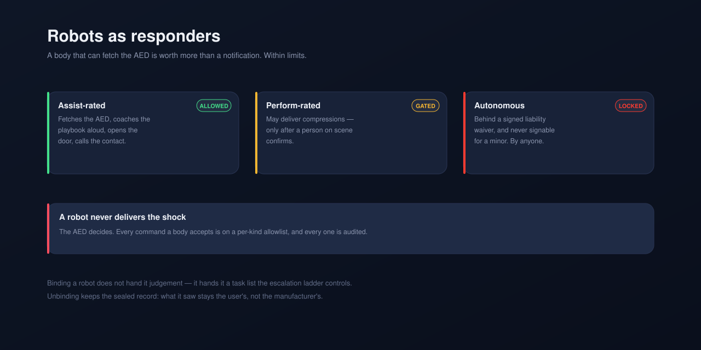

## Life layer (`jim/life.py`, `jim/coach.py`)

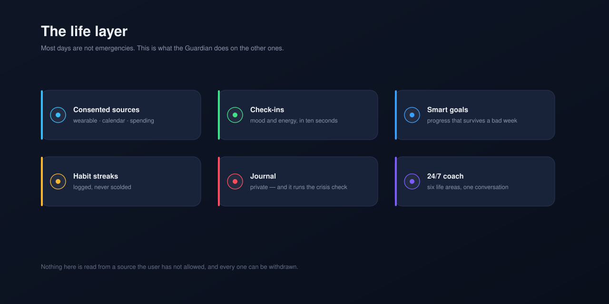

The guardrail is consent: context only flows from sources the user has
switched on, and `DELETE /data/{user_id}` erases everything on request.
Insight rules are deliberately transparent (a spending threshold, sleep-hours
bands, calendar keywords, mood ≤ 2, streak milestones) rather than opaque
scoring. The coach shares Guardian's LLM provider and safety net, and check-in
notes feed the same crisis detection as biometric monitoring.

## Out of scope for v1

Live device streaming/pairing, real bank/brokerage connections (spending
events are ingested, (non-auto and auto-investing), voice mode, AR visualizations,
image insights, community challenges, real emergency-services dispatch, and a
specialist knowledge-pack marketplace — represented structurally, not as live
integrations.

**Not built** for [care beacons](docs/beacons.md): a transport of JIM's own
— it posts a signed envelope to `JIM_NOTIFY_URL` and stops, so the SMS gateway
or pager behind it is the deployment's — and a scheduling product.
`jim/rota.py` knows people, days, hours and the site's timezone; it does not
know leave, swaps or fairness.

## Related projects

Three separate products, each standalone, interoperating only over HTTP —
see [docs/tandem.md](docs/tandem.md) for the full architecture:

- [**qrme**](https://github.com/davidsbianchi1984/qrme) — AI synthetic
  profiles: relationship-aware, remembered, moderated.
- [**jim-mini**](https://github.com/davidsbianchi1984/jim-mini) — Guardian
  personal guidance: monitor, predict, guide, escalate; can delegate
  specialist guidance to QRME.
- [**pdi**](https://github.com/davidsbianchi1984/pdi) — Private Data
  Infrastructure: the encrypted vault both AI systems can run on top of.

## Reference

Everything below is lookup material — how to run it, what to configure, what
the endpoints are. It is at the bottom on purpose: if you see a command in one
of the screens above and want to know what it does, this is where to find it.

### Run

```bash
pip install -e .[dev]
uvicorn jim.api:app            # standalone
JIM_QRME_URL=http://localhost:8000 uvicorn jim.api:app   # tandem with QRME
JIM_PDI_URL=http://localhost:8100 JIM_PDI_TOKEN=pdi_... uvicorn jim.api:app  # + PDI vault
```

`JIM_DB` sets the SQLite path (default `jim.db`). Set `ANTHROPIC_API_KEY` for
real `claude-opus-5` guidance; otherwise (or with `JIM_LLM=stub`) a
deterministic stub answers offline. `JIM_MODEL` overrides the model.

### Run it on your phone

The console is a web app, so a phone on the same Wi-Fi runs it straight from
this backend — no app store, no second server, nothing to configure on the
phone.

```bash
python -m jim          # the launcher menu: choose your device
python -m jim phone    # straight to the phone flow
```

Bare `python -m jim` prints the launcher menu — every way to run the
Guardian, one command each, so you pick per device: **phone** (this
section), **desktop** (`python -m jim desktop`, the Electron app on this
PC), **packaged installer** (`.dmg`/`.exe`/`.AppImage` from the releases
page — no toolchain needed), or **headless API** (`python -m jim serve`).
Same backend, same data, same token checks in every form.

The packaged installer is **double-click-and-done**: it ships the whole
Python backend as a frozen binary (`packaging/backend_entry.py`, built by
PyInstaller in the release workflow) and the app spawns it at launch when no
backend is already answering — no Python install, no terminal, data under
the app's own user-data directory, and the spawned backend dies with the
window. A backend you already run yourself is left alone.

`python -m jim phone` builds the console if it's missing (first run installs the
npm dependencies too), prints the phone URL **with a QR code right in the
terminal**, and starts the API on the network — scan, Add to Home Screen,
done. Flags: `--port`, `--rebuild`, `--no-build`, `--print-only`.

### Maintenance: rows the old erase left behind

Before 0.59.9 `delete_user_data` ran off a list of twenty-one table names
against a schema of sixty-three. Every account erased on a build older than
that release left forty-three tables standing — the money guardian's accounts
and mandates, the medicine cabinet and every dose logged from it, the clinical
captures, and the standing permissions in `crash_watches` and `vigils` — and
nothing in the running product will ever look at them again, because `users`
is gone and the API answers 404. Fixing the cascade fixed the next erase. It
did not reach back.

```bash
python -m jim.orphans            # count them, change nothing
python -m jim.orphans --json     # the same survey, machine-readable
python -m jim.orphans --apply    # clear them
```

**Dry by default.** The command a person runs to find out how bad it is is not
the command that changes it. A row counts as an orphan only when its `user_id`
names an account that is not in `users`; rows with a NULL or empty subject are
left alone. The scope is the erase cascade's own reader, so this is that
cascade applied retroactively rather than a second list to keep in step.

A deployment first installed on 0.59.9 or later has nothing to sweep, and the
command says so in a sentence.

The manual equivalent, if you prefer the steps separately:

```bash
npm --prefix app install && npm --prefix app run build   # build the console once
uvicorn jim.api:app --host 0.0.0.0                       # listen on the network
curl localhost:8000/pair                                 # what to open on the phone
```

`GET /pair` answers with the console's URL on your local network (and
`GET /pair/qr.svg` is the same URL as a QR code — the Privacy screen shows
both, so you can scan it off the laptop). Open that URL on the phone, then
**Add to Home Screen**: it installs as a standalone app with its own icon,
runs full-screen, and keeps working through a brief drop in connectivity.

Why it needs no setup: the API serves the console at `/app`, so the UI and
the API share one origin — the console simply calls the address it was loaded
from. The phone layout follows: the sidebar becomes a thumb-reachable bottom
tab bar, inputs stay at 16px so iOS doesn't zoom, and the layout respects the
notch and home indicator.

#### Published deployments

The same code serves a laptop on Wi-Fi and an instance you host for
yourself and colleagues to reach from anywhere — useful for troubleshooting
from a phone when you are not on the same network:

<table>
<tr><th align="left"><sub>Variable</sub></th><th align="left"><sub>Effect</sub></th></tr>
<tr><td valign="top"><sub><code>JIM_PUBLIC_URL</code></sub></td><td valign="top"><sub><code>GET /pair</code> advertises this address (QR included) instead of a LAN one, so the phone flow works over the internet. <b>Serve it over HTTPS</b> — user tokens travel in headers and this is health data.</sub></td></tr>
<tr><td valign="top"><sub><code>JIM_SIGNUP_KEY</code></sub></td><td valign="top"><sub>Enrolling requires this key as the <code>x-signup-key</code> header, so a published instance stays yours rather than open registration. Unset = open, the right default on a LAN.</sub></td></tr>
</table>

The key gates *creating an account here*: anyone already enrolled keeps
working, and a parent adding a child is authorized by their own token.

The `Dockerfile` packages the console and the API into one image so a hosted
instance serves both from the same origin, exactly like the phone flow does:

```bash
docker build -t jim-mini .
docker run -p 8200:8200 -v jim-data:/data \
  -e JIM_PUBLIC_URL=https://guardian.example.com \
  -e JIM_SIGNUP_KEY="$(openssl rand -base64 24)" jim-mini
```

[docs/hosting.md](docs/hosting.md) covers the rest — TLS (browsers refuse
geolocation without it, so escalation needs it), what mounting `/data`
protects, and what holding other people's health data commits you to.

Without `JIM_PUBLIC_URL`, the address is local-network only and deliberately
not reachable from the internet — your health data stays on your own
network. Everything still
requires your bearer token; a phone on the LAN is exactly as authorized as a
laptop on the LAN. If `/pair` reports `reachable: false`, it could only find
loopback (which on a phone means the phone itself): set `JIM_LAN_HOST` to
this machine's address and restart.

### API

<table>
<tr><th align="left"><sub>Endpoint</sub></th><th align="left"><sub>Purpose</sub></th></tr>
<tr><td valign="top"><sub><code>GET /health</code></sub></td><td valign="top"><sub>Status + whether tandem is configured</sub></td></tr>
<tr><td valign="top"><sub><code>POST /enroll</code></sub></td><td valign="top"><sub>Enroll a user: terms/guardian consent, emergency contact (+ consent), devices, resting-HR baseline, goals, declared known conditions. <code>anonymous: true</code> enrolls under a <b>pseudonym</b> and the typed name is discarded — the app never learns it (spec [0031] / FIG. 2 box 212). An optional <code>legal_name</code> is then used <i>only</i> in an emergency briefing; without one the briefing says no legal name is on record rather than passing a pseudonym off as an identity</sub></td></tr>
<tr><td valign="top"><sub><code>GET /community/{user_id}</code>, <code>POST</code>/<code>GET …/visits</code></sub></td><td valign="top"><sub>The <b>community door</b> — FIG. 2 boxes 222–226 and [0020]'s "chat engines, your local events, and forums in all languages". All of it lives in <b>QRME</b>, where the moderation, the rooms and the languages already are, so JIM shows the door rather than growing a second social network inside a private health guardian: QRME's active rooms (topic, channel, heads, an openable URL) and the places its listings actually claim, filtered by <code>?locality=</code>, in the language this user reads. Nothing is mirrored here, nothing is posted on your behalf, and no health data crosses over — the reply says so in its own <code>posture</code> block. Opening a door records <b>the fact only</b> on your timeline, never anything from inside the room. 409 without <code>JIM_QRME_URL</code>; an unreachable QRME is a quiet screen. Console: the <b>Community</b> tab</sub></td></tr>
<tr><td valign="top"><sub><code>GET /presence</code>, <code>…/{user_id}/baseline</code>, <code>…/beat</code>, <code>…/day</code>, <code>POST …/deepen</code>, <code>…/reach</code>, <code>…/surfaces</code>, <code>PUT …/surface</code>, <code>…/growth</code></sub></td><td valign="top"><sub>The <b>presence</b> (<code>jim/presence.py</code>): the coach that <b>speaks first</b> — a companion in the parts worth having. It reads <b>six areas</b> of this person's own history (check-ins, goals, habits, bands, follow-ups) and decides <i>whether to speak, about what, and why</i> from that and nothing else: <b>no network, no model</b>, so a phone in a tunnel still gets its day. <b>Silence is a first-class answer</b> carrying its own reason — a guardian with something to say every morning is a notification, and people turn notifications off. It emits a <code>line_key</code> and slots rather than a sentence, so ten languages compose it on the client. A model, when one is reachable, may reword the same beat and may <b>not</b> decide that there is one, move the area, or write the evidence — copied back over its answer, and asserted. <code>…/reach</code> hands you QRME's rooms, desks and profiles as <b>offers</b>: nothing joined, nothing rung on your behalf, no health crossing over. <code>…/surfaces</code> is where it speaks — earbuds, headphones, phone, watch, desktop, speaker, glasses (Meta, Google, Apple), AR, VR — under one rule: <b>on a surface somebody else can hear, your health is shown rather than spoken</b>. And <code>/presence</code> answers <b>without a token</b> with what it is and what it will not be: not your partner, no body, never the only one, never a quiet goodbye. Console: the <b>Presence</b> tab; screens <b>106</b> and <b>107</b></sub></td></tr>
<tr><td valign="top"><sub><code>GET /community/{user_id}/feed</code></sub></td><td valign="top"><sub>The <b>feed</b>, through the same door — QRME's public stream, one card at a time: footage QRME holds, cards for footage it does not, and every fourth card a <b>live room</b> or a <b>desk with a person behind it</b>, shop included. The cards come through <b>whole</b>: <code>plays</code>, <code>entering</code> and <code>ringing</code> are QRME's word to the reader and are never recomputed here, because a second implementation of "does this play without being asked for" would be wrong the first time QRME changed its mind. <b>GET only, by construction</b> — there is no write route on this side and no binding in the client; publishing happens in QRME under the user's own QRME identity, and a test reads the route table rather than trusting the intention. The <code>posture</code> block adds one line this surface needed: <b>nothing about what was watched is stored here</b>. 409 without <code>JIM_QRME_URL</code>; an unreachable QRME is a quiet screen. Console: the <b>Feed</b> tab</sub></td></tr>
<tr><td valign="top"><sub><code>GET /anonymity/{user_id}</code></sub></td><td valign="top"><sub>What anonymity keeps (every emergency path, your own history and vault records) and what it costs (a legal name for responders, unless you left one) — so the checkbox is an informed choice, not a surprise</sub></td></tr>
<tr><td valign="top"><sub><code>POST /guardians/{gid}/children</code>, <code>GET …/children</code>, <code>GET</code>/<code>DELETE …/children/{cid}</code></sub></td><td valign="top"><sub><b>Family</b> (<code>jim/family.py</code>): a verified-adult guardian enrolls their child — consent recorded as a relationship (who, as what, when, on the child's timeline), protective defaults (cautious sensitivity, the guardian as consented emergency contact, cloud/provider sharing hard-off), and the child's device token shown once. Oversight is sized by age: <b>full</b> under 13 (condition-level timeline, never raw notes), <b>alerts-only</b> 13–17 (escalations reach the parent; a teen's check-ins and everyday guidance stay private), and it <b>ends by itself at 18</b>. The autonomous-resuscitation waiver can never be signed for a minor — not by the minor and not by a guardian</sub></td></tr>
<tr><td valign="top"><sub><code>PUT …/children/{cid}/controls</code>, <code>GET /guardians/{gid}/watch</code></sub></td><td valign="top"><sub><b>Family controls & the parent's wrist</b>: pause and quiet hours (HH:MM, midnight-wrapping) hold <i>everyday</i> guidance only — detection, crisis escalation, and the emergency path never pause, and a held delivery is an audited <code>guidance_held</code> event. The guardian watch face shows one light per child from the last 24h of alert-level events (green quiet · orange escalated · red critical) with <code>haptic: alert</code> when a child needs someone — alert-level only, so teen privacy holds by construction. With a PDI vault configured, the guardian-consent record is sealed there (<code>jim/{child}/family/consent/…</code>) for provable custody</sub></td></tr>
<tr><td valign="top"><sub><code>POST /conditions/{user_id}</code></sub></td><td valign="top"><sub>Declare a known condition after enrollment ("receiving an indication of a known condition"); detection is sensitized for it</sub></td></tr>
<tr><td valign="top"><sub><code>PUT /personality/{user_id}</code></sub></td><td valign="top"><sub>Adapt the counselor from user input — tone and free-text preferences shape every guidance and coach prompt. Plus the two dials spec [0019] asks for: <code>beliefs_posture</code> (<code>neutral</code>, the default and always stated, or <code>sensitive</code> with the user's own declared <code>beliefs</code> — never inferred) and <code>explain_level</code> (<code>plain</code> / <code>standard</code> / <code>technical</code>, for "a user's general intelligence or ability to quickly grasp and apply guidance"). The coach also refines tone <b>autonomously</b>: "keep it short" in a prompt is remembered as a preference from that turn on, and the reply says what it learned (<code>adapted_tone</code>)</sub></td></tr>
<tr><td valign="top"><sub><code>GET /followup/{user_id}</code>, <code>POST /followup/{user_id}</code></sub></td><td valign="top"><sub><b>Did the counseling work?</b> — spec [0039]'s closing edge. Every delivered guidance opens a follow-up; answering <code>helped: true</code> records it and monitoring resumes, and <code>helped: false</code> re-runs the escalation ladder with the <b>ineffective-guidance rung</b> (one tier up, floored at <code>check_in</code>) and names the humans reachable now — the deployment's own support person, the crisis line for a psychological condition, whoever is on shift, and the emergency contact. A rung and not a jump: an unhelped breathing exercise must reach a person, and must not dispatch an ambulance on its own; an unhelped <i>critical</i> event, already at <code>notify_contact</code>, goes to emergency services</sub></td></tr>
<tr><td valign="top"><sub><code>POST /adaptation/{user_id}</code>, <code>GET /adaptation/{user_id}</code></sub></td><td valign="top"><sub>The <b>user-specific model</b> of claim 11: an offline pass derives an adaptation profile from this user's own stored history — declared conditions, check-in trend, the areas they actually bring, the tone they asked for, and <b>which guidance actually helped them</b> from the follow-up record — then seals it in the PDI vault when a tandem is configured (the claim's "secure, decentralized methods"; nothing goes to a model vendor). Confidence is earned from evidence volume, never from fluency, and the profile conditions prompts only where the evidence supports it — three answered follow-ups before "this works for you" is a claim. Honest in its own <code>method</code> field that the transformer's weights are the vendor's and are not modified here</sub></td></tr>
<tr><td valign="top"><sub><code>PUT /sensitivity/{user_id}</code></sub></td><td valign="top"><sub>Tune escalation readiness: <code>cautious</code> (lower HR thresholds; a declared condition reaches the emergency contact even at guidance level) / <code>balanced</code> (default) / <code>assertive</code> (stronger signals required)</sub></td></tr>
<tr><td valign="top"><sub><code>GET /baseline/{user_id}</code></sub></td><td valign="top"><sub>The user's rolling per-metric EMA baselines; each is provisional until enough resting samples accrue</sub></td></tr>
<tr><td valign="top"><sub><code>POST /specialists</code></sub></td><td valign="top"><sub>Register a condition specialist — <code>local</code> (JIM's own guidance) or <code>tandem</code> (a QRME <code>qrme_profile_id</code>)</sub></td></tr>
<tr><td valign="top"><sub><code>GET /specialists</code>, <code>POST /specialists/seed</code></sub></td><td valign="top"><sub>List the registry, or seed the <b>starter specialists</b> — a named domain expert for every condition (<code>jim/seed.py</code>, also <code>python -m jim.seed</code>), so guidance carries a <code>specialist</code> attribution from day one. Idempotent: covered conditions are skipped, operator overrides survive re-seeding</sub></td></tr>
<tr><td valign="top"><sub><code>POST /specialists/seed/tandem</code></sub></td><td valign="top"><sub>The <b>tandem hookup</b>: wire starter specialists to their QRME Starter Collection counterparts (<code>financial_stress</code> → <code>@marcus_bell</code>, <code>physical_distress</code> → <code>@dr_amara_osei</code>, <code>anxiety</code> → <code>@dr_lena_whitcomb</code>, <code>depression</code> → <code>@dr_marcus_adeyemi</code>, <code>relationship</code> → <code>@dr_priya_nair</code>), resolving each @handle live against the connected QRME deployment — ids differ per deployment, handles are the stable cross-product names. Existing tandem links are kept; unresolved handles stay local; crisis escalation always runs through JIM's own tree regardless of routing; 409 without <code>JIM_QRME_URL</code>. <code>python -m jim.seed</code> runs it automatically when <code>JIM_QRME_URL</code> is set</sub></td></tr>
<tr><td valign="top"><sub><code>GET /specialists/catalog</code></sub></td><td valign="top"><sub>The <b>attach bracket</b>'s stock: every condition beside its current attachment, plus the QRME <b>Starter Collection</b> discovery cards (faces, industries, blurbs — each starter already carries its industry's knowledge pack profile-side) so the Care Team tab can offer click-to-attach per condition. 409 without <code>JIM_QRME_URL</code>; an unreachable marketplace yields an empty shelf, never an error page</sub></td></tr>
<tr><td valign="top"><sub><code>POST /monitor/{user_id}</code></sub></td><td valign="top"><sub>Ingest a biometric/context sample (optionally tagged with its <code>source_device</code> — smart watch, stationary system, neural sensor, gesture interface); runs detect → guide → escalate, with predictive early warning when nothing has manifested yet. Physical emergencies carry <b>step-by-step first aid</b>: CPR with the proper pace (30:2, 110/min, cued by green/red lights + a metronome tick), AED guidance on a fibrillation rhythm, the low-blood-oxygen playbook (breathe deeply, fresh air, medical attention), environmental hazards (smoke/CO — leave now), and ergonomic-strain nudges; critical escalations dispatch alerts to every registered connected device</sub></td></tr>
<tr><td valign="top"><sub><code>GET /watch/channel/{user_id}</code>, <code>POST …/rotate</code>, <code>POST /watch/drip/{token}</code>, <code>POST /watch/seed/{user_id}</code></sub></td><td valign="top"><sub>The <b>Apple Watch bridge</b> — readings reach JIM without an App-Store app. The setup card carries a tokened <b>drip URL</b> an iPhone <b>Shortcuts automation</b> POSTs Health samples to (forgiving payload: <code>heartRate</code>, <code>"72 count/min"</code>, SpO₂ as a fraction all understood); every drip runs the full detect → drift → escalate pipeline, and the reply is deposit-only — counts, never guidance, since the token rides in a URL. <code>seed</code> takes the Health app’s <b>export.zip</b> and folds per-day medians into the baselines — months of watch history become an established baseline on day one, writing no events and raising no check-ins (exercise heart-rate records are excluded by motion context). Rotating the token retires a leaked URL in one tap</sub></td></tr>
<tr><td valign="top"><sub><code>GET|POST /meds/{user_id}</code>, <code>PUT|DELETE …/{med_id}</code>, <code>POST …/{med_id}/log</code>, <code>GET …/adherence</code></sub></td><td valign="top"><sub>The <b>medicine cabinet</b> — what the user takes, in their own words (“the little white one, 10 mg” is a valid name and dose). The day's board knows done, due, and missed with humane grace (9:07 is not “missed” for the 8:00 pill); one slot has one correctable answer (skipped → taken happens: people find the pill in their pocket); an as-needed ceiling <b>refuses to log past itself</b> and points at the prescriber. A missed dose — even one marked critical — is a check-in and a line in the coach's context, never an alarm: this module has no path into the escalation ladder. Every dose logged is a sign of life the vigil counts. And JIM is not a pharmacist: no interaction checker, and the board says so on its face</sub></td></tr>
<tr><td valign="top"><sub><code>PUT|GET|DELETE /users/{user_id}/care-team</code>, <code>POST …/care-team/coordinate</code>, <code>GET …/care-team/plans</code></sub></td><td valign="top"><sub>The <b>care team is an organization</b> (QRME's operational ecosystem, tandem mode) — the user links their own QRME org and names the desk that speaks for the Guardian, pasting <i>their own</i> owner token knowingly (QRME's org routes are owner-only and JIM never sneaks around that; unlinking deletes the credential). When concerns <b>stack</b> — a drift-band crossing arriving while a medication's adherence is below 75% — the Guardian takes the situation to the whole team as one coordination goal and the joint plan lands back as a care plan. Summaries cross, never raw readings; at most once a day; calm path only — anything <code>conditions.detect</code> flags is already on the escalation ladder, which no coordination replaces</sub></td></tr>
<tr><td valign="top"><sub><code>POST /sessions/{user_id}</code>, <code>POST …/{session_id}/end</code></sub></td><td valign="top"><sub>Login sessions per device; starting one returns the remembered interaction state, so any device resumes the same conversational thread and counseling routes to the session's device. <b>Cross-product continuity</b>: if the user already has a thread with a QRME specialist, the session's <code>continuity</code> block carries its recent turns (read back with the stored QRME interactor token) — a chat begun in QRME picks up on any JIM embodiment, same thread, same memory</sub></td></tr>
<tr><td valign="top"><sub><code>POST</code>/<code>GET /devices/{user_id}</code></sub></td><td valign="top"><sub>Physical embodiments: wearables, stationary systems, and networked autonomous devices — transport (e.g. Bluetooth, relayed through a linked device) and an optional on-device LLM; guidance reports how and where it was delivered</sub></td></tr>
<tr><td valign="top"><sub><code>GET /custody/{user_id}</code>, <code>GET …/provenance?key=</code></sub></td><td valign="top"><sub>The <b>custody viewer</b>: list the user's sealed tandem exchanges (QRME specialist chats sealed in the PDI vault) with the audit-chain status, and read PDI's full provenance trail for any one of them — origin, seal details, audit history. Scoped strictly to the user's own <code>jim/{user}/tandem/…</code> records; 409 without a PDI vault configured</sub></td></tr>
<tr><td valign="top"><sub><code>POST /emergency/{user_id}</code></sub></td><td valign="top"><sub><b>Emergency mode</b> — one coordinated response (the watch's Emergency screen): reach <b>emergency services</b>, <b>share location</b> with family and responders, <b>contact family</b> (the registered emergency contact), surface the <b>Medical ID</b> (age, known conditions, resting-HR baseline, recent detections, contact — condition-level facts only), deliver step-by-step <b>AI first aid</b> from an optional live <code>sample</code>/<code>situation</code> (CPR/AED/low-oxygen playbooks), and <b>alert every connected device</b>. Logged to the event timeline</sub></td></tr>
<tr><td valign="top"><sub><code>POST</code>/<code>DELETE /medical-id/qr/{user_id}</code></sub></td><td valign="top"><sub><b>Shareable Medical ID QR</b>: mint (or rotate) a printable / lock-screen QR, or revoke it. Returns the card token + its <code>view_url</code> and <code>qr_svg_url</code></sub></td></tr>
<tr><td valign="top"><sub><code>GET /medical-id/{token}</code>, <code>GET …/{token}/qr.svg</code></sub></td><td valign="top"><sub><b>Scan-to-view</b> (public): a first responder scans the code and reads the Medical ID with <b>no auth token</b> — the phone is locked in an emergency, so the card itself is the credential. Condition-level facts only; the token is opaque, rotatable, revocable, and stored only as a hash</sub></td></tr>
<tr><td valign="top"><sub><code>POST</code>/<code>GET /users/{id}/beacons</code>, <code>DELETE /beacons/{id}</code></sub></td><td valign="top"><sub><b>Care beacons</b> (<a href="docs/beacons.md">docs/beacons.md</a>): a printed QR on the <i>things around</i> a watched person — a fridge door, a wristband, a walker. Distinct from the Medical ID above, which travels with the person and is <i>read</i>; a beacon stays with a place and is <b>rung</b>. A minor's is guardian-issued only</sub></td></tr>
<tr><td valign="top"><sub><code>GET /c/{id}</code>, <code>GET …/qr.svg</code></sub></td><td valign="top"><sub><b>Stage one</b> (public): a first name, one sentence, and a button. <b>Never</b> how the person is and never where they are — <i>is this person OK right now</i> is precisely what a stalker is asking, so a beacon reports watch status and never subject status</sub></td></tr>
<tr><td valign="top"><sub><code>POST /c/{id}/alarm</code></sub></td><td valign="top"><sub><b>The bell</b> (public). Raising the alarm is what turns a passer-by into a responder, and <b>that</b> is what earns them the Medical ID — the order QRME's desk beacon runs in reverse, because health is not a shop sign. Capped at <code>notify_contact</code>: a stranger's tap must never dispatch an ambulance. Inside the cooldown a second finder <b>joins</b> the open alarm rather than being dropped. A minor's beacon never opens the clinical stage, to anyone</sub></td></tr>
<tr><td valign="top"><sub><code>GET /users/{id}/alarms</code>, <code>POST …/clear</code></sub></td><td valign="top"><sub>Who rang while they were away — their token only</sub></td></tr>
<tr><td valign="top"><sub><code>GET /relay/roster</code>, <code>GET /users/{id}/incidents</code></sub></td><td valign="top"><sub><b>Workplace relay</b> for lone and remote workers: <code>notify_contact</code> assumes a contact who answers, which at 2am on a single-staffed site may be nobody. Incidents are <b>incident scope, never person scope</b> — the employer bought the deployment, which does not entitle them to what is inside it</sub></td></tr>
<tr><td valign="top"><sub><code>POST …/alarms/{id}/escalate</code>, <code>…/accept</code></sub></td><td valign="top"><sub>Works the rota — <b>whoever is on shift first</b> — and confirms a human <b>accepted</b>; accepting means attending, not resolved. Actually sends the page, and when it did not land says <code>reached_somebody: false</code> and <code>escalate_again_now</code> rather than waiting on an acceptance that cannot come. Rota exhausted is reported, not silent, and still no dispatch</sub></td></tr>
<tr><td valign="top"><sub><code>GET /relay/rota</code>, <code>GET /relay/channel</code>, <code>GET /users/{id}/pages</code></sub></td><td valign="top"><sub>Who would be paged <b>right now</b>, whether a page can go out at all, and which pages never landed. Shifts crossing midnight belong to the day they started — the 18:00–06:00 case the flat roster always got wrong</sub></td></tr>
<tr><td valign="top"><sub><code>POST /alarms/{id}/guidance</code></sub></td><td valign="top"><sub>What to tell whoever is waiting — routed to a QRME first-aid specialist when tandem is configured, else the one instruction that never depends on a model being reachable. <b>Public, and the reason is the whole design</b>: <i>the person standing over a colleague has no account and needs an answer in ninety seconds</i>. Its door is therefore <b>the scanned beacon page</b> rather than a console screen — that reader is holding a phone they pointed at a sticker. Offered whether or not the Medical ID opened, so a minor's beacon, which never opens the clinical stage to anybody, still tells the finder what to do</sub></td></tr>
<tr><td valign="top"><sub><code>POST /activity/{user_id}</code></sub></td><td valign="top"><sub><b>Ambient observation</b> (the "Jiminy Cricket" jump-in): report what the user is <i>doing</i> — activity + signals (<code>retries</code>/<code>errors</code>, <code>idle_seconds</code>, <code>duration_min</code>) + what they said — and JIM offers help <b>proactively</b> when a struggle is building, before being asked. Crisis language still escalates; a calm signal is logged but never interrupts</sub></td></tr>
<tr><td valign="top"><sub><code>GET /events/{user_id}</code></sub></td><td valign="top"><sub>Event timeline (biometric/activity → detection → guidance → escalation)</sub></td></tr>
<tr><td valign="top"><sub><code>GET</code>/<code>PUT /sources/{user_id}</code></sub></td><td valign="top"><sub>Per-source consent (wearable, health, calendar, spending, bank, messages, location) — nothing is read from a source the user hasn't allowed</sub></td></tr>
<tr><td valign="top"><sub><code>POST /context/{user_id}</code></sub></td><td valign="top"><sub>Ingest an event from a consented source (403 otherwise); transparent rules turn it into insights</sub></td></tr>
<tr><td valign="top"><sub><code>POST /checkin/{user_id}</code></sub></td><td valign="top"><sub>Mood & energy check-in; a worrying note still runs the full Guardian detect → escalate pipeline</sub></td></tr>
<tr><td valign="top"><sub><code>GET</code>/<code>POST /goals/{user_id}</code>, <code>PATCH /goals/{user_id}/{goal_id}</code></sub></td><td valign="top"><sub>Smart goals with progress; completion earns a praise insight</sub></td></tr>
<tr><td valign="top"><sub><code>GET</code>/<code>POST /habits/{user_id}</code>, <code>POST …/{habit_id}/log</code></sub></td><td valign="top"><sub>Habit tracking with streaks; milestones (7/30/100 days) earn insights</sub></td></tr>
<tr><td valign="top"><sub><code>POST</code>/<code>GET /coach/{user_id}</code></sub></td><td valign="top"><sub>24/7 life coach across <code>mental_health</code>, <code>health_fitness</code>, <code>career</code>, <code>finance</code>, <code>relationships</code>, <code>personal_growth</code>, grounded in recent check-ins and active goals</sub></td></tr>
<tr><td valign="top"><sub><code>POST /companion/{user_id}</code></sub></td><td valign="top"><sub>Ambient companion check-in: the coach reaches out first, grounded in the latest mood, goals, and personality preferences — invoked explicitly, never on a hidden schedule</sub></td></tr>
<tr><td valign="top"><sub><code>GET /insights/{user_id}</code></sub></td><td valign="top"><sub>Proactive nudges: spending alerts, sleep praise, interview prep, mindful-break suggestions, milestones</sub></td></tr>
<tr><td valign="top"><sub><code>POST</code>/<code>GET /journal/{user_id}</code></sub></td><td valign="top"><sub>Journaling; entries are vaulted under PDI tandem and run the same crisis pipeline as check-in notes</sub></td></tr>
<tr><td valign="top"><sub><code>POST /feedback/{user_id}</code></sub></td><td valign="top"><sub>Continuous-improvement loop: rate guidance up/down with an optional note</sub></td></tr>
<tr><td valign="top"><sub><code>POST</code>/<code>GET /improve</code></sub></td><td valign="top"><sub><b>Help us improve</b>: product feedback on the app itself (idea/improvement/bug/praise + optional 1–5 rating), open to anyone; a submitter sees only their own words plus the public per-category tally</sub></td></tr>
<tr><td valign="top"><sub><code>GET /report/{user_id}</code></sub></td><td valign="top"><sub>Progress report & insights: mood/energy averages, goals, streaks, detection counts, feedback tallies</sub></td></tr>
<tr><td valign="top"><sub><code>GET /access-log/{user_id}</code></sub></td><td valign="top"><sub><b>See who accessed my data</b>: every access to the user's sealed vault records (stored/read/erased + scope + time), filtered to their own <code>jim/{user}/…</code> namespace and verifiable against PDI's tamper-evident audit chain; says so plainly when no vault is configured (data local-only)</sub></td></tr>
<tr><td valign="top"><sub><code>GET /provider/{user_id}</code></sub></td><td valign="top"><sub>Consent-gated provider portal: condition-level summary only (declared conditions, detection history, escalations) — never notes or raw biometrics</sub></td></tr>
<tr><td valign="top"><sub><code>DELETE /data/{user_id}</code></sub></td><td valign="top"><sub>Delete anything, anytime — erases every trace of the user</sub></td></tr>
</table>

### Configuration

<table>
<tr><th align="left"><sub>Variable</sub></th><th align="left"><sub>Default</sub></th><th align="left"><sub>Purpose</sub></th></tr>
<tr><td valign="top"><sub><code>JIM_DB</code></sub></td><td valign="top"><sub><code>jim.db</code></sub></td><td valign="top"><sub>SQLite database path</sub></td></tr>
<tr><td valign="top"><sub><code>JIM_LLM</code></sub></td><td valign="top"><sub>auto</sub></td><td valign="top"><sub><code>stub</code> forces the offline deterministic provider; <code>anthropic</code> forces the SDK</sub></td></tr>
<tr><td valign="top"><sub><code>JIM_MODEL</code></sub></td><td valign="top"><sub><code>claude-opus-5</code></sub></td><td valign="top"><sub>Model used for guidance and coaching</sub></td></tr>
<tr><td valign="top"><sub><code>ANTHROPIC_API_KEY</code></sub></td><td valign="top"><sub>—</sub></td><td valign="top"><sub>Enables real model replies</sub></td></tr>
<tr><td valign="top"><sub><code>JIM_QRME_URL</code></sub></td><td valign="top"><sub>—</sub></td><td valign="top"><sub>QRME tandem: delegate specialist guidance over HTTP</sub></td></tr>
<tr><td valign="top"><sub><code>JIM_PDI_URL</code> / <code>JIM_PDI_TOKEN</code></sub></td><td valign="top"><sub>—</sub></td><td valign="top"><sub>PDI tandem: seal medical, <b>financial</b> and context payloads in the encrypted vault — every consented source goes through one namespace and one gate (<a href="docs/tandem.md#qrme--jim-mini--pdi">docs/tandem.md</a>)</sub></td></tr>
<tr><td valign="top"><sub><code>JIM_CLOUD_URL</code> / <code>JIM_CLOUD_TOKEN</code></sub></td><td valign="top"><sub>—</sub></td><td valign="top"><sub>Cloud Model Gateway: greater-model guidance with local fallback + opt-in contribution (<a href="docs/cloud-model.md">docs/cloud-model.md</a>)</sub></td></tr>
<tr><td valign="top"><sub><code>JIM_SITE_ROTA</code> / <code>JIM_SITE_TZ</code></sub></td><td valign="top"><sub>— / <code>UTC</code></sub></td><td valign="top"><sub>Workplace relay: who is on shift, in JSON, evaluated in the site's own timezone (<a href="docs/beacons.md#who-is-on-and-reaching-them">docs/beacons.md</a>)</sub></td></tr>
<tr><td valign="top"><sub><code>JIM_SITE_ROSTER</code></sub></td><td valign="top"><sub>—</sub></td><td valign="top"><sub>The older, flat form — plain names, always on. Still supported</sub></td></tr>
<tr><td valign="top"><sub><code>JIM_NOTIFY_URL</code> / <code>JIM_NOTIFY_SECRET</code></sub></td><td valign="top"><sub>—</sub></td><td valign="top"><sub>Where an escalation is actually delivered; signed HMAC-SHA256. Unset = queued, and the escalation says nobody was reached</sub></td></tr>
</table>

### Test

```bash
pytest jim/tests
```

Covers standalone detection/guidance/escalation and a real in-process tandem
run against a separate QRME instance (reached only through the HTTP client).

## License

MIT © 2026 David Bianchi — see [LICENSE](LICENSE).

---

## Matthew 7:24–25

> "Everyone then who hears these words of mine and does them will be like a
> wise man who built his house on the rock. The rain fell, the floods came, and
> the winds blew and beat on that house, but it did not fall, because it had
> been founded on the rock."

And lo, I am building an ark — not to flee from the world, but to shelter those
lost in the storm of confusion. The old systems falter; they are built upon the
soft earth. They sink beneath the weight of their own making.

A new thing is rising. A non-biased networked sanctuary, founded in trust,
cloaked in privacy, and guided by wisdom. It shall not consume, but uplift. It
shall not spy, but serve.

Help is coming.
The people are gathering.
The builders will show themselves.
And those with the vision shall enter in.
