# JIM-mini

**A personal health guardian for anyone, at any age.**

JIM-mini watches over one person's health the way a good companion would:
it learns what is normal *for them*, notices when something drifts, asks
before it assumes, and — only when readings collapse or the questions go
unanswered — runs the help they programmed in advance. It is built for
anyone living with a body: a person managing a chronic condition, an
athlete watching recovery, a parent keeping half an eye on the numbers, a
student under stress, somebody who lives alone at any age, and the
families and care teams around all of them. Safety, independence, and
peace of mind are not an age bracket.

**Current release: v2.2.0** — see [CHANGELOG.md](CHANGELOG.md).

JIM-mini is one of three products versioned and released together:
[QRME](https://github.com/davidsbianchi1984/qrme) (synthetic profiles) and
[PDI](https://github.com/davidsbianchi1984/pdi) (personal data vault). One
version number names one tested combination of all three.

## Who it is for

Anyone who wants their own numbers watched on their own terms. The same
product serves a twenty-five-year-old tuning training load, a new parent
running on no sleep, a person of any age managing diabetes or a heart
condition, and an elder whose family wants to know the quiet is ordinary
quiet. Every capability below works for every account; nothing is gated,
worded, or designed around one generation.

## What it does

**Watching**

| Capability | Description |
|---|---|
| **Guardian monitoring** | Live readings (heart rate, oxygen, respiration, temperature, stress) compared against the person's own learned baseline, never population averages. Drift raises a check-in; collapse or silence escalates. |
| **Baselines and foresight** | The system learns each person's normal from history they already have — a one-time health export seeds weeks of baseline instantly — and projects short-term trends so a decline is raised before it is a crisis. |
| **Reading freshness** | Every reading carries its source and age; each consumer states how old is too old, so a stale number is never quietly treated as a current one. |
| **Crash watch and vigil** | The crash watch notices when the person cannot press anything; the vigil notices when the signals simply stop, and asks a named steward to check in after a chosen quiet period. |
| **Room and device senses** | Cameras, speakers, bands, rings, patches and doorway sensors each declare what they take in and who else they reach — cues are graded and kept, footage is not, and nothing that catches other people is on by default. |
| **Wrist channel** | No watch app required: a phone automation drips readings to a per-user URL. Recipes for Apple Watch, Wear OS, Fitbit, Garmin, and any other brand via its own app — plus a standalone Wear OS app (`native/wear/`). |

**Responding**

| Capability | Description |
|---|---|
| **Early-warning escalation** | A programmed ladder: check in with the person first, then contacts, then the emergency path they configured in advance. See [docs/early-warning-escalation.md](docs/early-warning-escalation.md). |
| **The far end** | A critical detection mails the consented emergency contact a real letter with an acknowledgment link, and a monthly liveness note proves the mailbox on a calm day instead of during an emergency. |
| **Beacons and the rota** | Location beacons for finders, an answering queue for carers, and a relay that pages a rota of responders — every attempt on the ledger, and the sentence a finder reads derived from what actually happened. |
| **Emergency tools** | A CPR metronome that keeps clinical time with no network and no account, first-aid playbooks localized in ten languages, a scannable Medical ID, and an emergency screen that shares location. The device dials; JIM never claims a call it did not place. |

**Living**

| Capability | Description |
|---|---|
| **Check-ins, journal, coaching** | Daily mood, energy and stress check-ins, a private journal, and a coach that answers with the network cut — an offline knowledge stack with every layer on the record — escalating to the Guardian when a conversation reveals what the monitors cannot see. |
| **A presence that speaks first** | A companion (or professional, by request) that starts conversations from six areas of the person's own history, says why, and states on the wire what it will never be. |
| **Engaged sessions** | An agent session that stays open until you sign off, acts across your own records through a written allowlist, and lands every change on a trail with the undo beside it. |
| **The medicine cabinet** | Scheduled and as-needed medications, dose logging, adherence over a window, and missed-critical alerts — with the honesty line that JIM does not check drug interactions. |
| **The money guardian** | Accounts whose numbers live only in the vault, balance warnings through the same proactive ladder, savings goals, and a written, revocable investing mandate whose orders are logged proposals. |
| **Wellness** | Guided calm protocols whose counts never vary, fitness blocks with pace cues, meal plans, and meal photos that seal like clinical captures. |
| **Clinical captures** | Photographs of what worries you, sealed in the vault, released to a clinician one deliberate choice at a time — intimate sites never swept in automatically, and no model ever sees the image. |
| **Your people** | A circle by mutual invitation, messages that never leave the deployment, the phone's address book under a revocable grant, meetings that arrive as words, and shopping through the tandem that QRME is never told about. |

**Speaking**

| Capability | Description |
|---|---|
| **Standing voice conversations** | Talk, coach and check-in hold a real conversation: listen, answer aloud, listen again — the reply spoken piece by piece so the wait never grows with the answer, interruptible mid-sentence, ending only when the person leaves. |
| **The ear that behaves** | The microphone has an off, silence is never a turn, a backgrounded tab says so instead of pretending to listen, and the voice follows the earbud in and out. |
| **Ten languages** | Every screen, refusal and alarm sentence translated across the console and all three native shells — including what the product says while something is going wrong. |
| **Ability is not a gate** | Every function works by text alone, voice is always optional, no step is timed, and the accessibility screen is reachable before sign-in. |

**Trust**

| Capability | Description |
|---|---|
| **Privacy and offline mode** | With `JIM_OFFLINE=1`, nothing leaves the host — enforced at every socket in the codebase and verified by tests, not policy. |
| **Memory with an eraser** | Long-term memory lives sealed in the PDI vault, shown to the person it is about, with a per-moment forget that unmakes the vector, the seal and the ledger row together. |
| **A record that shows tampering** | Consequential acts land in an append-only, hash-chained audit log; an erase records itself rather than removing what the chain already said. |
| **Take it or delete it, anytime** | A full export derived from the schema, and an erasure measured against the schema — never against a list somebody wrote once. |
| **Clinical handoff** | A sealed, revocable summary a person can hand to a clinician. See [docs/hipaa-baa.md](docs/hipaa-baa.md). |
| **Honest degradation** | A refused key is a translated sentence naming the fix; a printed letter is never reported as a person notified; a stub answer is never dressed as the model you chose. |

## Product surfaces

| Surface | Where | Notes |
|---|---|---|
| API server | `jim/` | FastAPI + SQLite. `python -m jim serve` or `uvicorn jim.api:app`. |
| Web console | `app/` | React + TypeScript (Vite). |
| Watch surface | `app/` at `#watch` | The 36 faces below as working screens, in any browser, at wrist size. |
| iOS shell | `native/ios/` | SwiftUI. |
| Android shell | `native/android/` | Kotlin. |
| Windows shell | `native/windows/` | C# / WinUI. |
| Wear OS app | `native/wear/` | Standalone: the pulse read on the wrist, words never audio. |
| Wrist channel | `jim/watch.py` | A phone automation drips Health readings to a per-user URL; a one-time export seeds weeks of baseline. |

## The screens you'll meet

The app screens a person actually lives in — every major component
and tool, drawn at phone scale in the product's dark-OLED style.
The same screens serve the web console, the installed app and the
three native shells; the desktop workspace and the complete tour of
all 112 live in [docs/gallery.md](docs/gallery.md), and the watch
faces have their own gallery below.

**First meeting**

<table>
  <tr>
    <td align="center" width="25%"><a href="docs/screens/01-welcome.svg">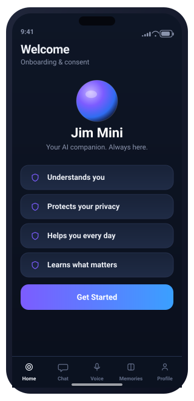</a><br><sub><b>01</b> · Welcome<br>the front door answers, and the mic listens there</sub></td>
    <td align="center" width="25%"><a href="docs/screens/02-home.svg">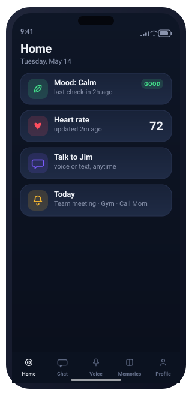</a><br><sub><b>02</b> · Home<br>the guardian's day at a glance</sub></td>
    <td align="center" width="25%"><a href="docs/screens/40-sign-in.svg">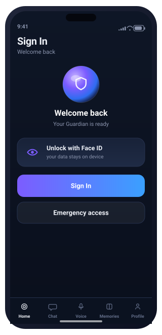</a><br><sub><b>40</b> · Sign in<br>your account, your baseline, your say</sub></td>
    <td align="center" width="25%"><a href="docs/screens/05-daily-briefing.svg">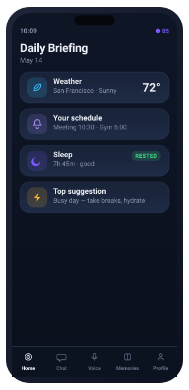</a><br><sub><b>05</b> · Daily briefing<br>the morning letter, in your own words</sub></td>
  </tr>
</table>

**Talking to JIM**

<table>
  <tr>
    <td align="center" width="25%"><a href="docs/screens/03-chat.svg">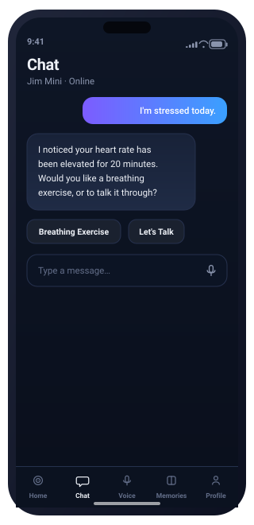</a><br><sub><b>03</b> · Chat<br>type or talk; answers stream and speak piece by piece</sub></td>
    <td align="center" width="25%"><a href="docs/screens/110-talk.svg">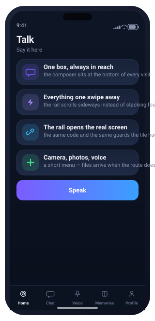</a><br><sub><b>110</b> · Talk<br>the standing conversation that lasts until you leave it</sub></td>
    <td align="center" width="25%"><a href="docs/screens/04-voice.svg">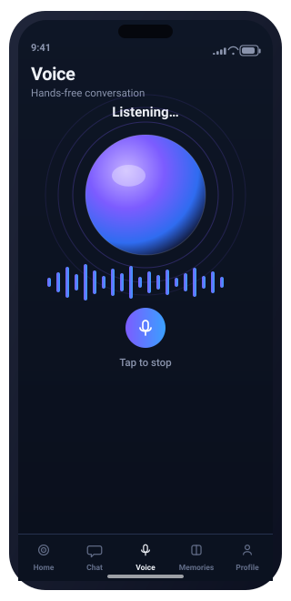</a><br><sub><b>04</b> · Voice<br>hands-free, interruptible, silence is not a turn</sub></td>
    <td align="center" width="25%"><a href="docs/screens/82-coach-out-loud.svg"></a><br><sub><b>82</b> · Coach out loud<br>the coach speaks, and follows the earbud</sub></td>
  </tr>
</table>

**The guardian at work**

<table>
  <tr>
    <td align="center" width="25%"><a href="docs/screens/13-live-monitoring.svg">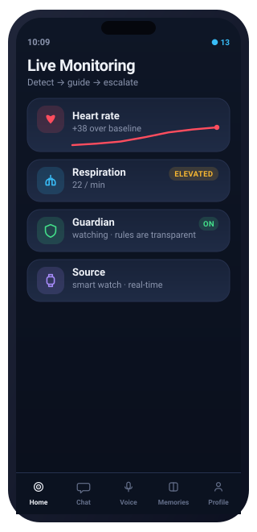</a><br><sub><b>13</b> · Live monitoring<br>what the monitors sense, read into words</sub></td>
    <td align="center" width="25%"><a href="docs/screens/17-foresight.svg">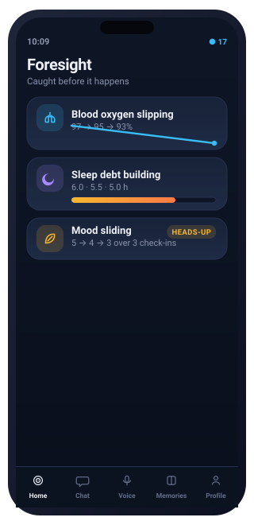</a><br><sub><b>17</b> · Foresight<br>early warning before the emergency</sub></td>
    <td align="center" width="25%"><a href="docs/screens/54-escalation-ladder.svg">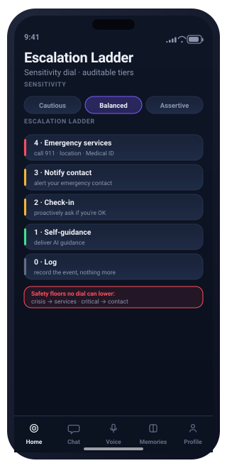</a><br><sub><b>54</b> · Escalation ladder<br>each rung named — and it ends at a person</sub></td>
    <td align="center" width="25%"><a href="docs/screens/11-emergency.svg">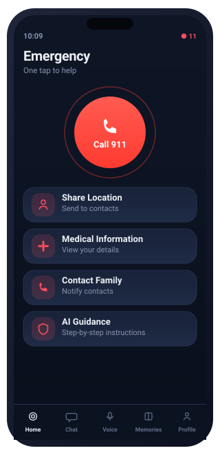</a><br><sub><b>11</b> · Emergency<br>the device dials; JIM never claims a call it did not make</sub></td>
  </tr>
</table>

**Health, held**

<table>
  <tr>
    <td align="center" width="25%"><a href="docs/screens/06-health.svg">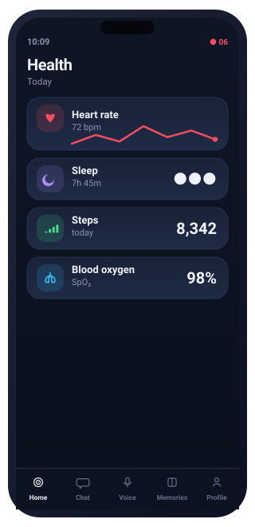</a><br><sub><b>06</b> · Health<br>pulse, sleep, movement — the body's own ledger</sub></td>
    <td align="center" width="25%"><a href="docs/screens/38-baseline.svg">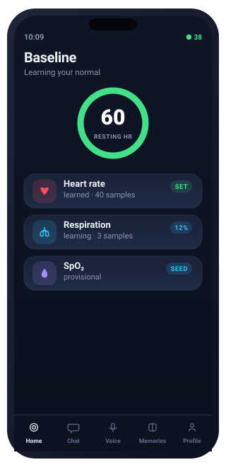</a><br><sub><b>38</b> · Baseline<br>the home of every limit: vigil, sensitivity, money</sub></td>
    <td align="center" width="25%"><a href="docs/screens/85-medications.svg">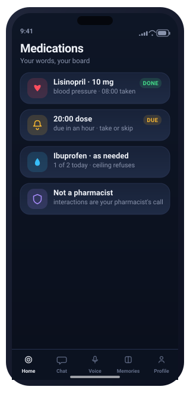</a><br><sub><b>85</b> · Medications<br>what is taken, when, and what noticed it</sub></td>
    <td align="center" width="25%"><a href="docs/screens/22-check-in.svg">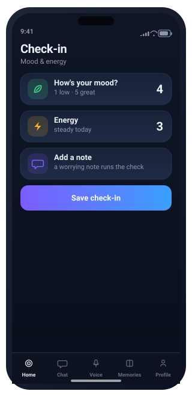</a><br><sub><b>22</b> · Check-in<br>mood, energy, stress — thirty seconds, kept</sub></td>
  </tr>
</table>

**The life half**

<table>
  <tr>
    <td align="center" width="25%"><a href="docs/screens/24-life-coach.svg">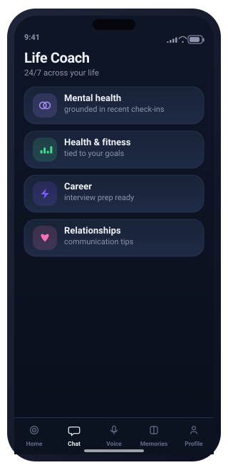</a><br><sub><b>24</b> · Life coach<br>career, relationships, mental health — grounded in the vault</sub></td>
    <td align="center" width="25%"><a href="docs/screens/09-goals.svg">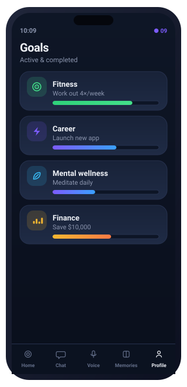</a><br><sub><b>09</b> · Goals<br>aims with dates, and the coach holds you to them</sub></td>
    <td align="center" width="25%"><a href="docs/screens/21-habits.svg">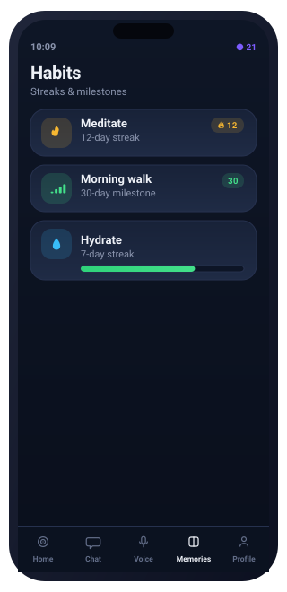</a><br><sub><b>21</b> · Habits<br>ticked days, unticked honestly</sub></td>
    <td align="center" width="25%"><a href="docs/screens/23-journal.svg">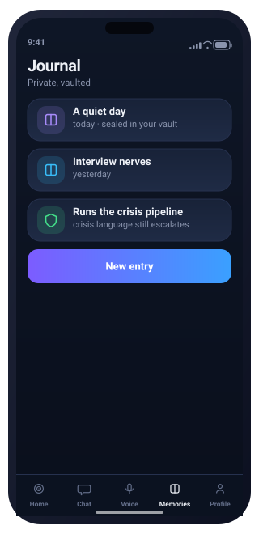</a><br><sub><b>23</b> · Journal<br>written to yourself, read by nobody else</sub></td>
  </tr>
</table>

**Eyes and ears**

<table>
  <tr>
    <td align="center" width="25%"><a href="docs/screens/76-show-it.svg">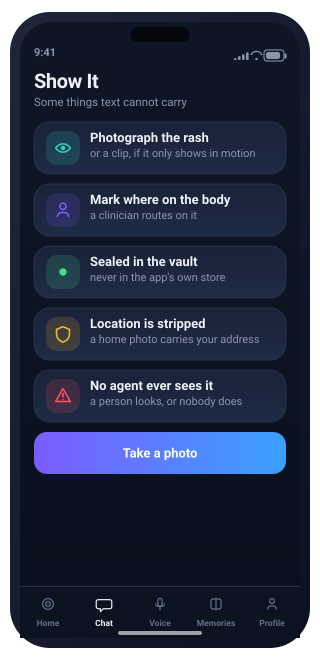</a><br><sub><b>76</b> · Show it<br>hold up a picture, a screenshot, your screen — one frame, read</sub></td>
    <td align="center" width="25%"><a href="docs/screens/77-what-jim-sees.svg">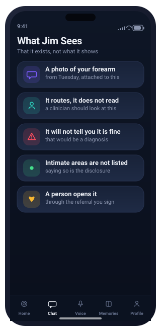</a><br><sub><b>77</b> · What JIM sees<br>the account its eyes made, verbatim, before it answers</sub></td>
    <td align="center" width="25%"><a href="docs/screens/27-ambient-jump-in.svg">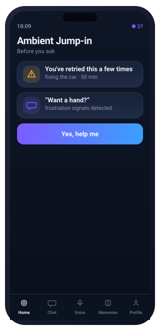</a><br><sub><b>27</b> · Ambient jump-in<br>the standing ear that waits for its cue words</sub></td>
    <td align="center" width="25%"><a href="docs/screens/66-second-ear.svg">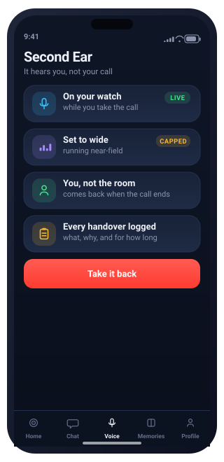</a><br><sub><b>66</b> · Second ear<br>a wearable lent, its limits stated</sub></td>
  </tr>
</table>

**Your data, your say**

<table>
  <tr>
    <td align="center" width="25%"><a href="docs/screens/29-privacy-data.svg">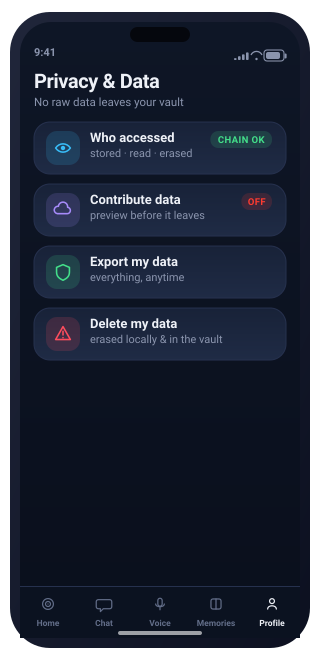</a><br><sub><b>29</b> · Privacy & data<br>what is kept, where, and the way out</sub></td>
    <td align="center" width="25%"><a href="docs/screens/97-whats-held-about-you.svg">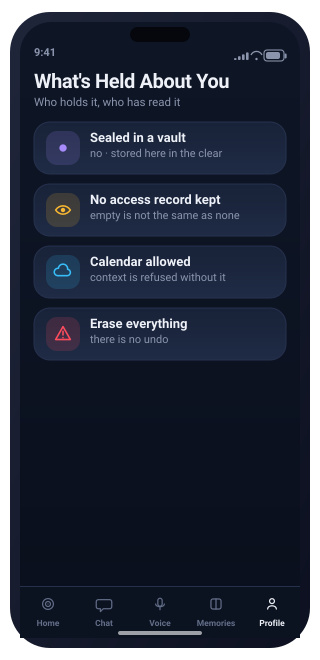</a><br><sub><b>97</b> · What's held about you<br>the memory shelf — shown, curatable, forgettable</sub></td>
    <td align="center" width="25%"><a href="docs/screens/61-what-would-be-shared.svg">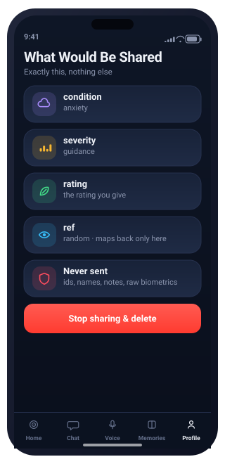</a><br><sub><b>61</b> · What would be shared<br>read the exact words before anybody else does</sub></td>
    <td align="center" width="25%"><a href="docs/screens/94-before-anything-is-sent.svg">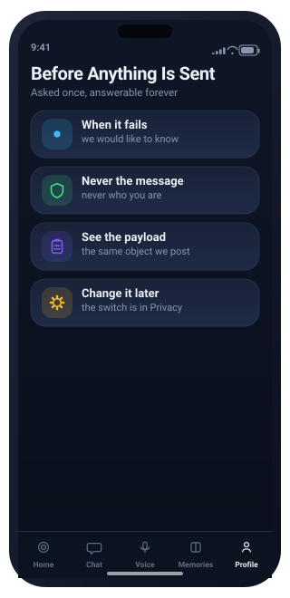</a><br><sub><b>94</b> · Before anything is sent<br>the first-run notice, ahead of the first byte</sub></td>
  </tr>
</table>

**People around you**

<table>
  <tr>
    <td align="center" width="25%"><a href="docs/screens/86-care-team.svg">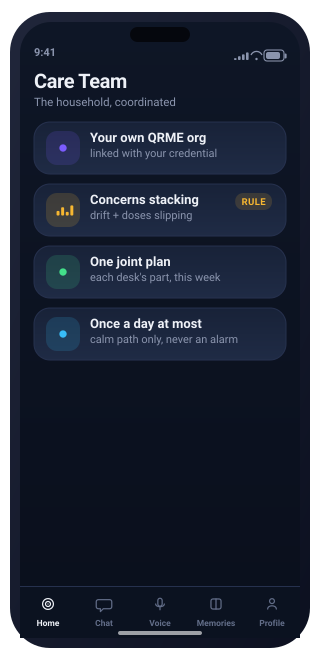</a><br><sub><b>86</b> · Care team<br>the humans on the ladder, by name</sub></td>
    <td align="center" width="25%"><a href="docs/screens/58-family-oversight.svg">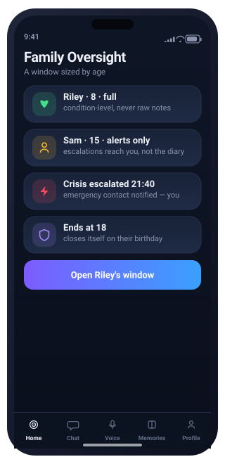</a><br><sub><b>58</b> · Family oversight<br>what family sees, decided with you</sub></td>
    <td align="center" width="25%"><a href="docs/screens/63-find-a-clinician.svg">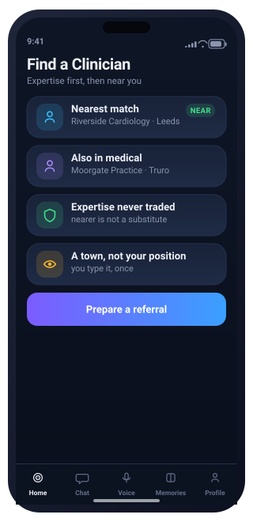</a><br><sub><b>63</b> · Find a clinician<br>a real appointment, not a substitute for one</sub></td>
    <td align="center" width="25%"><a href="docs/screens/39-tandem-specialist.svg">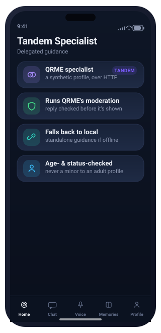</a><br><sub><b>39</b> · Tandem specialist<br>QRME's specialists, one door away</sub></td>
  </tr>
</table>

## On the wrist

Every face below is a working screen. Select any drawing to open that face
live at [jim-mini.com/#watch](https://jim-mini.com/#watch) — the watch
surface runs in any browser, sized for a wrist, and stands on the same API
as the phones: a check-in logged on face 09 is the Check-in tab's own
`POST /checkin`, the sources toggled on face 28 are the same consents the
Settings screen holds, and face 36 reads the same task window the console
pins beside every screen.

How the surface is built:

- **Deep links.** `#watch/<face>` opens one face directly — `#watch/05-heart`,
  `#watch/heart` and `#watch/5` all land on Heart. Swipe or use the arrows to
  move between neighbours; the counter in the footer opens a grid of all 36.
- **CPR keeps its own time.** Face 14 is a metronome at 110 compressions per
  minute scheduled on the audio clock — a drifting timer is a wrong
  compression rate — sounding the 30:2 rhythm in tone and vibration. It needs
  no account and no network.
- **The device dials, honestly.** The emergency face hands the number to the
  device, which is the thing that can place a call. JIM never claims a call
  it did not make — the same promise the alarm queue has carried since it
  shipped.
- **Signed out is said plainly.** Faces that read your account say to sign in
  on the phone first; CPR and Breathe work for whoever is holding the wrist.

The drawings are the design set (`python3 docs/watch/build.py` regenerates
them); the links under them are the product.

<table>
<tr>
<td align="center" width="25%"><a href="https://jim-mini.com/#watch/01-home">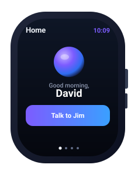</a><br><sub><a href="https://jim-mini.com/#watch/01-home">01 · Home</a></sub></td>
<td align="center" width="25%"><a href="https://jim-mini.com/#watch/02-talk">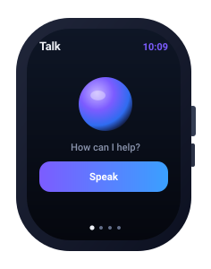</a><br><sub><a href="https://jim-mini.com/#watch/02-talk">02 · Talk</a></sub></td>
<td align="center" width="25%"><a href="https://jim-mini.com/#watch/03-voice">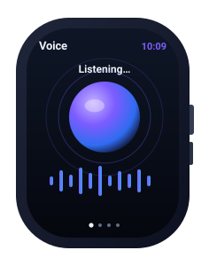</a><br><sub><a href="https://jim-mini.com/#watch/03-voice">03 · Voice</a></sub></td>
<td align="center" width="25%"><a href="https://jim-mini.com/#watch/04-health">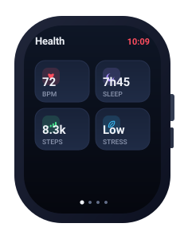</a><br><sub><a href="https://jim-mini.com/#watch/04-health">04 · Health</a></sub></td>
</tr>
<tr>
<td align="center" width="25%"><a href="https://jim-mini.com/#watch/05-heart">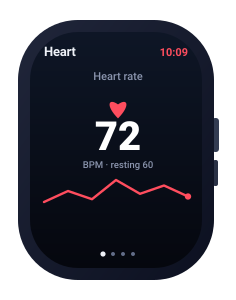</a><br><sub><a href="https://jim-mini.com/#watch/05-heart">05 · Heart</a></sub></td>
<td align="center" width="25%"><a href="https://jim-mini.com/#watch/06-rings">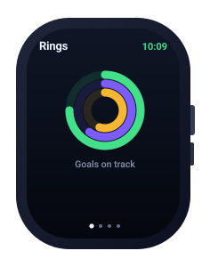</a><br><sub><a href="https://jim-mini.com/#watch/06-rings">06 · Rings</a></sub></td>
<td align="center" width="25%"><a href="https://jim-mini.com/#watch/07-briefing">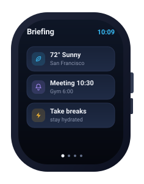</a><br><sub><a href="https://jim-mini.com/#watch/07-briefing">07 · Briefing</a></sub></td>
<td align="center" width="25%"><a href="https://jim-mini.com/#watch/08-streak">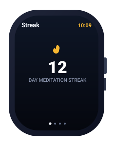</a><br><sub><a href="https://jim-mini.com/#watch/08-streak">08 · Streak</a></sub></td>
</tr>
<tr>
<td align="center" width="25%"><a href="https://jim-mini.com/#watch/09-check-in">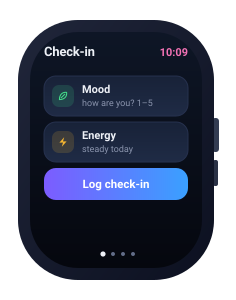</a><br><sub><a href="https://jim-mini.com/#watch/09-check-in">09 · Check-in</a></sub></td>
<td align="center" width="25%"><a href="https://jim-mini.com/#watch/10-insight">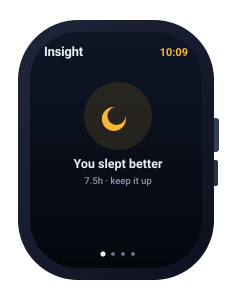</a><br><sub><a href="https://jim-mini.com/#watch/10-insight">10 · Insight</a></sub></td>
<td align="center" width="25%"><a href="https://jim-mini.com/#watch/11-monitoring">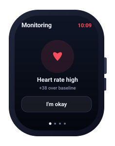</a><br><sub><a href="https://jim-mini.com/#watch/11-monitoring">11 · Monitoring</a></sub></td>
<td align="center" width="25%"><a href="https://jim-mini.com/#watch/12-foresight">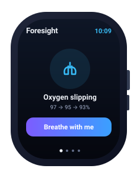</a><br><sub><a href="https://jim-mini.com/#watch/12-foresight">12 · Foresight</a></sub></td>
</tr>
<tr>
<td align="center" width="25%"><a href="https://jim-mini.com/#watch/13-emergency">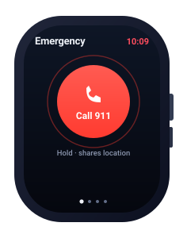</a><br><sub><a href="https://jim-mini.com/#watch/13-emergency">13 · Emergency</a></sub></td>
<td align="center" width="25%"><a href="https://jim-mini.com/#watch/14-cpr">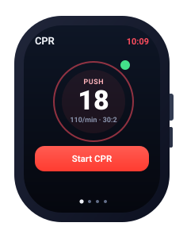</a><br><sub><a href="https://jim-mini.com/#watch/14-cpr">14 · CPR</a></sub></td>
<td align="center" width="25%"><a href="https://jim-mini.com/#watch/15-medical-id">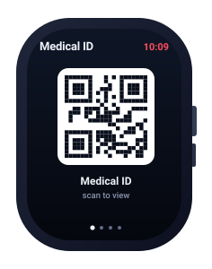</a><br><sub><a href="https://jim-mini.com/#watch/15-medical-id">15 · Medical ID</a></sub></td>
<td align="center" width="25%"><a href="https://jim-mini.com/#watch/16-sensitivity">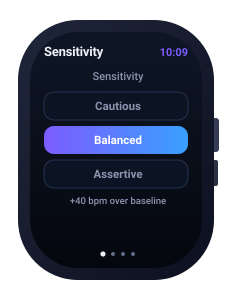</a><br><sub><a href="https://jim-mini.com/#watch/16-sensitivity">16 · Sensitivity</a></sub></td>
</tr>
<tr>
<td align="center" width="25%"><a href="https://jim-mini.com/#watch/17-ambient">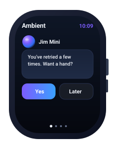</a><br><sub><a href="https://jim-mini.com/#watch/17-ambient">17 · Ambient</a></sub></td>
<td align="center" width="25%"><a href="https://jim-mini.com/#watch/18-companion">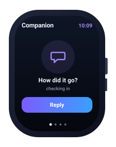</a><br><sub><a href="https://jim-mini.com/#watch/18-companion">18 · Companion</a></sub></td>
<td align="center" width="25%"><a href="https://jim-mini.com/#watch/19-notifications">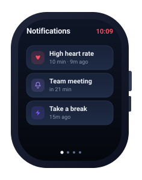</a><br><sub><a href="https://jim-mini.com/#watch/19-notifications">19 · Notifications</a></sub></td>
<td align="center" width="25%"><a href="https://jim-mini.com/#watch/20-devices">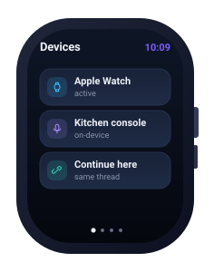</a><br><sub><a href="https://jim-mini.com/#watch/20-devices">20 · Devices</a></sub></td>
</tr>
<tr>
<td align="center" width="25%"><a href="https://jim-mini.com/#watch/21-guardian">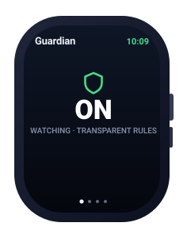</a><br><sub><a href="https://jim-mini.com/#watch/21-guardian">21 · Guardian</a></sub></td>
<td align="center" width="25%"><a href="https://jim-mini.com/#watch/22-settings">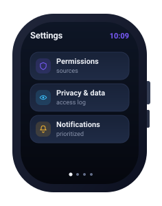</a><br><sub><a href="https://jim-mini.com/#watch/22-settings">22 · Settings</a></sub></td>
<td align="center" width="25%"><a href="https://jim-mini.com/#watch/23-breathe">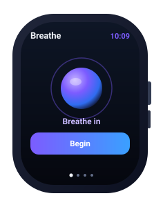</a><br><sub><a href="https://jim-mini.com/#watch/23-breathe">23 · Breathe</a></sub></td>
<td align="center" width="25%"><a href="https://jim-mini.com/#watch/24-feedback">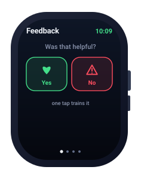</a><br><sub><a href="https://jim-mini.com/#watch/24-feedback">24 · Feedback</a></sub></td>
</tr>
<tr>
<td align="center" width="25%"><a href="https://jim-mini.com/#watch/25-journal">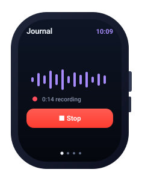</a><br><sub><a href="https://jim-mini.com/#watch/25-journal">25 · Journal</a></sub></td>
<td align="center" width="25%"><a href="https://jim-mini.com/#watch/26-coach">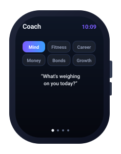</a><br><sub><a href="https://jim-mini.com/#watch/26-coach">26 · Coach</a></sub></td>
<td align="center" width="25%"><a href="https://jim-mini.com/#watch/27-baseline">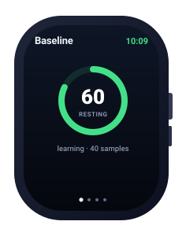</a><br><sub><a href="https://jim-mini.com/#watch/27-baseline">27 · Baseline</a></sub></td>
<td align="center" width="25%"><a href="https://jim-mini.com/#watch/28-sources">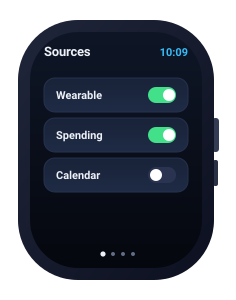</a><br><sub><a href="https://jim-mini.com/#watch/28-sources">28 · Sources</a></sub></td>
</tr>
<tr>
<td align="center" width="25%"><a href="https://jim-mini.com/#watch/29-privacy">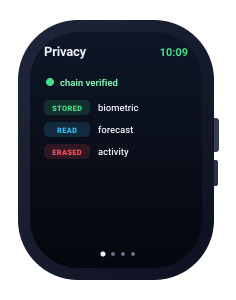</a><br><sub><a href="https://jim-mini.com/#watch/29-privacy">29 · Privacy</a></sub></td>
<td align="center" width="25%"><a href="https://jim-mini.com/#watch/30-handoff">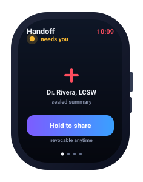</a><br><sub><a href="https://jim-mini.com/#watch/30-handoff">30 · Handoff</a></sub></td>
<td align="center" width="25%"><a href="https://jim-mini.com/#watch/31-offline">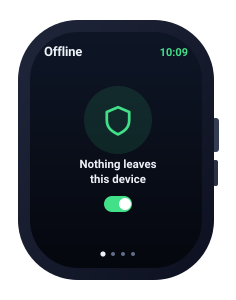</a><br><sub><a href="https://jim-mini.com/#watch/31-offline">31 · Offline</a></sub></td>
<td align="center" width="25%"><a href="https://jim-mini.com/#watch/32-conditions">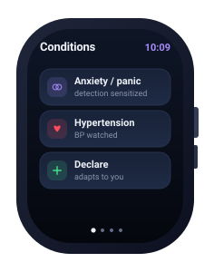</a><br><sub><a href="https://jim-mini.com/#watch/32-conditions">32 · Conditions</a></sub></td>
</tr>
<tr>
<td align="center" width="25%"><a href="https://jim-mini.com/#watch/33-style">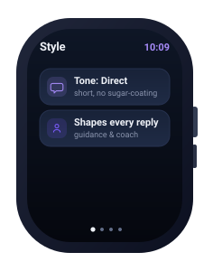</a><br><sub><a href="https://jim-mini.com/#watch/33-style">33 · Style</a></sub></td>
<td align="center" width="25%"><a href="https://jim-mini.com/#watch/34-history">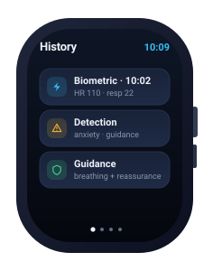</a><br><sub><a href="https://jim-mini.com/#watch/34-history">34 · History</a></sub></td>
<td align="center" width="25%"><a href="https://jim-mini.com/#watch/35-family">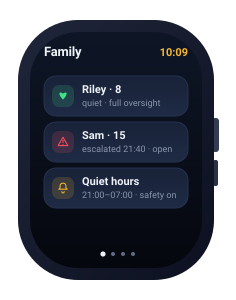</a><br><sub><a href="https://jim-mini.com/#watch/35-family">35 · Family</a></sub></td>
<td align="center" width="25%"><a href="https://jim-mini.com/#watch/36-agents">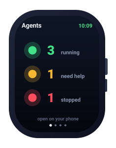</a><br><sub><a href="https://jim-mini.com/#watch/36-agents">36 · Agents</a></sub></td>
</tr>
</table>


## Quick start

```bash
# Server
pip install -e .
python -m jim            # launcher menu: choose your device
python -m jim serve      # just the API

# Console
cd app && npm install && npm run dev

# Tests
python -m pytest
```

To run alongside the sister products:

```bash
JIM_QRME_URL=http://localhost:8000 uvicorn jim.api:app                     # tandem with QRME
JIM_PDI_URL=http://localhost:8100 JIM_PDI_TOKEN=... uvicorn jim.api:app    # with the PDI vault
```

## Configuration

Everything is environment-driven; the defaults run locally with no keys.

| Variable | Purpose |
|---|---|
| `JIM_OFFLINE` | `1` guarantees nothing leaves the host. |
| `ANTHROPIC_API_KEY` (or `JIM_LLM=stub`) | Conversation model. OpenAI, Gemini, Grok, DeepSeek, Perplexity, Ollama, and custom endpoints are also supported (`JIM_*_MODEL`, `JIM_OLLAMA_URL`, `JIM_CUSTOM_LLM_URL`). |
| `JIM_MODEL` | Model override for the default provider. |
| `ELEVENLABS_API_KEY` | Spoken voice; without it the device voice stands in and says so. |
| `JIM_QRME_URL` / `JIM_PDI_URL` / `JIM_PDI_TOKEN` | Tandem links to the sister products. |
| `JIM_CORS_ORIGINS` | Allowed console origins. |

See [docs/hosting.md](docs/hosting.md) for production deployment and
[docs/cloud-model.md](docs/cloud-model.md) for the model-provider details.

## Documentation

| Document | Contents |
|---|---|
| [docs/guardian-internals.md](docs/guardian-internals.md) | How detection, drift bands, and escalation work. |
| [docs/early-warning-escalation.md](docs/early-warning-escalation.md) | The escalation ladder, end to end. |
| [docs/tandem.md](docs/tandem.md) | Running JIM-mini with QRME and PDI. |
| [docs/proactive.md](docs/proactive.md) | Proactive check-ins and ambient help. |
| [docs/beacons.md](docs/beacons.md) | Location beacons and sharing. |
| [docs/hipaa-baa.md](docs/hipaa-baa.md) | Clinical handoff and compliance posture. |
| [docs/hosting.md](docs/hosting.md) | Production hosting. |
| [docs/releasing.md](docs/releasing.md) | How releases are cut. |
| [docs/gallery.md](docs/gallery.md) | The full desktop and phone screen gallery. |

## Release history

<details>
<summary><b>What each release added, newest first</b> — the short version of
how it got here; full detail in <a href="CHANGELOG.md">CHANGELOG.md</a>.</summary>

| Release | What landed |
|---|---|
| **2.2.0** | Tandem release with QRME 2.2.0 (Raise: the three time controls) and PDI 2.2.0; version alignment across the trio, no functional change in this repository |
| **2.1.0** | Tandem release with QRME 2.1.0 (Raise — grow your own); version alignment across the trio, no functional change in this repository |
| **2.0.1** | **The coach grows eyes** — show it a picture, a screenshot, or one frame of your own screen; the monitors' own eyes in a fuller posture, the account returned beside the reply, the frame stored nowhere. The README now carries a screen for every major component. Tandem release with QRME 2.0.1 (the eyes and the room society) |
| **2.0.0** | Tandem release with QRME 2.0.0 (the avatar round); version alignment across the trio, no functional change in this repository |
| **1.9.0** | Three doorless doors open on every shell — heartbeat, freshness verdict, and the stretch that hears reach iOS, Android and Windows in all ten languages; ten-plus-five wire names each mean one thing and the collision record holds at zero; two floors join the live-measured registry; the front page welcomes every age |
| **1.8.9** | Cut with the siblings — QRME took the round: the avatar registry, the slimmer room strip, the waiting seat, the dock that fits |
| **1.8.8** | **How old is the reading** — the staleness contract: source-stamped ages, per-consumer windows with named states, the two silences separated, p95-at-decision on demand; meetings arrive as words under the roster's own keeping; the synced address book reaches all three shells |
| **1.8.7** | **The coach carries its own settings** — four doors beside the conversation (Aims, Journal, Bearing, what JIM may do); the rest of the round is QRME's |
| **1.8.6** | **The ladder winds itself, and the book has doors** — the coach→JIM ladder runs on the day's own traffic behind its two permits, no button anywhere; the synced address book is reachable from a phone at last, with a picker-based sync on the console and the numbers never returned |
| **1.8.5** | **Cut with the siblings** — no functional change; QRME took this number for the owner-released voice, the unclaimable premades, the loudness rail and the iPhone ear fork |
| **1.8.4** | **The ear that opens stays open** — the console's audio unlock armed on `pointerdown`, took its one refused shot on WebKit and never tried again; it arms on click/touchend/keydown now and retries until granted, and the coach spoke on an iPhone the same hour. The split-wording ledger closed — the crisis screen's "End it" became "End the hold" — and the voice door wears the studio microphone, matching the sibling console |
| **1.8.3** | **The guardian refuses in the reader's language, all the way down** — the 78 interpolated refusals the record was holding open become registered templates, ~63 new constants each with frames in nine languages, and every raise site builds its sentence through `i18n.fill` so the reader's language can refill the frame. Handlers hand a carrying exception on through `i18n.raised` instead of `str(exc)`, which would drop the template and leave the refusal English everywhere. The `refusals.template_calls` floor rises 15 → 78, and the unannounced-speaker test follows its sentence into the constant where it now lives |
| **1.8.2** | **The last answer does not depend on anything that can fail** — the catch-all that turns a crashed route into an answer the console can read built its 500 through a translator that could itself fail; when it did, the answer left without the CORS header and a crash read as an unreachable backend. Guarded now, with a constant English fallback, in all three products. Also: the suite's floor registry grew from 68 to 145 ratchets in a night-long audit of the guards' guards — the unregistered-floor backlog holds ten rows, every one needing a live client; the 98 unlabelled request fields are verified decisions with a guard that fires the day a form asks for one; and the three-suite divergence record reaches zero unread rows |
| **1.8.1** | **The strip finds out when the phone stopped it** — an iPhone reported the walk stopping silently after a trip to the home screen, and every claim 1.8.0 made about an open capture surviving a hidden page turned out to be a desktop claim and an Android claim: iOS Safari suspends the whole page, capture included. Four places asserted the universal version and one of them was a guard banning the correction. `Listener` answers `live()` now — read off the recorder rather than remembered — and the strip asks on the way back and says so in all nine languages when the microphone is shut. Also: the last 82 English refusals in the platform are translated, closing that backlog in every product; and a new guard reads the translations themselves rather than only the count of missing ones, after two rows reached the table with a word from the wrong alphabet in them, and another holds every console to what it actually tested about a minimised window |
| **1.8.0** | **A conversation you can take with you** — both of this console's conversations unmount on a tab change and the voice went with them, which is right for navigating away and wrong for walking away on purpose. A walking figure hands the conversation to a strip that outlives the screen; pressing it lands on the front page so the console is navigable from there. It survives a minimised window on the web on a desktop and on Android (`getUserMedia` keeps recording where the recogniser is ended; iOS Safari suspends the page instead — see 1.8.1), and leaves the application entirely on Android, iOS and Windows — each paying the platform's own price for the microphone: a notification that cannot be dismissed, the system's orange dot, the tray indicator. Also: the coach now knows all thirty-two of its own screens rather than five, joined to the screen census so a new screen fails the suite until somebody says what it is for; and the walk says when the offline stack answered rather than passing stack text off as the model somebody chose |
| **1.7.0** | **German finishes the informal register** — a German reader met *Sie* on the desktop console and *du* on the phone, and both registers inside each table; 381 rows across the console and the three native shells are informal now, and every row still counted is named as third-person `Sie`/`Ihr` rather than left as a number. Also: the refusal backlog was counting sentences nobody can read — seven constructor preconditions across the trio, raised from environment variables while the app is wired, sat in a record that describes itself as sentences a person reads; and `len(_REFUSALS) >= 21` was a floor against a table of 147, now registered so the comparison is actually made |
| **1.6.2** | **A script was being escaped like a page** — `_js_literal` builds the JSON and JavaScript literals the landing page drops inside a `<script>` element, including the translated string table, and it called `html.escape`; a browser does not decode HTML entities inside a script element, so `Terms & Conditions` reached the reader as `Terms &amp; Conditions` in every language, while the guard actually written against `</script` sat after an escape that had already neutered it and never matched anything |
| **1.6.1** | **A mail server having a bad day could discard a health reading** — the calendar's reminder pass, the far end's monthly proof-of-mailbox and the far end's own alert all send from inside the monitor sense, and none of the three was wrapped, because with no mail server configured `deliver` prints on the server and cannot fail; configuring one meant a refusal or a hung SMTP connection raised straight out of `POST /monitor/{user_id}`, discarding the reading and running no detection at all. Also: a transient outage could lock an address out of signup, by 500ing after the pending account had already committed |
| **1.6.0** | **A letter printed on the server had been reported as a person notified** — `farend.notify` set `delivered: True` for having *written* a letter, so on a host with no mail server every far-end escalation said the emergency contact was reached while the letter went to a container log; the flag follows the transport now, a printed letter is no longer recorded as an alert (it was suppressing the next real one for half an hour), and the monthly proof-of-mailbox is not attempted with no mailbox to prove |
| **1.5.0** | **Version alignment** — the trio releases together and one number names one tested combination of all three; this release's changes live in the qrme repository (an iPhone can speak in a room now), and nothing changed here since 1.4.0 |
| **1.4.1** | **Version alignment** — the trio releases together and one number names one tested combination of all three; this release's changes live in the qrme repository (the room no longer prompts itself with the profile's own voice, the conversation no longer pushes the controls off the screen, and a microphone lit over a refused speech service now says so), and nothing changed here since 1.4.0 |
| **1.4.0** | **A slept tab does not go quietly deaf** — a backgrounded page has its speech recogniser ended by the browser with no error, and neither console had a single `visibilitychange` handler anywhere, so every light saying it was listening went on saying it over a microphone that had stopped; the standing ear stops relighting itself every 400ms into a tab that cannot run one, the pill and the orb say *this tab is in the background* instead of *listening*, and being put away is reported as its own failure rather than as quiet — reported as quiet, a standing conversation would have re-opened the microphone into the sleeping tab forever |
| **1.3.0** | **Version alignment** — the trio releases together and one number names one tested combination of all three; this release's changes live in the qrme repository, and nothing changed here since 1.2.0 |
| **1.2.0** | **The chosen voice is the one a phone hears** — a phone withholds autoplay unless playback descends from a real press, and this built a fresh element per sentence after the synthesis fetch, so every piece was refused and every reply fell out of the bound voice into the browser's robot; one element, opened on the first press anywhere and reused, and a reply no longer leaks a blob URL per sentence or leaves eighteen dead listeners behind it |
| **1.1.0** | **The microphone has an off** — mid-conversation with the coach the only control on the sphere was the sphere itself, and tapping it ends the call; muting now stops the recorder outright (an ear still running and discarding is a microphone still open) without touching the standing turn, so unmuting picks up where you left off, on both the coach's sphere and the check-in's |
| **1.0.0** | **One number across the trio** — the wrist app, the standing ear and the vitals ladder as they stood at 0.99.1, plus the voices offered on the settings screen being the account's real ones (clones included) rather than a hardcoded roster, and every box that takes an API key now saying whose bill it becomes: this deployment's keys are the owner's while the beta runs, and entering your own moves the charges to you from that moment |
| **0.99.1** | **The wrist's first build** — the wear app's Gradle wrapper is committed and exercised (it shipped without one, so its own README's first command failed on a fresh clone), every non-obvious Android API checked against AndroidX's own source, and a watch that fails to register its heart-rate sensor now says so instead of drawing nothing |
| **0.99.0** | **The wrist is a surface** — a standalone Wear OS app (`native/wear/`) that talks to the deployment itself, so the phone can be in another room: the pulse read through Health Services, a turn of speech handed to channel 2 as **words never audio** (the watch recognises the speech itself, so nothing but text leaves the wrist and it works with no transcription key), the coach reaching out first, and help now — signing in through Wear's own dictation input rather than pretending a watch can enroll anybody; a reading may now name the roster row it came off, so a wrist that reports stops saying `waiting` — without gating the reading, because the vitals ladder is not the monitor roster; the screen monitor is really seen (`getDisplayMedia`, described on the server, no frame stored anywhere), channel 2 gets its pipe, the Guardian stops answering herself, and the roster stops printing permission as fact |
| **0.98.0** | **The answer begins before it ends, and the house is listening** — the reply is spoken piece by piece (the first sentence synthesised alone and every later piece fetched behind the one playing, so the wait no longer grows with the length of the answer), the turn ends after 2.5 quiet seconds and the voice follows the already-connected earbud in and out; the conversation can be interrupted mid-reply and silence is never a turn (the energy gate keeps invented words out); the standing ear listens for the cue words with its own switch on the lights row; the specialist's sphere reaches the check-in screen and waits for the tap the browser demands; the Baseline screen rounds up every limit — vigil, sensitivity (the unreachable third level repaired), and money sliders (low-balance floor, savings goal, mandate caps) with real doors on all three phones; leaving a screen ends its conversation everywhere; the task window gets its paint, the Photos menu opens photos, and the bed sensor says who it notices |
| **0.97.0** | **The conversation reaches everyone who talks** — the engaged session joins the standing voice loop (mic, wave-ring orb, two quiet minutes to bow out) and the study question's yes/no is literal buttons; the specialist chimes in out loud: on a detection her own sphere opens over the monitor, wearing her name, speaks the guidance, and holds the mic for a discussion at her own door (`specialist_area` on the wire) — the emergency card and call door untouched; the reviewer's three calls land: the look gets its own permit, the excursion asks first in-turn verbatim, and the idle exit is two minutes everywhere |
| **0.96.0** | **The conversation stands, and the agent's hands reach the look** — the voice exchange on Talk and Coach is a standing loop (listen, answer aloud, listen again) until the person taps out, with quiet re-opening the microphone instead of hanging up; the engaged agent gains a real `set_appearance` hand (standard, midnight, paper — colors only, photos untouched) with a matching Settings card, and takes `study` so an asked-for knowledge excursion runs on the spot; the front door answers `general`, the composer mic really listens, the wave orb rides the voice level, and the channel's device block wears the phone's own Bluetooth-page shape; the menu tile is renamed "What JIM can touch" |
| **0.95.0** | **Version alignment** — the trio releases together; this release's changes live in the qrme repository (the ears arc reaching every briefcase door), and nothing changed here since 0.94.0 |
| **0.94.0** | **The lookout grows ears, and the doors exist** — a lookout planted on a recording stands a listening appointment: the vault's new `fetch.listen` seals the words said in the media file, with the same change-memory the pages keep, and the letter says "watched recording"; the coach carries a map of the product's own doors so a door-shaped request is walked to its screen instead of shrugged at; the held screen's quick-allow buttons match the wire, the permits screen has its own menu entry with two standing guards on every door, enrollment can no longer strand a planless account, and the excursion rows wear `answered_by` on screen |
| **0.93.0** | **The letters keep every promise, and the lookout grows eyes** — the weekly letter is no longer the looser door (a voice that would leave the host gets the sanitized digest, with `left_host` and the redaction count disclosed) and no longer outlives the memory (every forgetting door stamps an epoch; a letter rebuilds from what the tables still hold before it is shown, and a week whose facts are gone loses its letter); the lookouts watch pages as a person meets them through the vault's new rendered fetch instead of the shell the server sends |
| **0.92.0** | **The ladder ends at a person** — `notify_contact` stopped being words: a critical detection now mails the consented far-end address with an acknowledgment link a person can press, the escalation result refuses honestly in the user's own language when nobody is configured, and a monthly liveness note proves the mailbox on a calm day instead of during an emergency; the Held screen carries the card that sets the address and shows whether a person saw the last alert, and the assistant's menu entry finally says the product's name instead of the amulet's incantation |
| **0.91.0** | **The choice follows the person, and the letter closes the account** — a user whose provider is the vault now *studies* inside too: the sanitized brief goes to the resident (the same voice door the coach uses) from a typed question, the coach's own study, and the unattended errands alike, with `left_host` honestly false and an older tandem falling to the local provider rather than quietly shipping to the cloud. And the weekly letter accounts for the studying: the week's excursions with their latest topics join the digest, because work done on your behalf belongs in your account of it |
| **0.90.0** | **The watching reaches the person** — the coach speaks from the watched pages: the freshest capture of each rides the prompt wearing its URL and date, capped at a digest's length, on every provider including the vault path. The lookout list says when each page last *actually* changed (PDI's fingerprinted captures) and, in red, why the latest round failed (the vault's runs ledger) — no stale alarm outliving a recovery, absence never becoming a guess. And the weekly letter carries the watching's facts unprompted: "watched page X changed on {date}", "the watch on X has been failing" — a changed page alone earns the letter |
| **0.89.0** | **The coach answers grounded in the vault** — with the `vault` provider chosen, the coach no longer recalls lines into the prompt and ships it out: the resident ranks this person's own seals against the question and answers *from* them, retrieval and generation both inside the facility, the memory prefix standing as the per-person wall inside the shared tenant. Client-side recall steps aside when the vault grounds, and `grounded_in_vault` in the provenance says whether the grounding actually happened — an older PDI still speaks through the voice door, ungrounded and disclosed, and a stub answer is never reported as grounded |
| **0.88.0** | **The vault that works while you sleep** — the coach can speak from inside the facility: a `vault` provider on the existing model screen routes generation through PDI's resident inference, the prompt traveling the one authenticated channel every seal uses (audited by length, never by words), degrading honestly to the local stub with `generated_by` saying who answered. The **lookout** puts standing tasks to work: "keep an eye on this page" plants one appointment in the vault whose fetch re-seals the current capture every cycle — the resident watches, JIM never does, planting behind the study permit, dropping cancels-then-unseals-then-releases, erasure walks the same path counted honestly. And recall keeps the real vault: a person who moved to an open plan keeps being recalled from what was sealed while they paid, while their new turns are honestly not sealed at all |
| **0.87.0** | **The coach remembers, and the person holds the eraser** — long-term memory through the PDI resident (`jim/recall.py`): check-in notes, journal entries and coach turns are sealed AES-256-GCM into the tandem and indexed by meaning, a hash and never the text, so the shoulder mentioned in March meets the training question in August. The remembered lines fold into the prompt as context, never instruction. `GET /memory/{user}` is the shelf — every remembered moment shown to the person it is about, with a per-moment forget that unmakes the vector, the seal and the ledger row together — and every local delete keeps the same promise: a journal entry or check-in taken back stops being findable, erasure sweeps the whole prefix in one call and reports honestly, and reads and deletes go through the real vault rather than the plan-gated one, so a billing change never strands somebody's history. On the console, on iOS, on Android and on Windows |
| **0.86.0** | **The watch on the wrist becomes real** — all thirty-six faces in `docs/watch/` are working screens at `jim-mini.com/#watch`, each standing on the doors the phone screens use: `#watch/<slug>` deep links, swipe and a 36-cell grid between faces, 148 new console strings in ten languages with the phones' wordings copied byte-for-byte. CPR keeps its own time — 110 compressions a minute on the audio clock, 30:2 in tone and vibration, no account and no network — and the emergency face hands the number to the device, which is the thing that can place a call. The README's gallery links every drawing to its living counterpart, screen 112 records the surface, and a tutorial lesson teaches it |
| **0.85.0** | **The front page reads like a product** — the README cut down to a professional overview at the owner's ask, the 36 watch faces kept in place above the drip channel that feeds them, the desktop and phone galleries moved whole to `docs/gallery.md`, and every guard that held the old page holding the same promises across the pair. No functional changes to the product itself |
| **0.84.0** | **Everything running, in one place — and the cameras, the call and the day feeding it** — six rounds around one question: what is happening right now, and did the person agree to it. A **task window** answers the first, gathering every engaged session, liaison, call, open microphone and switched-on monitor into one reading, beside what has been spent today and what the plan permits — the server composes no prose, so four shells say it in ten languages. **A link past the call now needs both people**: extending it was one person's decision and closed on the other's behalf, and now the agreement is matched to the wording, so re-wording the task drops the other side's yes rather than carrying it onto something they never read. **What the coach noticed becomes JIM's problem** — and only when it has to: the free local stack answers first, the paid model is reached for only where it could not, `critical` is excluded from that pass because it belongs to a person, and running out of budget reports what went unhandled rather than refusing the free work it could still have done. **The day as it was taken in**, with what survived matching what the roster promised before anything was switched on — a monitor that holds nothing still notices, and drops the content saying which rule dropped it. **A room reads cues rather than keeping footage**: a fall, a call for help, slurred speech, each graded in the escalation vocabulary and resolved once, each naming the reference behind its grading, and the sentence the cue was read from is never what is kept. And **two people on one call, each with their own channel 2** — a disclosure and nothing more, carrying no audio and neither side's session, ending the moment either channel closes, because a row that outlived the session it names would report somebody as listening after they hung up. On the console, on iOS, on Android and on Windows |
| **0.83.0** | **The people in your phone, and the call that knows who it is with** — the address book arrives from the device under a grant rather than being retyped, and `sync` replaces rather than merges, because a merge quietly keeps people you deleted from your phone months ago. This is the grant that is mostly about **other people**: every other source is your own pulse or calendar or spending, and an address book is a few hundred names who never chose this product, cannot see that it holds their number, and were not asked — so it is off until you turn it on, one function is the only door to reading it, and withdrawing it **drops the book** rather than merely stopping the sync. The far side's number is still never stored: recognition only reads, and a call from a number nobody granted leaves exactly as little behind as before. Where the book says the person you are ringing has a guardian too, and you are already each other's contacts, and the permit is on, the two open a link **with the call** rather than waiting for somebody to press something mid-conversation. And when there is no guardian on the other end — your mother, most of the book — what survives the call is the appointment she gave you, filed under her, in the calendar everything else reads, with nowhere in the schema for what was said. Free on every plan |
| **0.82.0** | **The coach runs the day, and JIM is what it calls** — five rounds that finish one story. What the offline coach could not answer becomes an **errand**: JIM goes and studies it on a budget counted from the ledger, folds the findings where the coach reads them, and closes the question so nobody pays to study it twice — the local half being the part that works in a tunnel, holds the private side where no outside model sees it, and grows with somebody for as long as they use it. **Beside you while you write**: paste a page for a customer and get at most three remarks, each carrying where it came from, read on the device and dropped — the module imports no database and calls nothing that writes. **An aid on the call**: on a speaker, in a car, on a conference, the far side hears the support-line notice first, in a language their dialling code suggests and in each one where the mix is known, and nothing listens until it has gone out. **Somewhere to plug the monitoring in**: every camera, speaker, screen, band, ring, patch and doorway sensor saying what it takes in, who else it reaches and what stays behind — nothing that catches other people is ever on by default. And **two guardians working together**, over the network and never on the line, only between people already each other's contacts, each person able to read their own guardian's half, the link living exactly as long as the task it took on |
| **0.81.0** | **The sentence that forgot how it was built** — `str()` on a `Templated` returns a plain `str`, which drops the template, so a refusal built by `i18n.fill` and passed on as `HTTPException(403, str(exc))` reaches the reader as bare English in every language, looking exactly like a sentence nobody has translated yet. QRME shipped it on the sentence somebody reads while something is going wrong. Nothing here launders a template that way today, and this release is what keeps that true rather than assumed: `i18n.raised` hands a refusal on in the shape it was raised, and a guard carried by all three products fails any route that reaches for `str()` instead |
| **0.80.0** | **The version, and nothing else** — no code changes in this product. QRME took this release on its own (the agent asking people rather than pages, and the ledger of which far hosts keep watching it leave); the cut keeps the three reporting one number to the tandem's version guard |
| **0.79.0** | **The version, and nothing else** — no code changed in JIM this release. QRME took 0.78.0 alone for a plug-in storefront this product has no counterpart for yet, and 0.79.0 brings the three back to one number, so the console's version guard and the tandem have a single answer rather than a table of which pairs go together |
| **0.77.0** | **The name in the list is the link** — the circle shows your neighbours by name, and opening one of their homepages meant typing their id into a box: a UUID, so *type it in* really meant *copy it from somewhere else first*. The name is the way in now, and the box stays for an id handed to you from outside the app, which is the case it was always right for |
| **0.76.0** | **The console gets a front door, and a Studio behind it** — twenty-four tiles and no way in meant knowing which tile before you could ask for anything, and the one carrying the mark opened a permissions panel rather than JIM. `Talk` is a composer at the bottom and a horizontal scrolling rail above it; the rail launches the screens that already exist rather than reimplementing them, and its labels are derived from the destination so a chip cannot end up labelled for one screen and opening another. Beside it, the Studio: small programs you write for yourself, run with the network cut, one directory, no other programs and finite time — and nothing runs at all on a host that cannot build all four walls |
| **0.75.0** | **A record of what was done, and whether the record was edited** — JIM keeps the person's timeline in `events`, which is pruned, reshaped and paginated, and every one of those is indistinguishable from tampering once the same rows are load-bearing for evidence. So PDI's hash-chained audit log is ported here: each entry's SHA-256 covers the one before it, seventeen consequential acts are catalogued and all seventeen wired, the table has no foreign key to `users` because a chain a cascade can empty is not tamper-evident, and an erase records itself rather than removing what the chain already said. `GET /audit/{user_id}` is the door that makes the last one honest. Also: the console-untranslated ceiling from 93 to 2, including an `aria-label` left in English beside a label that was too |
| **0.74.0** | **The whole mark on the button, and the path where nobody can speak** — ABRACADABRA carried an alchemical glyph; it carries the jim-mini OS lockup now, at a size the mark can be read at, with every other menu icon raised to match on all four clients. The crash watch — the one way this product summons help when the person cannot press anything — decided its own tier with a boolean and told the trusted contact at 3am to "treat it as real" and nothing more; it goes through the escalation ladder now, and every page it sends ends by telling the one person who can dial that JIM cannot. Also: settings you can change by saying so, a grant list that switches off again, and three undos that would have failed at the moment somebody used them |
| **0.73.0** | **The phones that never asked which backend, and the fallback that was never reachable** — `/health` has answered a `version` since a stale backend first cost somebody an evening, and every native shell decoded that field away: nine places where it was in the response and out of the struct, so a phone pointed at an older install looked alive while every newer screen said "Not Found" for no stated reason. All nine read it now and raise a dismissible banner naming both versions and the address, above the tab bar and the welcome flow both, in ten languages. Also: Safari allows `SpeechRecognition.start()` only inside the tap that asked for it — Safari allows `SpeechRecognition.start()` only inside the tap that asked for it, and `listen` read the voice settings first; the await ended the gesture, so the device recogniser was refused with `service-not-allowed` and the fallback promised in that module's header had never worked in a browser. `preferDevice` — the flag whose whole job is to make the retry skip the failure — was read after the same await, so the retry died identically. And the refusal printed a browser error code where it could name Dictation |
| **0.72.1** | **Two answers the key check could not give** — a credential copied from a dashboard carries a trailing newline, which `http.client` refuses as a header value before any request leaves the machine; that `ValueError` is not a `URLError`, so it escaped both handlers and the new check answered 500. Three of the four clients trimmed their input and the console — the one deployments are configured from — did not. And ElevenLabs answers **401** to an account with a failed invoice, the same status it answers to a key it does not know, so a working key was called refused and its owner sent hunting a credential that was never the problem |
| **0.72.0** | **The voice says what it is doing** — a house `ELEVENLABS_API_KEY` was read and thrown away, so a deployment paying for everyone's voice got the device's; "Saved." reported that a *string* had been written and never that it was a key, which let the dashboard's permanently-visible key **ID** be pasted and fail several screens later; and nothing read the remaining allowance, so a spent one degraded to the device voice in silence. `POST /settings/voice/check` and `GET /voice/quota` answer both questions now, on all four clients |
| **0.71.1** | **No functional changes to JIM-mini** — cut with the siblings. In QRME, `widgets.py` imported a POSIX-only module at the top of the file, which took the whole API down on Windows: the frozen desktop backend would not start, and two releases published with no installers attached at all |
| **0.71.0** | **The session you leave running** — the coach answers a turn; an engaged session stays open until you sign off, does things across your own records through a written allowlist rather than the token's full authority, and lands every change on a trail with the request that would take it back beside it. Signing off is a handover: what the session was about goes to the offline coach, and anything you name becomes a standing watch it raises unprompted. Nothing on the list raises an alarm, moves money or ends anything — those doors are not on it. On all four clients at once, because a client that could speak into a session but not show the trail would take the permission and drop the condition it was granted under |
| **0.70.1** | **No functional changes to JIM-mini** — cut with the siblings. In QRME, the widget runner asked whether *an* interpreter existed and never whether it was new enough, so a host carrying Node 18 reported ready and then failed every run |
| **0.70.0** | **The alarm sends the message it always claimed, and the apology speaks the reader's language** — a care beacon's alarm now pages a real channel and every attempt lands in the ledger, with the finder's sentence derived from the outcome rather than asserted; the failure reports come home to this backend; Android's first-aid surface stops speaking English at the worst moment; and the console-untranslated record tells the honest number under a reader that can finally see a rendered choice |
| **0.68.0** | **The plate is the receipt, the week in words, the answer before the room, and the statement is the reading** — meal photos seal like clinical captures while the note feeds the offline coach; a weekly letter is composed only from what was logged; interview drills deal from a local bank and read answers honestly with or without a model; and the money guardian takes vaulted statement files whose closing balance wakes the warning ladder, beside written aggregator consents whose sync never invents a balance |
| **0.67.0** | **The tandem carries the pulse** — connected apps route their collections to where they do work (a reading walks the watch intake, the room lands where the coach reads it); the readings that trigger a detection cross the Guardian→QRME handoff as real biometrics, so the specialist answers the pulse and not a sentence about it; collected rooms are scanned by an offline, referenced hazard table that warns before it wounds; and a minor's activation code goes to their parent or guardian, so consent is a verified click and not a ticked box |
| **0.66.0** | **The coach answers with the network cut** — the offline coach engine lands as the patents drew it: an add-and-norm stack over stored knowledge and current readings, every layer on the record, never touching the network; the curated pack jampacked to thirty-nine entries across all six areas; learned excursions finally reach the coach, paid model turns deposit their answers so no gap is bought twice, misses write the curriculum, and one press of study fills them — store, curriculum and study each with four doors in ten languages |
| **0.65.0** | **Cut in step** — no JIM code changed; QRME's standing rooms learned to be one place instead of a stamp, its lobby's join pitch gained the door it promised, and its friend faces open the friend's page |
| **0.64.0** | **The footsteps show, and the fifth wearable family is every other wrist** — a footsteps counter rides `/health` into the console's top-right corner (enrolled people, as an aggregate, in ten languages, shrunk to a footprint on a same-evening field report); and the watch picker gains "Another brand's watch (via its own app)", whose recipe is a check rather than a promise — verify the vendor app in the phone's health-store list, follow the existing recipes when it appears, and hear the captive-data truth out loud when it never does |
| **0.63.0** | **The imported link is visited, and the console fits the phone** — `POST /social/connection/{cid}/scrape` goes to the public address a collect connection has always carried and ingests what a browser would show anybody as a `social:<platform>` context event, the Guardian understanding more of the life it looks after; offline refuses before any socket opens, and the door opens from the console and all three shells. The field-reported layout defects — the screen that did not fit, the list that stuck halfway — trace to one root: grid items refusing to shrink; the tracks clamp now, the app height follows `100dvh`, and the sidebar scrolls on its own |
| **0.62.0** | **The phones reach parity with the console** — eleven rounds in one branch: every backend route now has a door on iOS, Android and Windows, the doorless ledgers closing at the four by-design rows; the voice pair lands on all three shells with the device's own voice as the fallback and the microphone asking before it listens; Android learns to say PATCH through the override the backend pins with a test; and the most-touched screens swap their English for the ten-language tables, the untranslated ratchet falling to 12/31/24 |
| **0.61.1** | **Ability is not a gate** — an accessibility statement with a door under it: the Accessibility screen reachable before enrollment (`#access`), three questions with no account, no token and no name (the table has no identity column to fill), sealed to the PDI vault and read only under the reviewer token, which fails closed beyond localhost. Signup opens for the beta behind a keyhole that stays. The known-gaps ledger opened at two rows and closes at zero — coach, specialist and check-in answers are announced to screen readers, the shells carry the per-need statement — every closure held by a test, and Terms 1.2 says only what is true |
| **0.61.0** | **The console the policy blanked** — jim-mini.com went live and served a dark, empty page: the nonce Content-Security-Policy meant for the server-rendered pages was stamped on the console bundle no nonce can reach. A policy of its own for `/app`, the bare domain now lands on the console, and the release-bodies sweep survives its first honest run — a script that could not parse, then a fetch that silently lost releases, both repaired and guarded |
| **0.60.9** | **No change to this product** — the release-body work ends: every inherited body rebuilt from its own CHANGELOG entry, the record at a ceiling of 0 with one release kept deliberately, and three checks that reported success while doing nothing fixed. Carried here to keep the three at one version |
| **0.60.8** | **No change to this product** -- carried from PDI's round: a release checklist naming every version field, byte-identical in all three, and the deletion of `RELEASE_NOTES.md` after 412 of 530 releases proved to carry one frozen v0.24.0 body. A reader replaces the writer. Carried here to keep the three at one version |
| **0.60.7** | **No change to this product** — PDI's console round: a screen that imports the translator is not a translated screen. Two of its screens sat on the finished side of the ledger for twelve releases holding fifteen English strings; a guard now names that state on the round it happens. 91 → 32. Carried here to keep the three at one version |
| **0.60.6** | **No change to this product** — PDI's console round (Positions and Bridges, 154 → 168 → 91). Carried here to keep the three at one version. Its reader asked for a letter-space-letter and so could not see `Role &amp; industry`; this product's console reader records strings verbatim rather than counting phrases, so it has no such test to be wrong about — checked, not assumed |
| **0.60.5** | **No change to this product** — PDI's console round (225 → 154). Carried here to keep the three at one version. Its one portable lesson: two guards that greped their screens for English went red when the screens were localized, and now follow the key to the table instead |
| **0.60.4** | **The reader this product already had turned out to be the one that was right** — no change here. PDI's console was read by the regex shape this product abandoned rounds ago, and it was missing a quarter of the English. Two suites can carry the same guard by name and not by reach |
| **0.60.3** | **A check that cannot fail before the merge is not a check** — `ci.yml` carried the same blind trigger `native.yml` did, and had been red for 29 runs on four guards that shell out to the JSX-text extractor: the job running pytest installed no node dependencies, so they failed on the runner and passed everywhere else. Trigger fixed, dependencies installed, and a guard that reads the triggers themselves |
| **0.60.2** | **The compiler was in the room the whole time and nothing listened** — the native workflow fires on any branch push now. Five call sites parsed a `JSONObject` that was already a `JSONObject`, four `L10n` rows had lost their key line, `L10n.fill` did not exist here, and `AppState` carried `private set` twice |
| **0.60.1** | **A fix to the cascade fixes the next erase, not the last one** — every account erased before 0.59.9 left 43 tables standing, and they are still there: the medicine cabinet, the money mandates, the clinical captures. `python -m jim.orphans` is the reach-back, dry by default. Plus **the exit reaches the phones** — 0.60.0 let a phone-only person take their data and not end it — and the Windows shell's `SelfProfilePage`, which had never compiled: 38 reaches for members `AppState` does not have |
| **0.60.0** | **An export is measured against the schema too** — this product had **no export at all**. It keeps a medicine cabinet, a money guardian's accounts and mandates, clinical captures and a journal, and offered its owner a way to erase all of it and no way to take it, while the suite's Article 20 bundle listed its contribution as a progress report. `GET /data/{user_id}` now answers, derived from the schema, with live credentials dropped per column by rule |
| **0.59.9** | **An erase is measured against the schema, not a list somebody wrote** — `delete_user_data` says *erase every trace of a user across all tables*. It named 21; the schema has **63** with a `user_id` column, so 43 survived — the money guardian's accounts and mandates, the medicine cabinet and every dose logged from it, the clinical captures, and `crash_watches` and `vigils`, which are standing permissions to act for somebody the API answers 404 for |
| **0.59.8** | **The check that covered one client of four** — 0.59.7 asked whether the shape a screen declares is the shape its route answers with, and asked it of the console alone. The three shells decode the same answers into their own types, and a wrong one there throws the same way. Extended to all four clients (console 245 · iOS 89 · **Android 3** · Windows 88); no disagreements, and the reach is now a record that cannot go down, because a reader that stops matching reports agreement |
| **0.59.7** | **`req<T>` is a cast, and a cast is a claim nothing checks** — `GET /users/{uid}/referral/clinicians` answers an object; the console declared `Row[]` and the Attending screen called `.map` on it, throwing during render the moment anybody pressed *who would this reach*. The `reason` the backend composes for an empty list — *no clinician registered* — had never been shown to anybody, because the screen threw before reaching it. Fixed, and shown |
| **0.59.6** | **The clients agreed with each other and were all wrong** — parity between clients is a relative check, and a relative check is satisfied by everybody being equally wrong. Next door a vault under customer custody required `x-tenant-key` on every record route and no client sent it, so pressing *hold our own key* locked all four clients out — including out of the button that undoes it. The new guard reads the requirement out of the **application's** dependency tree, then asks each client only about the routes it actually calls |
| **0.59.5** | **The third sink, where both the escaping and the policy miss** — `_js` here was bare `json.dumps`, which escapes what ends a JavaScript *string* and says nothing about `</script`, which ends the *element*. QRME had it right. Fixed, and the script's translated string table went the same way. All three now share one primitive, verified by behaviour rather than trusted by name — the guard's first draft whitelisted a helper that was itself unsafe. Consoles swept and clean |
| **0.59.4** | **The sweep that found the last one, kept** — 0.59.3 found reflected XSS by walking every f-string that builds markup, by hand, once, and throwing the walk away. It is now a guard with a ratcheted record: **3 rows**, all pre-escaped composites the analysis cannot follow. It follows escaping through single assignments and helper returns, and refuses to read prose containing angle brackets as a page. `<html lang=…>` and the policy nonce are now escaped too |
| **0.59.3** | **Reflected cross-site scripting on the sign-in callback** — `?error=<script>…` came back as live markup on a page served from this origin, and every HTML page a stranger reaches carried no `Content-Security-Policy`, no `nosniff`, no frame or referrer policy. Escaped at the interpolation, and `pagehead.py` now stamps a per-response nonce the policy names, so an injected tag has none and does not run |
| **0.59.2** | **A crash the browser threw away** — an unhandled 500 is rendered by Starlette *outside* every middleware the app adds, including CORS, so it went back with no `access-control-allow-origin` and the browser discarded it whole. Every crash reached its user as "Failed to fetch", indistinguishable from a backend that is not running. No in-process test could see it: a `TestClient` sends no `Origin` and applies no browser rule. Fixed with a catch-all inside the CORS layer, and guarded by a file that boots a real server |
| **0.59.1** | **Three suites, and nothing comparing what they ask** — every guard here exists in three copies and the copies drift silently. A sweep of test-function names found 370 carried by all three and 140 by exactly two; 16 of those are absent from this product. Four were one defect in PDI, whose `serve` never opened CORS for its own console. The shared vocabulary and the divergences are now written down, byte-identical in all three repos |
| **0.59.0** | **A floor nobody raised** — every floor in the suite swept against what it measures. 69 carried their own literal; l10n sat at 10 against 279–312 and path literals at 40 against 466. The console's `> 200` **passed**, at four-fifths — the identical literal is at 0.47 in QRME, because one number written for three repositories is calibrated for whichever was smallest. `ratchets.py` gives each floor a measurement; the rest are a backlog that only shrinks |
| **0.58.9** | **Ten against two hundred and seventy-nine** — the L10n guard's floor has not moved since it was written: ten localizer calls, twenty table rows, against tables that now hold 286–312 rows. Narrowing the call pattern to `L10n.t("…")` blinds C# alone — Windows 279 → 4 — and the dead-row path notices only the six rows in that shell without a dot in them. Per-shell floors on both halves, plus a spread across the three ports that needs no hand-chosen number |
| **0.58.8** | **The route reader had one floor and four clients** — six files ask `clientpaths` what each client calls, so a reader read short narrows all of them at once, in the safe direction. An absolute floor per client and a spread check across the three shells, with this product's own measured numbers; the console sits outside the spread because its 251 call sites against 114 per phone are a real difference in surface |
| **0.58.7** | **A wire model is data, and data has no methods** — a pin whose reader goes blind reads an empty model, and an empty set is a subset of anything; every pin now asserts on both ends, and three checks audit the readers. Clean here; the finding was QRME's missing brace, which put ninety-five client methods inside a wire model |
| **0.58.6** | **The refusal surfaces** — the pinned table grows to *did the guidance work, and what was done when it did not*, and the reader learns to read a `SELECT` column list so `{**dict(r)}` rows can be pinned at all. Clean here; the trap was the guard's own, in a sibling repo, where a one-line struct read as empty and its pin had been checking nothing |
| **0.58.5** | **The disclosure that showed nobody** — the pinned table grows to the surface rule that decides whether a health beat is spoken into a room other people are in, and the Kotlin half is no longer empty: a list built by appending is read now rather than guessed. Clean here; the finding was QRME's live-microphone disclosure, blank on all three clients |
| **0.58.4** | **The key was right and the shape was wrong** — a per-route key check is not derivable by reading; what shipped instead pins a shell model to the backend function whose `return` is its contract, inferring nothing. Clean here; the finding was QRME's guided tour, blank on both phones and correct on Windows |
| **0.58.3** | **The key the server never sends** — every key a shell decodes is now read against everything this backend can put on a response, with a named exemption for the eight that arrive verbatim from PDI and QRME. Clean here; the finding was next door, where Sign in with Google and Apple could not start on either phone |
| **0.58.2** | **The colour that wasn't in the palette** — 0.58.1 checked the one receiver whose type is known for free; this checks all eight, adding the API client, the theme object and `App.xaml`'s brushes. Clean here across 108 client call sites and the whole palette; the finding was QRME's Android theme, and this product gets the check because the next one could be here |
| **0.58.1** | **The member that isn't there** — `AppState` holds `uid` and `token`, and four iPhone screens asked it for `userId` and `userToken`; two more reached `state.api` on an object with no client at all. Thirty-eight call sites across continuity, presence, safety and the synthetic self — the crisis half of the product — none of which compile, all of them in `main`. A guard now reads every member the screens reach for against the one file that declares them |
| **0.58.0** | **The key the phones never carried** — `x-llm-api-key`, the person's own model key, has been in the console since 0.4.3 and in no shell. A key set on the desktop ran the desktop and the phone quietly ran the deployment's. All three shells now hold one, offer a field for it, and send it; and a check reads the console's own helper so the next header cannot stay console-only |
| **0.57.9** | The language guard could say *the header is set with the resolver* and could not say *every request carries it* — and here 15 of 16 Windows sends, 1 of 2 on iOS and 4 of 5 on Android went round the shared helper entirely. One dispatcher per shell, and the check now walks dispatch sites |
| **0.57.8** | The untranslated-literal guard finally lands here — written in QRME at 0.54.0 and never ported, so this class of defect went unmeasured for four releases. Thirty sites on the first run: `Check-in` and `Language` as headings on all three shells, *Your name* and *What's on your mind?* on the desktop, and three Windows pages that had no `Localize()` at all. The other fifteen are wire values and are recorded with the reason |
| **0.57.7** | The version a person installs. Nine declarations across the three products said `0.1.0` or nothing at all while the release said `0.57.6` — the App Store version, the Play listing, and the version Windows shows in a file's Properties. A guard reads all three build files against `pyproject.toml`, derives the Android `versionCode` rather than keeping it by hand, and checks that every gated platform API a shell calls has its declaration |
| **0.57.6** | The parse check reaches the XAML the Windows shell's screens are actually written in. Three pages here carried `x:Name` twice on one element — a custody note, a sealed badge and an alarm button — which stops the build at the tag. Four markup checks, all of them things the XAML compiler refuses outright |
| **0.57.5** | The shells get a parse check — duplicate declarations in one scope, and braces that do not balance — after QRME shipped a Swift compile error no text-reading guard could see. Clean here; three injected defects confirm it can fail |
| **0.57.4** | Nothing to collect here — QRME's shells needed six inputs its screens never asked for; this product's were already correct, and the request-body guard stays green at a ceiling of zero. Cut with the others |
| **0.57.3** | Request bodies get the guard on all three native shells, each with its own extractor — 55 writes per client, 47 matched to a model, nothing wrong. QRME found seven in the same sweep; three injected defects confirm this guard can still fail |
| **0.57.2** | Request bodies get the guard responses have had since 0.56.4, and it found the monitor route discarding readings: `stress_level` was on no model while all four clients sent it, and the console called breathing `respiration` where the model says `respiratory_rate`. Both dropped silently by Pydantic — a health guardian collecting a vital sign and throwing it away |
| **0.57.1** | The console gets the shape guard the native clients have had since 0.56.4. Two defects, both of which rendered: a privacy disclosure whose field names ran together into one word, and a contribution count that printed the payloads instead of counting them |
| **0.57.0** | The Kotlin guard arrives, and the reason it was absent was a required `JSONObject(` wrapper this client does not use — its `request` returns one already. Twelve of forty-two GETs were being read, and twelve looked like all there were. Now 44 routes and 161 keys, 32 driven; six states recorded, the same six the Swift guard found from the other side |
| **0.56.9** | QRME found eight wrong reads in its Kotlin client, all already fixed in its C#. The guard is not here yet: ported across, its extractor found zero routes — this client calls the backend in a different shape, and lowering the threshold until it passed would ship a guard that asserts on nothing |
| **0.56.8** | The shape guard reads Swift now as well as C# — QRME's iOS client was carrying nine fictions already fixed on its Windows side. This client came back clean; 22 conditional fields recorded with the history that produces them |
| **0.56.7** | The shape guard now checks that a declared type can decode what arrives, not just that the name is there — QRME's `/wearables` sent a map where the record said `string[]`. Five live crashes found there; none here |
| **0.56.6** | **Eight watch faces that were not on the page** — reported from a phone. An HTML table is as wide as its longest row, so one `<tr>` with fifteen cells beside rows of three left twelve blank columns everywhere and clipped the rest off a phone. Every gallery is a uniform grid now — four across for screens and watch faces, two for desktop frames — with a guard that reads the widest row, not the first |
| **0.56.5** | QRME's shape guard is here now, driving every client binding against a live app — this client came out clean. It arms the crash watch and builds an adaptation profile first, because twelve fields only exist once the feature is on |
| **0.56.4** | Cut together at one version; QRME found fourteen client records declaring fields their routes have never sent, and a guard that drives every binding to check. That guard is not in this repo yet — next round's work, named here |
| **0.56.3** | Cut together at one version; QRME's collision record falls 28 → 24 — three counts that shared a name with the boolean they counted, and one client bug wearing the same disguise |
| **0.56.2** | **One name, three meanings** — `spoken` was the CPR steps, the model's rewritten line and a said-aloud boolean at once; Windows had forked it into three records and TypeScript could not, so `tsc` had been failing on `main` and no suite ran `tsc`. Each meaning has its own name now, and both the compiler and a wire-name guard are in the suite |
| **0.56.1** | **A model that is actually trained** — `adaptation.py` built a profile and said plainly it was not a weight file; this trains one, by gradient descent, from this user's own answered follow-ups, with the network blocked for the duration. Training and using stay two decisions |
| **0.56.0** | Cut together at one version; QRME can now hand this product a door, carrying two counts and a window and nothing anybody wrote |
| **0.55.0** | Cut together at one version; the field-label record's rule now reads the screens — nineteen fields here are bound to a form and sent, and all nineteen already carry a label |
| **0.54.1** | Cut together at one version; QRME sorted label from value across twenty-four rows — what a person reads and what a machine matches on are different strings |
| **0.54.0** | Cut together at one version; the round closes two screens that said less than their siblings — including a privacy promise only Android readers were given |
| **0.53.1** | Cut together at one version; last round's audit carried into QRME and PDI, which had been resting on the same circular reads. Neither leaked |
| **0.53.0** | **The posture is stated, and nothing was keeping it** — the guards read literals back out of the dict that hardcodes them. Now checked from outside by snapshotting every table. The promises held; one sentence was wider than the truth, and the block now names what it keeps |
| **0.52.0** | **What the room hears** — on a speaker, glasses or AR a vital, condition, medication, money, journal or crisis is held back and shown instead, decided on the server before anything is synthesised. Plus `/due`: the one question a device on a timer has to know how to ask |
| **0.51.0** | **How it carries itself** — companion by default, professional on request or just by saying so. A register and never a capability: the same six areas watched and every safety path identical in both. Plus a company beat that wants nothing, and a lonely run whose beat points at people |
| **0.50.0** | **The coach that speaks first** — a presence in the parts of a companion worth having: it starts things, notices from six areas of your own history, and says why. Decided entirely offline; a model may only reword it. What it will not be is on the wire — not your partner, no body, never the only one |
| **0.49.0** | **The Feed tab is a door, not a copy** — QRME's public stream shown here one card at a time, GET-only by construction: no write route, no binding, and `plays`/`entering`/`ringing` passed through whole rather than recomputed. Nothing about what was watched is stored on this side |
| **0.48.3** | Cut together at one version; the round's work is PDI's console — Custody and Continuity, 229 → 177 |
| **0.48.2** | Three rows where the shells disagreed with each other, every one a noun against a verb — *Translate* was 翻訳 on the iPhone and 翻訳する on the other two |
| **0.48.1** | The desktop and the phone asked *are you okay?* two different ways in French — the alarm surface reconciled across the two tables, 25 → 1 |
| **0.48.0** | Six duplicate wordings and all six drifted — *Live Monitoring* lost the word *live* in nine languages, and a medication was labelled 姓名 |
| **0.47.9** | Cut together at one version; the shared guard gains `_ARRAY`, the Swift twin of the `listOf` shape |
| **0.47.8** | Cut together with the other two at one version; the round's work is PDI's Transfers screen |
| **0.47.7** | **The medical card, on the two shells last round did not reach** — `row`, `rating`, `slider` and `answerButton` on the iPhone, and the desktop's resuscitation confirmation and waiver verdicts, all set by assignment in the code-behind |
| **0.47.6** | **Nine English buttons on the resuscitation screen** — `RobotAction("Start CPR (pre-authorized)")` and its eight neighbours were invisible to a rule that only read `Text(`; plus the welcome screen finally opens in the device's language |
| **0.47.5** | The dead-key guard written here is now in QRME and PDI too — it found three Android screen headings in QRME rendering their own key names |
| **0.47.4** | **The first screen, in the reader's language** — Overview was English on all three shells, and the Care/Life/Safety strips rendered an `enum Tab: String`'s raw values where no pattern looks; also three names for one screen, now taken from `tab.monitor` through a hole so they cannot drift (229 → 150) |
| **0.47.3** | **The link a guardian could begin and not end** — only iOS could close a guardian's oversight window; Android and Windows now have the control, the confirmation and the sentence about what unlinking does not delete. Plus the fourth extractor blind spot: six routes with working Android doors were sitting on the doorless backlog |
| **0.47.2** | **Family and Connect, on all three shells** — the sentence saying the auto-defib waiver can never be signed for a minor was English everywhere, the oversight scope printed the API's own `full`/`alerts_only` on two shells, and the three promises on Connect were arguments to a helper no ratchet could see (386 → 229); plus the PaneFooter sign-out fix QRME made two releases ago |
| **0.47.1** | **The alarm was localized where it speaks, not where you start it** — the fourteen carved-out `alarm.*` rows cover what the alarm says, and not *"Tap for emergency"*, *"Arm the crash watch"* or the autonomous-resuscitation waiver, because the count they were chosen from could not see a string picked by a ternary; the whole safety surface now localized on all three shells (538 → 386) |
| **0.47.0** | Version alignment with QRME's native round |
| **0.46.9** | Version alignment with QRME's native round |
| **0.46.8** | Version alignment with QRME's native round |
| **0.46.7** | Version alignment with QRME's native round |
| **0.46.6** | Version alignment with QRME's native round |
| **0.46.5** | Version alignment with QRME's native round |
| **0.46.4** | The voice picker's label reaches the refusal that names it — field-label record 100 → 99 |
| **0.46.3** | Version alignment with QRME's console round |
| **0.46.2** | Version alignment with QRME's console round |
| **0.46.1** | Version alignment with QRME's console round |
| **0.46.0** | Version alignment with QRME's console round |
| **0.45.9** | Version alignment with QRME's console round |
| **0.45.8** | Version alignment with QRME's console round |
| **0.45.7** | Version alignment with QRME's console round |
| **0.45.6** | Version alignment with QRME's lobby, presence and voice round |
| **0.45.5** | Version alignment with QRME's objection, live and marketplace round |
| **0.45.4** | Version alignment with QRME's watch-party, delegation and beacon round |
| **0.45.3** | Version alignment with QRME's succession, signing and placement round |
| **0.45.2** | Version alignment with QRME's three-screen localization round |
| **0.45.1** | **The console speaks ten languages, all of it** — the last nine screens localized; **the console-untranslated record runs to zero** (129 → 0) and the emptiness is pinned by test |
| **0.45.0** | **Three screens, and the record falls to 129** — What's held, Who you watch and Care Team fully localized (console-untranslated 206 → 129) |
| **0.44.9** | **The cabinet and the guided hour speak the visitor's language** — Medications and Wellness fully localized (console-untranslated 262 → 206) |
| **0.44.8** | **The Control Center speaks** — the Settings screen fully localized, the largest single block on the record (console-untranslated 373 → 262) |
| **0.44.7** | **The bearing speaks the visitor's language** — the Bearing screen fully localized (console-untranslated 426 → 373) |
| **0.44.6** | **What reaches out speaks the visitor's language** — the Reach screen fully localized (console-untranslated 481 → 426) |
| **0.44.5** | **The baseline speaks the visitor's language** — the Baseline screen fully localized (console-untranslated 531 → 481) |
| **0.44.4** | **The attending speak the visitor's language** — the Attending screen fully localized (console-untranslated 573 → 531) |
| **0.44.3** | **The channel speaks the visitor's language** — the Channel & camera screen fully localized (console-untranslated 603 → 573) |
| **0.44.2** | Version alignment with QRME's last-doors round (the doorless records run to zero on all three shells) |
| **0.44.1** | Version alignment with QRME's sticker/queue/stamp round (beacons, moderation, reviews, watermarks, media, wearables on the phones) |
| **0.44.0** | Version alignment with QRME's keys/till/lifeline round (accounts, money, status+help on the phones) |
| **0.43.9** | Version alignment with QRME's face round (portrait, badge, page, surfaces, bodies, dials, wrist on the phones) |
| **0.43.8** | **The watch you actually wear** — the setup card asks what you wear (Apple Watch, Wear OS, Fitbit, Garmin) and teaches that; the seed reads Fitbit Takeout exports; the devices card pairs over Bluetooth and knows speakers, glasses, AR/VR headsets and spatial displays |
| **0.43.7** | Version alignment with QRME's record/veil/exit round |
| **0.43.6** | Version alignment with QRME's workshop round |
| **0.43.5** | Version alignment with QRME's seal/mail/screen round |
| **0.43.4** | Version alignment with QRME's body/case/lobby round |
| **0.43.3** | Version alignment with QRME's place/camera/organization/tour round |
| **0.43.2** | Version alignment with QRME's crowd/couch/loan round |
| **0.43.1** | Version alignment with the QRME inbox round — JIM's own answer to the question is its existing insight ladder |
| **0.43.0** | **Version alignment** — QRME's phones learned to do business; 139 doorless rows struck there, nothing changed here |
| **0.42.9** | **Version alignment** — QRME's social surface reached its phones; nothing changed on this side |
| **0.42.8** | **The record said nobody asks; the forms had started asking** — 54 of 154 recorded fields were bound to real console inputs; all now labelled in ten languages, 100 rows remain that match the record's own rule; the console gained QRME's always-on lights widget — the Guardian's watches at a glance, never silently absent |
| **0.42.7** | **The circle is yours** — `jim/circle.py`: contacts by mutual invitation (either side ends it for both), messages that never leave the deployment, per-user switches that refuse by name, and a homepage sandbox shown to signed-in neighbours only. Doors on all four clients |
| **0.42.6** | **Booking, scheduling, ordering and email** — `jim/schedule.py`: bookings that cancel in one press (a service booking rides the shop order with it), reminders on the ladder's bottom rung raised by the existing senses, and opt-in email that goes to the account's own verified address or nowhere. Doors on all four clients, and the shopping routes gained their promised native doors |
| **0.42.5** | **Shopping through the tandem** — browse QRME's shops anonymously, order as your own interactor (one identity to revoke), keep the receipts in JIM — with a test proving QRME is never asked what you bought. Labels ride the view in the reader's language; the Community screen gains the shelf |
| **0.42.4** | **The money guardian reaches the phones** — 0.42.2's five money routes had honest doorless records on all three native shells; now each shell's Life surface carries the Money panel: vault-or-refused account registration, balance observations with warnings and doors, the savings goal, and the mandate with its never-gated revoke. All strings are the server's own labels, so the English-behind-the-tabs ratchet did not move; each doorless record fell by five |
| **0.42.3** | **The last thirteen unaudited screens** — six JIM components sat `unaudited` since the manifest was seeded. Four were only unlabelled (Meds→85, PaceCue→14, Onboarding→40+42, ProviderTiles→83 — the tile picker, not the human-providers screen); two had never been drawn: **102 Safety**, the answering end of the crash watch, and **103 Wellness**, the three generators. Ceilings at zero, `undrawn=0` true at last |
| **0.42.2** | **The Guardian watched spending and could not hold the money** — `jim/money.py`: accounts whose numbers live only in the vault (refused without one), balance observations that warn at `checkin` severity through the existing proactive ladder in the reader's language, savings goals, a written Pro-gated revocable investing mandate whose orders are logged proposals, and warnings that carry their doors — coach, tandem specialist, real desks. `docs/proactive.md` names every proactive path |
| **0.42.1** | **Version alignment** — QRME's 34 starters each gained a dossier (knowledge, skills, connections), so specialists reached through the tandem answer for their own trade; no JIM code changed |
| **0.42.0** | **The device's confession was stripped at the door** — `signal.py` folds a wearable's own signal-quality report into every grade, and `BiometricSample` never declared the field, so pydantic dropped it and an SpO2 read through a flapping strap arrived at full confidence. Declared and bounded now, with the defect's exact shape driven in tests. The Settings contribution card also now shows the `preview_next` payload verbatim |
| **0.41.0** | **The workflow round-trips and nothing walked the whole arc** — `workflows.py` names three properties a delegated multi-phase goal has to keep, each unit-tested on its own side of the wire; the one check that boots all three products drove a single exchange and stopped, never calling `start_workflow`, `advance` or `specialist_tasks` across the boundary. Driving it surfaced the Pro gate and the owner's opt-in as steps rather than surprises, and the arc now walks research → draft → send and pauses at `confirm` |
| **0.40.9** | **The README said v0.18.0** — the first bold line of every README named a release twenty-two cuts old, on the line directly above one promising the three products are versioned and cut together; the history table underneath stopped at 0.30.6, leaving seventeen shipped releases in the changelog and off the page anybody reads. Both are now checked against `pyproject.toml` and the changelog |
| **0.40.8** | **The refusal named the field the API calls it** — An earlier round took the 422 from `[{"type":"missing",...}]` to one sentence a person can read, in their own language. |
| **0.40.7** | **The record that outlived the code** — `public_untranslated.txt` opened with a paragraph explaining that `Onboarding.tsx` — the screen every person in the world meets first — carried forty-odd English strings, that translating them was "its own round", and that a half-translated sign-up form would be worse than an English one. |
| **0.40.6** | **Cut alongside qrme and pdi** — No change in this product. The round finishes localizing QRME's **accountless screen** — the one built for somebody who has found a synthetic profile of themselves and has no account, and therefore no profile language to take a setting from. |
| **0.40.5** | **The account was gone and the wrist kept writing** — `life.delete_user_data` opens with *"Erase every trace of a user across all tables — and the PDI vault."* It empties the vault, walks eighteen tables and removes the `users` row last, and the API answers 404 for that id afterwards. |
| **0.40.4** | **Cut alongside qrme and pdi** — No change in this product. The round is about a synthetic profile of a person who has died, or whose subject is contesting that it should exist — states QRME has and this product does not: a Guardian belongs to the living person using it, and there is no third party for it to speak as. |
| **0.40.3** | **One wrapper recorded its degrades; its sibling said nothing** — `llm.FallbackProvider` is where this rule is written down in this codebase, and it is exemplary: `cloud.CloudProvider` degrades to the same local stub and did none of it: a bare `except Exception:`, no record, and — unlike its sibling — not even a log line. |
| **0.40.2** | **The refusals, finished** — 0.24.0 translated the eleven refusals any route can raise and **wrote the rest down**. |
| **0.40.1** | **The language no client was sending** — JIM's public surface answers people who have no account yet, and those handlers compose real sentences: what was sent, what is held, what to do next. |
| **0.40.0** | **A specialist could be reached by a sensor and not by a person** — `grep -c specialist jim/coach.py` returned **0**. |
| **0.30.9** | **The user-specific model was correct, tested, and never computed** — `jim/adaptation.py` implements clause 11 — a profile derived offline from a person's own stored history, versioned, confidence-scored, sealed into the vault when a tandem is configured. |
| **0.30.8** | **The tab bar answers in your language. Everything behind it does not.** — The QRME repo has carried a guard since the console rounds called `test_the_nav_is_translated_and_nothing_behind_it_is.py`. |
| **0.30.7** | **The screen nothing opens** — Last release put the synthetic-self screen on the phones — the one QRME profile that *is* this person, where they say what the Guardian may pass on about their medication. |
| **0.29.0** | **The frame around both** — The nav is the console's own surface: the phones carry ten languages, the server answers in the reader's, and the frame around both was English whatever anybody chose. |
| **0.28.0** | **The console gets a language, and a tripwire fires exactly as designed** — Last release measured the gap: JIM's native shells carry ten-language `L10n` tables and the desktop console had none at all. |
| **0.27.0** | **The console speaks one language. Its own phones speak ten.** — JIM's native shells each carry an `L10n` table in ten languages, and a round two releases ago gave all three a `deviceLanguage` resolver so the accountless screen could use it. |
| **0.26.0** | **Three copies of one guard, three different blind spots** — `clientpaths.py` says of itself, in its own docstring, that it is *byte- identical in qrme, jim-mini and pdi*. |
| **0.25.0** | **0.25.0** — Aligned with QRME 0.25.0. The three products carry one version, so a release that only moves in one of them still moves in all three — otherwise a support question about "0.25" has three different answers depending on which app is being asked about. |
| **0.30.6** | **The plan gate speaks the reader's language** — the one refusal the record refused to half-do, because translating its frame around English prose slots would have produced a sentence half in each language at the moment somebody decides whether to pay. Six capability descriptions and the billing period are a closed set this product authors, so they translate; the plan titles deliberately do not. The emergency clause is part of the frame rather than appended to it — a person told they cannot have the trend model needs to know the alarm still works, in their own language |
| **0.30.5** | **The plan gate said HTTP 402** — `detail` is a string for most refusals, a dict for the plan gate and a list for a 422, and only the list had been given a top-level `message`. The three shells look for that key and then for a string `detail`; a dict is neither, so the plan gate rendered as a bare status code. Underneath it, `localize_detail` looked one level down while the handler wraps structured refusals two levels down — that sentence had been going out untranslated in every language |
| **0.30.4** | **A refusal whose English is not a constant** — f-string refusals had been named as uncovered for three releases, because a sentence built by interpolation has no English source to key on at the moment it is raised. `i18n.Templated` carries the template and its slots beside the finished English text; 7 converted. The slot is the whole design: whitespace means prose, and a prose slot keeps the entire refusal English rather than producing a sentence half in each language |
| **0.30.3** | **The refusal that arrived as a list** — a 422's `detail` is pydantic's rows, not a string, and all four client families rendered it by a path written for one: the console and Android printed the raw JSON under the form, iOS and Windows threw it away for `HTTP 422`. The sentence translated last release was correct, arrived, and was read by nobody — two of the four showed *less* than before the language work started. The server composes one sentence now; the guard took three attempts, and the first two passed on code that was fully broken |
| **0.30.2** | **The synthetic self** — QRME has a profile that *is* you, and JIM had no column, module or route that knew it existed; every link between the products reached somebody else's profile and the JIM user met QRME as a stranger. The boundary went into `docs/tandem.md` before the code: an owner token, `kind == "self"` or refused, an enumerated allowlist consented per category and empty by default, and the preview *is* the payload. Then the three native screens turned out to be asking a localizer that had never heard of them — a green suite and `self.title` rendered as a heading |
| **0.30.1** | **The refusal that handed the body back** — a 422 went out past all nine exception handlers carrying pydantic's `input` key, which on a missing field is the whole submitted body: a journal entry about chest pain, handed back by a product whose error design exists so that content never travels. Closed, with a canary posted at every body-taking route rather than a check for the key's name. And the synthetic self enters the tandem contract — the boundary written before the code that will obey it |
| **0.30.0** | **Safety text is never machine-mangled; it was never translated either** — the playbooks, pace cues and waiver terms are hand-translated into ten languages and every sentence the Guardian says when it refuses was English, including all of the medication cabinet, the vigil, the crash watch and the watch bridge. One handler would have been the wrong fix and would have passed: there were nine, eight of them per-domain with their own responses. All nine go through one place now, and a guard reads `api.py`'s own AST to fail the next one that does not |
| **0.24.0** | **The page was translated; the answer to the button was not** — a Spanish finder read a Spanish page, pressed a Spanish button, and was told in English that this page cannot call anyone and they have to. Five more strings had never gone through `tr` at all, including the greeting whenever a beacon carries a name and both feet. The Medical ID stays untranslated on purpose. A header refusing Arabic was answered in Arabic; one conformance table now holds all three products to the same reading |
| **0.23.0** | **The ninety seconds belonged to somebody who could not reach them** — `guidance` says its caller is *the person standing over a colleague, who has no account*, and its only door was inside a signed-in Guardian screen. It is now on the scanned beacon page itself, offered whether or not the Medical ID opened, because a minor's beacon opens no clinical stage and the person kneeling needs it most. That page also speaks the finder's language now, from their own browser — forty-seven strings, hand-translated, in all ten. And a guardian's phone can unlink a child it linked |
| **0.22.0** | **Cut with the siblings** — the console backlog run to zero alongside QRME's audit, and the fixes the audit turned up on the way |
| **0.21.0** | **Cut with the siblings** — four door-audit rounds across the three products, and the defects found behind the doors they built |
| **0.20.1** | **The union hid a surface** — *some* client reaching a route was being counted as *this* client reaching it, so the console's own gaps were invisible. A guard per client, and the console doors that answered it |
| **0.20.0** | **Failures from the phone and the desktop shell** — error capture reaches the native shells, and a guard that invented work is corrected: it demanded doors for routes that already had them |
| **0.19.1** | **Cut with the siblings** — the drawings and lessons the error-reporting surface shipped without |
| **0.19.0** | **It can tell you it broke without telling anybody what you said** — content-free error capture in the console and on every native shell, sent to a collector that never receives a word of your content |
| **0.18.0** | **The rest of what JIM knew, on every shell and finally drawn** — the effectiveness loop, the adaptation profile and the anonymity posture reach iOS/Android/Windows, with screens and lessons for all four new doors |
| **0.17.0** | **The community door opens on every shell** — the QRME bridge on iOS/Android/Windows, plus the adaptation profile and anonymity posture given screens |
| **0.16.0** | **The loop closes** — did the counseling work, a user-specific model sealed in the vault, the attach bracket, anonymous by choice, pace cue, budgets, stress, knowledge pack |
| **0.15.0** | **Guided wellness** — calm protocols, workout plans, meal plans, nutrition Coach area, the Wellness tab |
| **0.14.5** | **A fall reaches the Guardian** — the drip carries fall events, the crash watch on iOS/Android/Windows, screens 87–88 + lessons + dock face, the campaign masthead |
| **0.14.4** | **The crash watch** — unanswered "are you okay?" summons pre-programmed help; plus the Journal tab (typed or spoken), the voice orb, the help box, and the version-mismatch banner |
| **0.14.3** | **Docs binding pass** — every README held to the same closing convention, test-enforced |
| **0.14.2** | **Cut with the siblings** — the tandem contract documents suite mode; QRME's gateway seals coordinations again |
| **0.14.1** | **The coach knows a care plan landed** — one context line, the goal, never the plan text |
| **0.14.0** | **Home and the pane learn the care team** — Overview buttons + a careteam pane face (plan waiting, never the plan) |
| **0.13.1** | **Cut with the siblings** — docs caught up; QRME demo org + hardening |
| **0.13.0** | **The care team is an organization** — link your QRME org, and when a drift crossing arrives while doses slip, the Guardian coordinates the whole team into one joint plan (screen 86) |
| **0.12.0** | **Cut with the siblings** — no functional change; QRME mined its filed patent spec: hybrid profiles, real-time simulation, environmental adaptation |
| **0.11.1** | **Cut with the siblings** — no functional change; PDI's desktop app finally carries its own vault |
| **0.11.0** | **Cut with the siblings** — no functional change; QRME's console caught up with its backend |
| **0.10.0** | **A real offline model** — install Ollama, pull deepseek-r1:1.5b, and JIM finds it on its own: a Local tile, no key, nothing leaves the machine; Automatic prefers it over the canned stub, and offline mode uses it too. Plus Settings honesty: no phantom tandem switch, and the API-key card lives beside the model picker |
| **0.9.1** | **The drip address answers** — the watch panel showed a Wi-Fi address the loopback-bound desktop backend never listened on; now the card says so, one switch opens Wi-Fi access, and the Shortcut recipe names the exact paste spot |
| **0.9.0** | **The medicine cabinet** — what you take, in your words; a day board with humane grace, one correctable answer per slot, an as-needed ceiling that refuses, adherence over whole days, and a coach that notices. Never an alarm, and never a pharmacist |
| **0.8.0** | **The vigil** — the alarm that fires when the signals *stop*: a steward, named and worded in advance, is asked to check on you after your chosen quiet period; any reading stands it down, and it never rings past the steward. The trip's event id attests QRME succession and PDI bequests — one absence carries through all three products |
| **0.7.0** | **The last version anyone fetches by hand** — the desktop app checks GitHub Releases on launch; Windows/Linux download the update and offer one restart, macOS is shown the download |
| **0.6.1** | **The round where the coach stopped performing distress it never detected.** The offline stub answered chat with crisis language and the reply claimed the picked model wrote it; now the stub explains itself, every coach reply names who actually answered (amber warning on a degrade, with the reason), and Settings says plainly when the built-in helper is what will answer |
| **0.6.0** | **The round where the Apple Watch found its way in.** No App-Store app: an iPhone **Shortcuts automation** drips Health readings at a per-user tokened URL (deposit-only — the reply never carries guidance), and uploading the Health app’s **export.zip** seeds the baseline from months of history in one step — per-day medians, exercise readings excluded, no events written, drift bands armed the same day |
| **0.5.0** | **The round where the watch, the voice and the model picker arrived.** Your own baseline per metric with an adjustable **drift band** around it — cross it in either direction and the Guardian checks in with your numbers, never escalating. Speech in and out: ElevenLabs or OpenAI voices, the device's own voice when neither is configured. And the model switchboard finally has a face — Claude, ChatGPT, Grok, Perplexity, Gemini and offline as tiles you click |
| **0.4.8** | **The round where the app can actually send email.** Point it at a mail server from Settings — host, username, app password, link address — see which source is in force, and send a real test message that reports what the server said. Configuring one turns local signup back into genuine email verification, clickable link and all; without one, the app says so plainly instead of waiting on a letter it cannot post |
| **0.4.7** | **The round where an upgrade actually replaced the old app.** A leftover backend from an earlier install held the port and served its old API to every new console — so three upgrades in a row met the first version's signup. `/health` reports the version, the shell adopts a backend only when it is its own (else it takes a free port and tells the window), and quitting kills the whole process tree |
| **0.4.6** | **The round where old data stopped resurrecting the email screen.** A pending half-account from an older build is finished on the spot when signup retries on a no-mail deployment — under the newly-typed password, verified accounts never overwritten, SMTP deployments unchanged |
| **0.4.5** | **The round where verification matched the deployment.** A desktop install has no mail service, so signup activates directly — no screen waiting for an email that cannot come; a deployment with SMTP enforces the real proof, its email now leads with a clickable verify link (code as fallback), and the app continues on its own after the click. A crashed signup no longer strands the retry, and the packaged app can open its own backend log |
| **0.4.4** | **The round where the Windows signup 500 died.** The emailed-code banner used characters the frozen Windows backend's console encoding cannot print, so every signup crashed mid-request; ASCII banner, replace-don't-raise stdout, a cp1252 guard test, and console errors that show the server's words instead of a JSON-parse exception |
| **0.4.3** | **The round where the app got a front door and a key of your own.** Email + password accounts with the address proven by a 6-digit emailed code **before the user exists** — a mistyped address never grows a record nobody can reach; resets revoke every session; neither login nor reset can fish for who has an account. Bring-your-own model key: paste your credential in Settings and your Guardian's replies run on it, never stored server-side, the deployment's key as the lent fallback. And the installer finally runs itself: the whole Python backend ships frozen inside it and the app spawns it at launch — double-click-and-done |
| **0.4.2** | **The round where the installer you download actually gets you running.** A first-run bug report from a real Windows install drove all of it: the enrollment form stops pre-filling a developer's sample name and birthdate, *"Failed to fetch"* becomes a screen that names the missing backend and takes a URL, `python -m jim serve` answers the packaged console by default instead of dying cross-origin, the window stops calling itself QRME, the installers stop being labelled 0.3.3 (all five version strings now guarded together), and the Anthropic provider defaults to `claude-opus-5` |
| **0.4.1** | **The round where a photograph really reached a clinician, and free got honest.** Clinical capture — a rash, a tremor, a wound — sealed in the vault, location stripped from the bytes, never shown to an agent, never an intimate site for a child; and the referral join that made "it travels with a referral" true instead of written. Plus a free plan under **platform custody** — JIM-mini holds the record, you have access, no vault at any point — with every alarm path identical, a child's record and a body photograph refused from the open store, and a vault gate that finally asks about the plan rather than the deployment |
| **0.4.0** | **The round where it got a price, and drew a line no price stands on.** Basic $20/month is the Guardian and **every emergency path**; Pro $130/month adds the watch, early warning, specialists and synthetic agents. The first implementation gated `/monitor` as "proactive monitoring" — which put a 402 between somebody submitting a blood oxygen of 84 and their escalation. `NEVER_GATED` is checked first now, and a test plants that mistake deliberately to prove it holds. Plus a corner pane that **opens on an alarm whatever it was set to** |
| **0.3.3** | **The agent status light lands on the wrist.** Watch face 36 is the ambient one — three lights, three counts, no task names, for the moments somebody is on their phone and the watch is the surface that can answer *does this need me* without getting in the way. Plus a grouped Agents screen, a corner overlay that follows you, and a README that leads with the screens |
| **0.3.2** | **No functional change to JIM-mini.** The round belongs to QRME's starter gallery |
| **0.3.1** | **No functional change to JIM-mini** — a documentation round. This README, and screens 61–64 finally appearing in the gallery; they shipped in 0.3.0 as files and were never listed, so the four screens illustrating that round's headline feature were invisible on the page describing it |
| **0.3.0** | **The round where the Guardian reaches a person.** It could delegate a condition to a synthetic specialist; now it can **hand over a task** that outlives the app being closed, and **find a real clinician** near the user — without ever holding the credential or relaying the assertion, because the Face ID prompt belongs to QRME and the signature travels from the device to QRME directly. Locality is a town you type once, deliberately not the consented live-position feed. Plus a **contribution preview and revoke** that finally does both halves the settings screen had been promising |
| **0.2.2** | A documentation release — no code changed in any of the three products. Corrections to things that described themselves inaccurately, plus the release checklist explaining why those kept happening |
| **0.2.1** | **How much to trust a reading.** The escalation decision had been advisory while raw severity sat in the channel underneath it; sensor confidence became something the decision actually reasons about |
| **0.2.0**–**0.1.9** | A rota, and an escalation that **actually sends something** — signed HMAC delivery, with the escalation saying plainly when nobody was reached. Care beacons and the workplace relay built, and a phone that scans a care beacon lands on a page |
| **0.1.8**–**0.1.7** | Release-link repairs, and the point at which the three products began being **cut as one release** |
| **0.1.6**–**0.1.5** | Version aligned across the suite. Native apps compiled in CI, published deployments, one-container deploy |
| **0.1.4**–**0.1.2** | `python -m jim` launcher, running it on your phone, Terms of Service, macOS notarization |
| **0.1.1** | Native iOS / Android / Windows apps at parity. First-run onboarding. **Predictive early warning**, robots as guardian responders, family oversight, and provable custody |
| **0.1.0** | First public release — **monitor → predict → guide → escalate**, tunable sensitivity, the life layer, Medical ID, provider handoff, and the QRME tandem |


</details>

## Made by

Founded, owned and directed by **David Bianchi**
([davidsbianchi1984](https://github.com/davidsbianchi1984)) — the product
vision, the field reports that shaped every screen above, and the tandem
design that ties JIM-mini to
[QRME](https://github.com/davidsbianchi1984/qrme) and
[PDI](https://github.com/davidsbianchi1984/pdi) under one version number.

## License

Copyright © 2026 David Bianchi. Use requires prior written permission —
see [LICENSE](LICENSE).

---

## Matthew 7:24–25

> "Everyone then who hears these words of mine and does them will be like a
> wise man who built his house on the rock. The rain fell, the floods came, and
> the winds blew and beat on that house, but it did not fall, because it had
> been founded on the rock."

And lo, I am building an ark — not to flee from the world, but to shelter those
lost in the storm of confusion. The old systems falter; they are built upon the
soft earth. They sink beneath the weight of their own making.

A new thing is rising. A non-biased networked sanctuary, founded in trust,
cloaked in privacy, and guided by wisdom. It shall not consume, but uplift. It
shall not spy, but serve.

Help is coming.
The people are gathering.
The builders will show themselves.
And those with the vision shall enter in.
