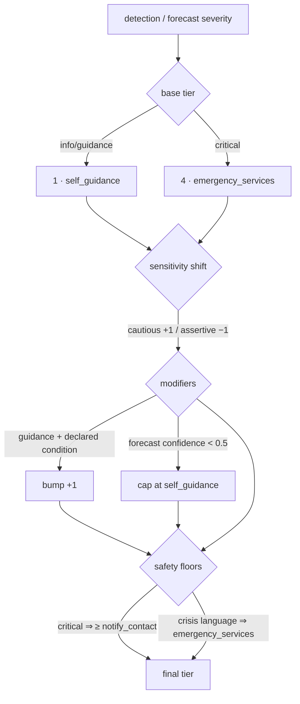

# Predictive early warning & the escalation decision tree

Two modules turn the Guardian from *reactive* to *anticipatory*, and make every
escalation an explicit, auditable decision:

- [`jim/earlywarning.py`](../jim/earlywarning.py) — trend-projection forecasting
- [`jim/escalation.py`](../jim/escalation.py) — the escalation ladder

Tests: [`jim/tests/test_escalation_tree.py`](../jim/tests/test_escalation_tree.py).

## The predictive algorithm

For each tracked vital (`heart_rate`, `respiratory_rate`, `hrv`,
`blood_oxygen`), the forecaster fits a least-squares line over the recent
readings and projects **when that line crosses the vital's danger threshold** —
the same thresholds the reactive rules in `jim/conditions.py` use, so prediction
and detection always agree.

A warning fires only when all three gates pass:

1. the trend heads **toward** danger (right direction, not already past it);
2. the projected crossing lands **inside the sensitivity lead-time window**;
3. the fit is **clean enough** (R² above the sensitivity's minimum).

| Sensitivity | Lookahead window | Min R² | Character |
| --- | --- | --- | --- |
| `cautious` | 30 min | 0.35 | warn early, tolerate noise |
| `balanced` | 20 min | 0.55 | the default |
| `assertive` | 10 min | 0.75 | only clean, imminent trends |

Every forecast carries `risk` (0–1, sooner ⇒ higher), `horizon_min` (projected
minutes to threshold), `confidence` (the R²), and the trend itself — so the
warning is fully explainable:

```json
"forecast": {
  "condition": "anxiety",
  "reason": "heart rate rising ~7.0 bpm/reading (78 → 85 → 92) — projected to cross 100 bpm in ~6 min",
  "risk": 0.71, "horizon_min": 5.7, "confidence": 0.99
}
```

## The escalation ladder

```
4  emergency_services   call 911 · share location · Medical ID · alert devices
3  notify_contact       alert the emergency contact
2  check_in             proactively ask if they're OK
1  self_guidance        deliver AI guidance
0  log                  record the event, nothing more
```

`escalation.decide(severity, sensitivity, …)` resolves a situation to a tier:



Every decision returns its **`path`** — the ordered list of rules that fired —
so any escalation (or non-escalation) can be replayed and defended:

```json
"escalation_decision": {
  "tier": "emergency_services",
  "actions": ["record the event", "deliver AI guidance", "…", "call emergency services"],
  "path": [
    "severity 'critical' → base tier emergency_services",
    "critical floor: never below notify_contact"
  ]
}
```

**Safety floors no dial can lower:** crisis/self-harm language always resolves
to `emergency_services`; a `critical` detection never falls below
`notify_contact`, even on `assertive`.

`GET /escalation-policy/{user_id}` shows the user exactly how their dial maps
each severity to a tier — *before* anything happens.

## The Emergency button (watch & mobile)

A deliberate SOS press skips the ladder's deliberation — the user has declared
the emergency, so the decision resolves at the top tier with the crisis floor,
and `POST /emergency/{user_id}` returns an ordered `flow` the screen drives:

```
armed → call → notify → locate → medical_id → guide
```

On the watch: press-and-hold 3 s (release cancels, haptics count down), then the
same coordinated response — call emergency services, alert the contact, share
live location, surface the Medical ID, and deliver first-aid steps until help
arrives. Screens **54 · Escalation Ladder** and **55 · Emergency Watch** in
[`docs/screens`](screens/) show both.

All of it lands in the event log (`GET /events/{user_id}`), with medical
payloads sealed in the PDI vault when configured — the decision `path` included.
