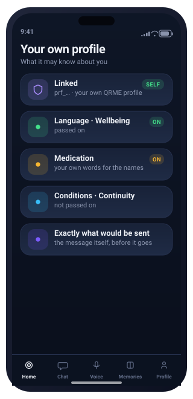
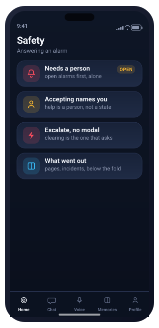
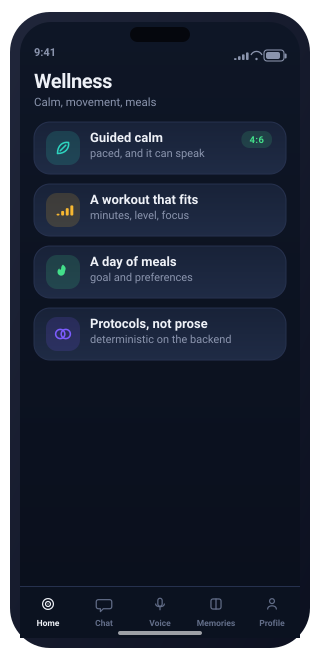
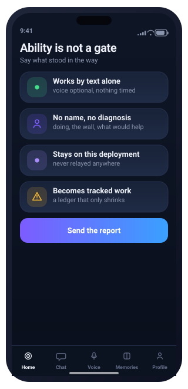
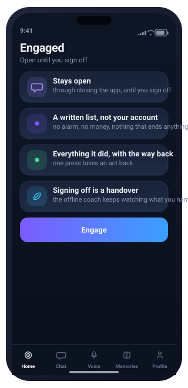
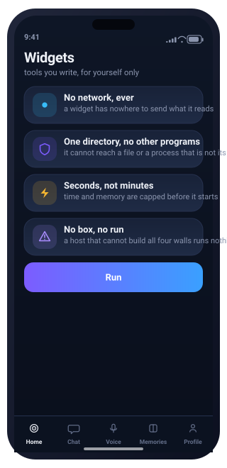

# JIM-mini — screen gallery

The full set of product mockups: the desktop workspace and every phone
screen, one per capability. The watch faces live in the
[README](../README.md#on-the-wrist). Each image is a self-contained SVG.

## Desktop app

A wide, multi-panel desktop form of Jim Mini — sidebar nav and an operator workspace, in the guardian-green identity — complementing the phone app and the watch. Each is a self-contained SVG; regenerate with `python3 docs/desktop/build.py`.

<table>
  <tr>
    <td align="center" width="50%"> <b>01</b> · Overview</td>
    <td align="center" width="50%"> <b>02</b> · Live Monitoring</td>
  </tr>
  <tr>
    <td align="center" width="50%"> <b>03</b> · Health</td>
    <td align="center" width="50%"> <b>04</b> · Emergency & Guardian</td>
  </tr>
  <tr>
    <td align="center" width="50%"> <b>05</b> · Coach & Life</td>
    <td align="center" width="50%"> <b>06</b> · Privacy & Data</td>
  </tr>
</table>

## App screens

Every capability has a screen, in the product's dark-OLED style (regenerate with `python3 docs/screens/build.py`). Each is a self-contained SVG — no fonts, images, or scripts — and maps to a shipped endpoint.

<table>
<tr>
<td align="center" width="25%"> 01 · Welcome</td>
<td align="center" width="25%"> 02 · Home</td>
<td align="center" width="25%"> 03 · Chat</td>
<td align="center" width="25%"> 04 · Voice</td>
</tr>
<tr>
<td align="center" width="25%"> 05 · Daily Briefing</td>
<td align="center" width="25%"> 06 · Health</td>
<td align="center" width="25%"> 07 · Memories</td>
<td align="center" width="25%"> 08 · Profile</td>
</tr>
<tr>
<td align="center" width="25%"> 09 · Goals</td>
<td align="center" width="25%"> 10 · Finance</td>
<td align="center" width="25%"> 11 · Emergency</td>
<td align="center" width="25%"> 12 · Settings</td>
</tr>
<tr>
<td align="center" width="25%"> 13 · Live Monitoring</td>
<td align="center" width="25%"> 14 · CPR Coach</td>
<td align="center" width="25%"> 15 · Emergency</td>
<td align="center" width="25%"> 16 · Medical ID</td>
</tr>
<tr>
<td align="center" width="25%"> 17 · Foresight</td>
<td align="center" width="25%"> 18 · Guardian Sensitivity</td>
<td align="center" width="25%"> 19 · Known Conditions</td>
<td align="center" width="25%"> 20 · Providers</td>
</tr>
<tr>
<td align="center" width="25%"> 21 · Habits</td>
<td align="center" width="25%"> 22 · Check-in</td>
<td align="center" width="25%"> 23 · Journal</td>
<td align="center" width="25%"> 24 · Life Coach</td>
</tr>
<tr>
<td align="center" width="25%"> 25 · Insights</td>
<td align="center" width="25%"> 26 · Companion</td>
<td align="center" width="25%"> 27 · Ambient Jump-in</td>
<td align="center" width="25%"> 28 · Connected Sources</td>
</tr>
<tr>
<td align="center" width="25%"> 29 · Privacy & Data</td>
<td align="center" width="25%"> 30 · Devices</td>
<td align="center" width="25%"> 31 · Continue</td>
<td align="center" width="25%"> 32 · Notifications</td>
</tr>
<tr>
<td align="center" width="25%"> 33 · Progress Report</td>
<td align="center" width="25%"> 34 · Model & Cloud</td>
<td align="center" width="25%"> 35 · Rate Guidance</td>
<td align="center" width="25%"> 36 · Counselor Style</td>
</tr>
<tr>
<td align="center" width="25%"> 37 · History</td>
<td align="center" width="25%"> 38 · Baseline</td>
<td align="center" width="25%"> 39 · Tandem Specialist</td>
<td align="center" width="25%"> 40 · Sign In</td>
</tr>
<tr>
<td align="center" width="25%"> 41 · End Session</td>
<td align="center" width="25%"> 42 · Log In</td>
<td align="center" width="25%"> 43 · Permissions</td>
<td align="center" width="25%"> 44 · About You</td>
</tr>
<tr>
<td align="center" width="25%"> 45 · Emergency Contacts</td>
<td align="center" width="25%"> 46 · All Set</td>
<td align="center" width="25%"> 47 · Social Connections</td>
<td align="center" width="25%"> 48 · Connected Apps</td>
</tr>
<tr>
<td align="center" width="25%"> 49 · Knowledge Excursions</td>
<td align="center" width="25%"> 50 · Files &amp; Photos</td>
<td align="center" width="25%"> 51 · Apple Intelligence</td>
<td align="center" width="25%"> 52 · Google Gemini</td>
</tr>
<tr>
<td align="center" width="25%"> 53 · Microsoft Copilot</td>
<td align="center" width="25%"> 54 · Escalation Ladder</td>
<td align="center" width="25%"> 55 · Emergency Watch</td>
<td align="center" width="25%"> 56 · Robot Helpers</td>
</tr>
<tr>
<td align="center" width="25%"> 57 · Parent Setup</td>
<td align="center" width="25%"> 58 · Family Oversight</td>
<td align="center" width="25%"> 59 · Care Beacons</td>
<td align="center" width="25%"> 60 · Workplace Relay</td>
</tr>
<tr>
<td align="center" width="25%"> 61 · What Would Be Shared</td>
<td align="center" width="25%"> 62 · Specialist Working</td>
<td align="center" width="25%"> 63 · Find a Clinician</td>
<td align="center" width="25%"> 64 · Sign to Release</td>
</tr>
<tr>
<td align="center" width="25%"> 65 · Channel 2</td>
<td align="center" width="25%"> 66 · Second Ear</td>
<td align="center" width="25%"> 67 · Agents</td>
<td align="center" width="25%"> 68 · Chat · overlay</td>
</tr>
<tr>
<td align="center" width="25%"> 69 · Choose a Plan</td>
<td align="center" width="25%"> 70 · What Pro Adds</td>
<td align="center" width="25%"> 71 · The Corner Pane</td>
<td align="center" width="25%"> 72 · Pick a Plan</td>
</tr>
<tr>
<td align="center" width="25%"> 73 · Payment</td>
<td align="center" width="25%"> 74 · You're on Basic</td>
<td align="center" width="25%"> 75 · This Needs Pro</td>
<td align="center" width="25%"> 76 · Show It</td>
</tr>
<tr>
<td align="center" width="25%"> 77 · What Jim Sees</td>
<td align="center" width="25%"> 78 · You're on Free</td>
<td align="center" width="25%"> 79 · Where It Lives</td>
<td align="center" width="25%"> 80 · Not On Free</td>
</tr>
<tr>
<td align="center" width="25%"> 81 · Your Baseline</td>
<td align="center" width="25%"> 82 · Coach, Out Loud</td>
<td align="center" width="25%"> 83 · Which Model Answers</td>
<td align="center" width="25%"> 84 · Apple Watch</td>
</tr>
<tr>
<td align="center" width="25%"> 85 · Medications</td>
<td align="center" width="25%"> 86 · Care Team</td>
<td align="center" width="25%"> 87 · Journal</td>
<td align="center" width="25%"> 88 · Crash Watch</td>
</tr>
<tr>
<td align="center" width="25%"> 89 · Did That Help</td>
<td align="center" width="25%"> 90 · What JIM Learned</td>
<td align="center" width="25%"> 91 · Your Name Here</td>
<td align="center" width="25%"> 92 · Community</td>
</tr>
<tr>
<td align="center" width="25%"> 93 · What Went Wrong</td>
<td align="center" width="25%"> 94 · Before Anything Is Sent</td>
<td align="center" width="25%"> 95 · What You're Working On</td>
<td align="center" width="25%"> 96 · Who You Watch</td>
</tr>
<tr>
<td align="center" width="25%"> 97 · What's Held About You</td>
<td align="center" width="25%"> 98 · Who Else Is Looking</td>
<td align="center" width="25%"> 99 · What Reaches Out</td>
<td align="center" width="25%"> 100 · Bearing</td>
</tr>
<tr>
<td align="center" width="25%"> 101 · Your Own Profile</td>
<td align="center" width="25%"> 102 · Safety</td>
<td align="center" width="25%"> 103 · Wellness</td>
<td align="center" width="25%"> 104 · Feed</td>
</tr>
<tr>
<td align="center" width="25%"> 105 · What This Tab Won't Do</td>
<td align="center" width="25%"> 106 · Presence</td>
<td align="center" width="25%"> 107 · What It Will Not Be</td>
<td align="center" width="25%"> 108 · Ability Is Not A Gate</td>
</tr>
<tr>
<td align="center" width="25%"> 109 · Engaged</td>
<td align="center" width="25%"> 110 · Talk</td>
<td align="center" width="25%"> 111 · Widgets</td>
</tr>
</table>

The first-run journey runs **01 Welcome → 42 Log In → 43 Permissions → 44 About You → 45 Emergency Contacts → 72 Pick a Plan → 73 Payment → 46 All Set**, landing on **78 You're on Free** — or **74 You're on Basic** if the plan step was paid — then hands off to the daily app and, at the other end, **41 End Session**.

