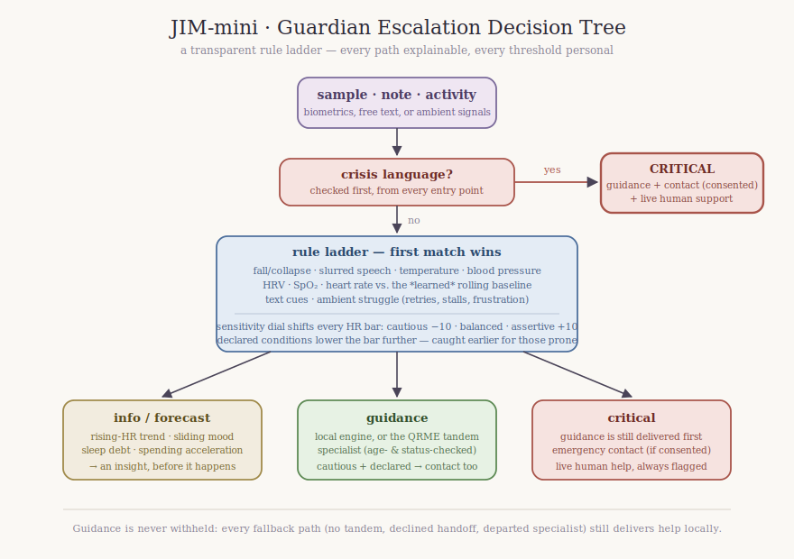

# JIM-mini / Guardian internals

The exact rules behind detection, prediction, escalation, and the life layer.
**[implemented]** = in code and tested; **[planned]** = intended design.

## Personal biometric baseline

- **Seeded** at enrollment: `resting_heart_rate` is captured on `/enroll`.
  Detection thresholds are computed *relative* to this baseline, not to
  population constants — a resting-60 user and a resting-80 user trigger at
  different absolute heart rates. **[implemented]**
- **Per-sample fallback**: a sample may carry its own `resting_heart_rate`;
  otherwise the enrolled baseline is used; otherwise a conservative default
  of 70 bpm. **[implemented]** (`guardian.monitor`, `conditions.detect`)
- **Rolling update** **[implemented]** (`guardian.update_baseline`,
  `baselines` table): the baseline adapts over time. An EMA of resting-state
  samples (folded in only when `activity_level` ≤ 3 and no condition fired),
  `baseline ← baseline + α·(sample − baseline)` with α = 0.05. The heart-rate
  baseline is seeded from the enrolled resting rate at `/enroll`; detection
  compares against the learned baseline once it is established
  (≥ 5 resting samples) and against the enrolled/default seed until then —
  `GET /baseline/{user_id}` reports each metric and whether it is still
  provisional. The schema generalizes to other metrics (HRV, respiration,
  SpO₂, BP); heart rate is wired through detection today.

## Detection rules **[implemented]** (`jim/conditions.py`)

Evaluated in priority order; the first match wins (highest-severity signals
are checked first):

1. **Crisis language** in free text (regex: "kill myself", "end it all",
   "suicide", "hurt myself", "don't want to live") → `anxiety`, **critical**.
2. **Cardiac patterns** (outrank the generic collapse rule): `rhythm:
   fibrillation` (ECG-capable wearable) → `cardiac_event` critical with the
   **AED playbook**; `fall`/`collapse` with an absent pulse or HR < 30 →
   `cardiac_event` critical with the **CPR playbook** (steps, 30:2, pace cued
   at 110/min by green/red lights + a metronome audio tick).
3. **Movement** `fall`/`collapse` (pulse present) → `physical_injury`
   critical; `immobile` → guidance.
4. **Speech** `slurred`/`incoherent` → `physical_distress` critical (stroke
   pattern).
5. **Body temperature** ≥38.5 °C or <35 → guidance; ≥40 or <35 → critical.
6. **Blood pressure** systolic ≥160 or diastolic ≥100 → guidance; ≥180/≥120
   → critical (hypertensive crisis).
7. **HRV** <20 ms → `stress` guidance (sustained load).
8. **SpO₂** <90 % → guidance (the low-oxygen playbook: breathe deeply, fresh
   air, seek medical attention); <88 → critical.
9. **Environmental hazards** (connected sensors): `air_quality` smoke/CO or
   CO ≥ 9 ppm → `environmental_hazard` **critical** (leave-now playbook);
   `poor` air → guidance.
10. **Heart rate** ≥ resting + threshold, with respiratory-rate corroboration
    (≥20/min or absent). Threshold is **+40 bpm** normally, **+30 bpm** if the
    user declared an HR-sensitive known condition (anxiety/stress/phobia).
    ≥ resting + 70 → critical.
11. **Ergonomic risk factors**: slouched/hunched/awkward posture or ≥ 45 min
    of repetitive motion → `ergonomic_strain` guidance (posture reset,
    movement break) — a strain flagged before it becomes an injury.
12. **Text cues** for anxiety, depression, stress, phobia, financial stress,
    relationship distress, physical injury → guidance.

Severity ladder: `info` (log only) → `guidance` (deliver help) →
`critical` (deliver help **and** escalate).

**First-aid playbooks** (`guidance.first_aid_for`): physical detections carry
a deterministic, step-by-step `first_aid` block alongside the conversational
guidance — CPR (30:2, pace cued at 110/min with green/red lights and a
metronome tick), AED, low-blood-oxygen, environmental-hazard, and ergonomic
playbooks. Critical escalations **dispatch alerts to every registered
connected device** (`dispatched_alerts`), so the nearest embodiment surfaces
the guidance.

## Predictive early warning **[implemented]** (`conditions.forecast`)

Fires when nothing has crossed a threshold yet. Logic: given the current HR
and the last two prior HRs, if the three are strictly rising, the current HR
is ≥ resting + 25, and the rise across the window is ≥ 15 bpm, emit a
`forecast` event (`info`) and a "may be building" insight — catching a stress
or anxiety episode before it manifests. Prior samples are read back from the
PDI vault when tandem storage is on, so prediction works without keeping
medical data locally.

**Beyond the heart-rate climb** **[implemented]** (`life.forecast_*`,
`trend_points` table): three more before-it-happens signals, each a
transparent trend rule over bare local numbers (context payloads stay in the
PDI vault; the trend store keeps only a metric name and a value):

- **Sliding mood** — three strictly declining check-ins ending ≤ 3 → a
  mental-health forecast before the low lands.
- **Sleep debt** — three consecutive nights under 6.5 h → the accumulated
  debt is flagged while tonight can still fix it.
- **Spending acceleration** — the last three purchases total ≥ 2× the prior
  three → a financial-stress early warning even when no single purchase trips
  the high-spend alert.
- **Blood-oxygen slide** — three strictly declining SpO₂ readings ending
  ≤ 94% (still above the 90% detection threshold) → a physical-abnormality
  warning while there is still time to breathe deeply and get fresh air.

Each lands as a `forecast` insight; erasure removes the trend points with
everything else.

**Knowledge packs for thresholds** **[planned]**: the request for
"purchaseable/downloadable knowledge for thresholds" maps to a
*specialist knowledge-pack* model — signed, versioned rule bundles per domain
(cardiac, metabolic, mental-health, financial-stress, career, etc.) that
supply threshold tables and baseline-update coefficients. A pack is a JSON
manifest (`domain`, `version`, `signals`, `thresholds`, `baseline_alpha`,
`references`) loaded into the detection layer; the current transparent rules
are the built-in default pack. Distribution would ride the marketplace.

## Handling conflicting / noisy signals

- **Corroboration today** **[implemented]**: the HR rule already requires
  respiratory-rate agreement (or absence) before firing, so a lone HR spike
  from a loose strap doesn't escalate on its own.
- **Confidence & sensor fusion** **[planned]**: each sample carries an
  optional `confidence` (0–1) per sensor; a detection's effective severity is
  gated by the minimum confidence of the signals that produced it. Conflicting
  signals (e.g. high HR but normal HRV and normal respiration) lower
  confidence and downgrade critical→guidance→info. A short debounce window
  (N consecutive corroborating samples) suppresses transient artifacts before
  escalation.

## Escalation decision tree **[implemented]** (`guardian._escalate`)

For a **critical** detection:

1. **Guidance is always delivered** first (local engine or the tandem QRME
   specialist), regardless of severity.
2. **Emergency contact** is notified when the user enrolled one *and* gave
   `contact_consent`. The escalation event records
   `notified_emergency_contact` and the contact.
3. **Live human help** is flagged (`live_support: true`) on every critical
   escalation — the handoff to a live counselor / emergency services.

**Tunable sensitivity** **[implemented]** (`guardian.set_sensitivity`,
`conditions.detect`): a per-user `sensitivity` setting (`cautious` /
`balanced` / `assertive`) shifts the heart-rate guidance/critical boundaries
by ±10 bpm — `cautious` escalates earlier (lower thresholds, **and** notifies
the emergency contact at guidance level for a *declared* condition),
`assertive` requires stronger signals. Exposed as `PUT /sensitivity/{user_id}`;
defaults to `balanced`. **[planned]**: expressing the escalation routing
(contact vs. live help vs. guidance-only) as an ordered policy the user can
reorder.

## Life layer details **[implemented]** (`jim/life.py`, `jim/coach.py`)

- **Smart goals**: progress is a 0–1 float; reaching 1.0 flips status to
  `completed` and emits a praise insight.
- **Habit streaks**: `streak()` counts consecutive logged days ending at the
  most recent log (a gap resets it); milestones at 7/30/100 days emit
  insights.
- **Proactive insight rules** (deliberately transparent): spending ≥ $200 →
  alert; sleep ≥7.5 h → praise, <6 h → nudge; calendar keyword "interview" →
  career prep; mood ≤2 → mindful-break suggestion.
- **Journaling + check-in crisis pipeline**: a journal entry or check-in note
  runs the *same* `guardian.monitor` detection as a biometric sample, so
  crisis language in a sad entry escalates identically — contact notified when
  consented.

## Tandem specialist safety **[implemented]** (`guardian._tandem_safe`)

Before delegating guidance to a QRME specialist profile, JIM checks the
profile's public card (`GET /profiles/{id}`, exposing `adult_mode` and
`status`): a **minor or unknown-age user is never connected to an
age-restricted profile**, and a non-`active` (restricted/departed/terminated)
profile is not used — in both cases JIM falls back to its own standalone
guidance with a note. If the card can't be read, JIM proceeds and relies on
QRME's own age-gate as the backstop (JIM passes the user's birthdate when it
creates the QRME interactor); a QRME refusal is caught and also falls back, so
the user is never left without help.

## Provider handoff **[implemented, in QRME]**

JIM-mini surfaces the local-provider directory and consented session handoff
through the tandem QRME community layer (`/providers`, `/handoffs`): the AI
specialist's session summary is packaged **only with explicit consent**,
sealed in the PDI vault, released to the provider via a revocable token, and
purged on revocation. See QRME `docs/design/lifecycle-and-consent.md` and the
tandem doc.

## Physical-embodiment session continuity **[implemented]**

`POST /sessions/{user_id}` starts a per-device login; the remembered
interaction state is **per user**, so any device (wearable, stationary
console, phone, robot) that starts a session resumes the same conversational
thread, and guidance routes to the active session's device. See the README
API table and `guardian.start_session`.

## DELETE /data/{user_id} propagation **[implemented]**

Full erasure removes every local table for the user (events, sources,
check-ins, goals, habits, journal, feedback, sessions, devices, insights,
coach messages, tandem links) **and** purges the user's records from the PDI
vault via the tracked `vault_keys`. Cross-system propagation to QRME is
covered in the tandem doc.
